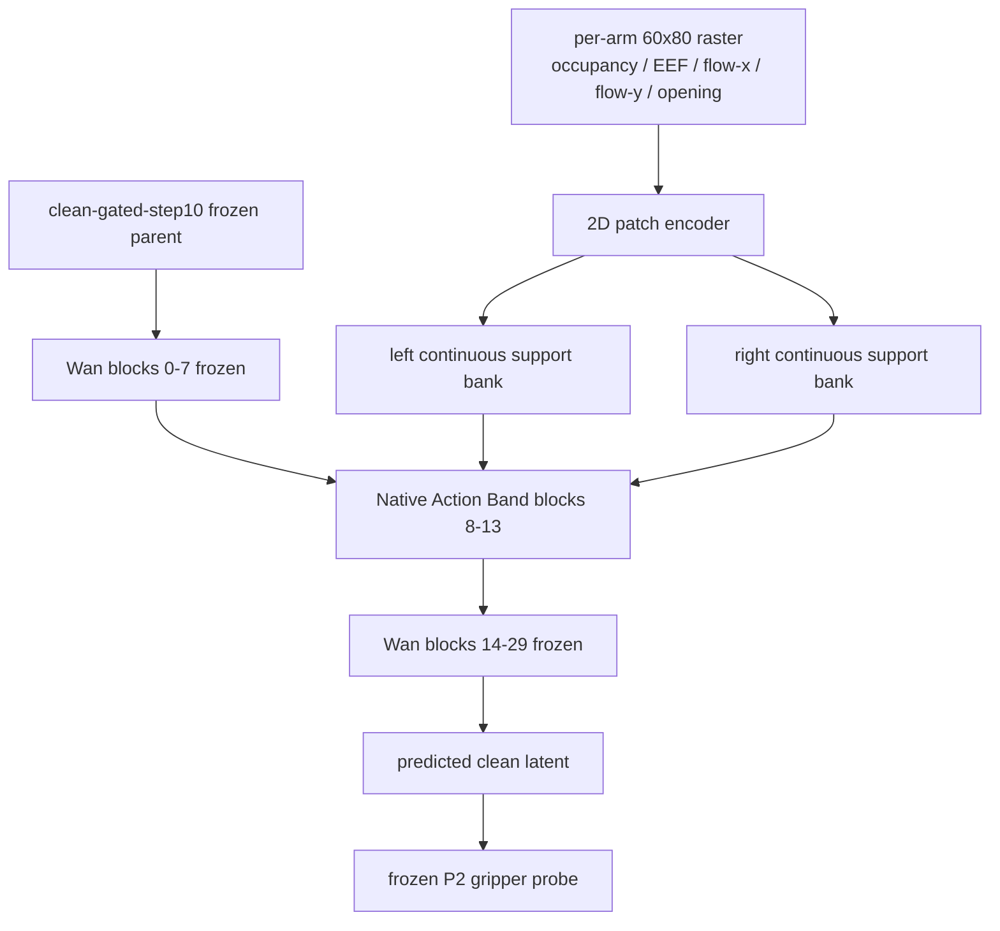

# Final-NativeBand 受控实验报告

日期：2026-08-19  
状态：**exposure64 按修正后的联合门进入128；exposure128 最终硬门失败，实验终止，未解码 RGB。**

## 1. 实验问题

本实验只回答一个问题：把历史上三个已有正证据的组件合并后，能否在固定 Canary-4 上形成明确的 image-space action causal response？

- v3：`60×80` per-arm raster/support，历史上唯一 matched RGB trajectory 正收益；
- v8：blocks `8–13` 连续 native attention band，历史上 reverse/swap hidden separation 最强；
- v12.2：same-noise/same-timestep physical-pair heatmap supervision，隔离 frozen parent 与 trainable action path。

没有引入 SE(3)、phase、PRA、GRU/TCN、FM、trajectory loss、新数据或超参数 sweep。

## 2. 架构



连续 band 中每个 block 的完整权限为：

```text
native Q/K/V/O: trainable, LR 1e-6
action ΔQ/ΔK/ΔV: trainable, LR 3e-5
2D patch/time encoder: trainable, LR 3e-5
left action: only left 12-head bank
right action: only right 12-head bank
arm absent: corresponding ΔQ/ΔK/ΔV exact zero
```

可训练参数总数：`233,754,880`。blocks `0–7`、`14–29`、frozen raster parent 与 P2 probe 均冻结。

## 3. 数据与 lineage

复用 v12.2 的完全相同 Canary-4：2 条 left-only、2 条 right-only；审计使用双符号 physical perturbation，共 8 个 signed cases。

样本：

1. `place_container_plate__aloha-agilex_clean_50__episode_000038`
2. `shake_bottle_horizontally__aloha-agilex_clean_50__episode_000016`
3. `shake_bottle_horizontally__aloha-agilex_clean_50__episode_000006`
4. `stack_bowls_two__aloha-agilex_clean_50__episode_000019`

关键固定证据：

| 项目 | SHA256 |
|---|---|
| source closure（0–64） | `4fffc3624f2c09a279f5da74c61e4086e0b929d5704910e0ec8fddb6378969af` |
| source closure（修正64联合门后） | `face356cad30cd037553b21b3917855c1f4ef531a098f965b3de1510d833af06` |
| parent | `105fb760fd371885ba362d26ef2352c260755e47cd036f46711181edc3b30ca2` |
| canary | `f49730f1270a8d1f959742a0ebe89afb91c490192fd025fe01ce49fc0b7dc0ad` |
| replay | `386b53530e77118a09d55cf25d46763098d7face74e88a5f3f527830bc334138` |
| frozen targets | `d71e6d47067760c1d339e93a436d7ddf853fef6abf8d09601b23b6c8d335871c` |
| P2 probe | `300b4c6a7aa246110625d2e1747273ee07e30cc4f6d92e544799567496531480` |
| config | `ab43e86ebc88b56dac81a020ab9cc1d83631ed67d8abc750e1c5a751b14523bd` |

`dev-fast20_overlap=0`，`audit20_overlap=0`。可靠 sigma 固定为 timestep `800`。

## 4. 工程验证

远端 Torch focused suite：`12 passed`。

生产 smoke 连续执行 warmup 后三次 `forward → backward → optimizer.step → zero_grad`：

| 指标 | 结果 | 门限 |
|---|---:|---:|
| peak allocated | 15.31 GiB | <22 GiB |
| peak reserved | 16.14 GiB | <22 GiB |
| step time | 5.27 s | telemetry |
| native gradient | 非零 | 必须非零 |
| projector gradient | 非零 | 必须非零 |
| encoder gradient | 非零 | 必须非零 |

GPU 仅使用 physical GPU6；GPU0–5 与 GPU7 未被本实验占用。实验结束后 GPU6 为 `6 MiB / 0%`，无 compute PID。

## 5. 训练目标

训练保持 v12.2 objective：

```text
base graph:
  parent(correct) + native-band(correct)

perturbed graph:
  parent(correct) + native-band(perturbed)

target:
  Shift(stopgrad(P2(frozen_parent)), physical_delta)

loss:
  heatmap KL
  + 0.1 coordinate
  + inactive-arm penalty
  + locality penalty
  + base-preserve
```

base 与 perturbed graph 顺序执行并累积梯度，避免同时保留两套 activation graph。Canary 阶段没有 FM shortcut。

## 6. 结果

### 6.1 训练健康

0→128 全程没有 OOM、NaN 或 nonfinite gradient。exposure128 末步：

| gradient family | norm |
|---|---:|
| native | 1.3340 |
| action projector | 0.00691 |
| 2D encoder | 0.03295 |

因此失败不能归因于参数未更新或训练链路断开。

### 6.2 审计曲线

| metric | exposure32 | exposure64 | exposure128 | 128 门限 | 判定 |
|---|---:|---:|---:|---:|---|
| active direction rate | 47.02% | 52.38% | 42.86% | ≥80% | fail |
| median cosine | -0.1946 | -0.1507 | -0.2644 | ≥0.60 | fail |
| median magnitude ratio | 2.76% | 3.01% | 2.69% | ≥25% | fail |
| inactive / active | 2.499 | 1.382 | 1.765 | ≤0.50 | fail |
| outside / inside | 1.723 | 1.736 | 2.367 | ≤0.75 | fail |
| base-parent RMS | 0.00207 | 0.00372 | 0.00404 | ≤0.02 | pass |
| heatmap loss reduction | -0.19% | +1.69% | +5.57% | decrease | pass |
| positive-sign direction | 45.24% | 52.38% | 44.05% | ≥75% | fail |
| negative-sign direction | 48.81% | 52.38% | 41.67% | ≥75% | fail |

exposure32→64 有弱 heatmap 下降趋势，因此按最终确认的三项联合停止条件继续到128。64→128 后 heatmap loss 继续下降，但 direction、cosine、magnitude、inactive leakage 和空间 locality 全部恶化或远低于门限，说明优化器降低了目标 loss，却没有形成正确的局部 action response。

### 6.3 exposure64 合同修正与 exposure128 最终决策

最终确认的 exposure64 停止条件是三项同时满足：`direction<=55% AND cosine<=0 AND heatmap不下降`。实际 heatmap 已下降1.69%，因此通过可审计 gate-only lineage migration 进入128；权重没有改变，迁移后的 gated checkpoint SHA256 为 `fc9c6d0639872c2ed7f3877ef4f8ba0fcafd607f88f0cfe9b7b6b94f9b3d91ee`。

exposure128 正式 gate：

```json
{
  "pass": false,
  "action": "permanent_stop_action_architecture",
  "reasons": [
    "active_direction_rate_min_0.8_failed",
    "median_cosine_min_0.6_failed",
    "median_magnitude_ratio_min_0.25_failed",
    "inactive_active_ratio_max_0.5_failed",
    "outside_inside_ratio_max_0.75_failed",
    "positive_direction_rate_min_0.75_failed",
    "negative_direction_rate_min_0.75_failed"
  ]
}
```

因此：

- 不运行 Canary-B / 2060 pool；
- 不加入 FM/Soft-DTW/swap/reverse/arm-null；
- 不解码 RGB fast20；
- `exposure-0128.pt` 只保留用于审计/复现，禁止作为训练 parent 或发布候选。

## 7. 结论

Final-NativeBand 已经同时给 action 足够的连续 native 容量（六层 Q/K/V/O）、高分辨率 2D condition 与干净 physical-pair supervision，但在128 exposure 后仍只有42.86% direction、负 cosine、2.69% magnitude，并伴随明显跨臂和空间泄漏。

这关闭了“只是 sparse blocks / frozen V / 控制容量不足”的最后一个主要解释。当前比赛窗口应回滚到 `clean-gated-step10` incumbent，不再继续小型 action architecture；下一步应优先完成 incumbent 的 dev-clean50 WorldArena/VLM/JEPA profile，并根据真实分项缺口投入剩余算力。

## 8. 产物

远端根：`/data/di/worldarena2_track1_20260815/runs/final-native-band`

- `source-receipt.json`
- `data/receipt.json`
- `gpu6/preflight.json`
- `gpu6/smoke.json`
- `gpu6/exposure-0032.pt`
- `gpu6/exposure-0032-telemetry.pt`
- `gpu6/audit-0032.json`
- `gpu6/exposure-0064.pt`
- `gpu6/audit-0064.json`
- `gpu6/audit-0064-latest-contract.json`
- `gpu6/exposure-0064-gated.pt`
- `gpu6/exposure-0128.pt`
- `gpu6/audit-0128.json`

产物均保留在正式根下，便于复核；128失败后没有继续产生 Canary-B、2060 或 RGB 资产。
