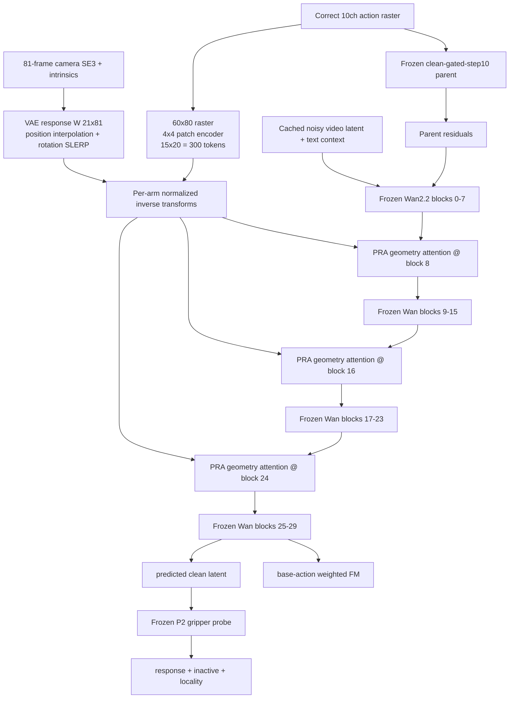
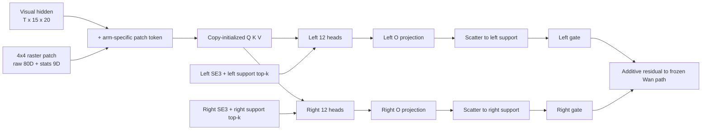
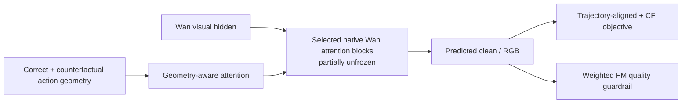

# Wan-Action v12.1-PRA 详细实验报告

日期：2026-08-19  
实验名称：`v12.1-PRA`（Pairwise Relational Action）  
状态：**实现、远端 Torch 测试、CPU 数据准备、GPU6 preflight、production smoke、exposure 1–256 训练和 audit256 均已完成。audit256 硬门失败，按合同停止；未运行 exposure 257–512，未生成 RGB 视频，未进入 fast20 或官方评测。**

---

## 1. 一页结论

### 1.1 最终裁决

v12.1-PRA 的工程实现是健康的，但核心机制假设没有成立。

已确认成立的部分：

- 单卡 RTX 4090 production shape 能稳定训练，峰值 allocated `18.09 GiB`、reserved `18.80 GiB`，低于 `22 GiB` 硬门；
- Wan2.2 原生主干和 `clean-gated-step10` parent 全冻结，只有 PRA geometry branch 可训练；
- 114,470,534 个参数、29 个 trainable tensors 均符合白名单；
- geometry、gate、patch encoder 三类参数均获得非零梯度；
- 三个 block 的左右臂 gate 都从 `0.02` 明显更新，说明分支没有“没接上”或“完全没训练”；
- `geometry-off` 时输出响应严格为零；
- 相对 frozen parent，base-action FM 下降 `5.19%`，没有出现训练损失退化；
- 训练 256 exposures 全程 finite，无 OOM、NaN、Inf 或 checkpoint 损坏。

没有成立的核心部分：

- 对目标 `±12 px` EEF 扰动，模型最终响应幅值中位数只有目标的 `3.85%`；
- 响应方向几乎无相关性，median cosine 仅 `0.0228`；
- active-arm 方向正确率仅 `51.32%`，接近随机；
- inactive arm 的响应是 active arm 的 `2.65×`，跨臂泄漏严重；
- support 外响应是 support 内的 `2.33×`，局部几何控制没有建立；
- 16 个“episode × 正负扰动”结果存在明显符号不对称：同一 episode 一个方向偶尔有效，反方向往往失败，不符合近似等变的几何响应。

因此严格执行实验合同：

```text
audit256 FAIL
  -> 不生成 exposure-0256-gated.pt
  -> 不运行 exposure 257–512
  -> 不解码 RGB
  -> 不运行 matched fast20
  -> 不作为 Stage-2 parent 或提交候选
```

### 1.2 这个结果真正说明什么

它排除了“代码没跑通、显存不够、分支没梯度、参数量太小、gate 没打开”这些工程原因。当前证据更支持：

> 在 Wan 主干完全冻结的前提下，PRA additive geometry attention 可以找到有利于 base-action FM 的视频预测 residual，但没有学会“动作扰动应当在正确机械臂、正确局部区域、沿正确方向产生对应视觉轨迹变化”。

FM 变好不能被解释成 Trajectory 变好。v12.1 没有通过 RGB 解码前的机制门，所以本实验**没有 WorldArena、VLM、JEPA、SAM3 Trajectory 或排行榜结果**。

### 1.3 下一步建议

不继续堆 v12.1 的层数、rank 或训练 exposures。下一步应停止 frozen-backbone additive branch 路线，转向：

```text
partial Wan attention unfreeze
+ explicit geometry condition
+ counterfactual / trajectory-aligned objective
+ larger zero-leakage action-video data
```

在启动大训练前，只值得追加一个不训练的诊断：直接测 frozen P2 probe 对 predicted-clean latent 的 Jacobian、目标尺度和 support 内外梯度分布，确认当前 response/locality supervision 是否病态。除此之外，不建议再为 v12.1 烧训练卡。

---

## 2. 实验问题与边界

### 2.1 唯一研究问题

v12.1-PRA 只回答一个问题：

> 在冻结 Wan2.2 原生视频生成路径和已验证 parent 的前提下，加入 copy-initialized、左右臂永久分组、显式 SE(3) 作用、读取高分辨率 action raster 的 robot-only attention，能否把小幅、物理一致的 EEF perturbation 转化为方向正确、幅值合理、跨臂隔离、空间局部的最终视觉轨迹响应？

该问题比“训练 loss 是否下降”严格得多。我们要求模型对 counterfactual action 产生具有因果方向的输出差异，而不是只在正确 action 上拟合视频。

### 2.2 本轮明确冻结

- Wan2.2-TI2V-5B backbone 全冻结；
- `clean-gated-step10` action-raster parent 全冻结；
- frozen v6 P2 gripper probe 只负责读取最终 predicted-clean latent；
- action raster、text embedding、video latent 使用已缓存正式资产；
- 不训练 T5、VAE、SAM3、V-JEPA、Depth branch、GAN 或 DMD；
- 不解冻 native Wan Q/K/V/O；
- 不加入 trajectory head、Pose FiLM、PRoPE、persistent slot、GRU、TCN 或 coordination branch；
- 不把 perturbed action 当作原视频的 FM 监督目标。

### 2.3 本轮唯一新增能力

新增三层 PRA geometry attention，位于 Wan blocks `8 / 16 / 24`。它读取：

- 当前 Wan visual hidden；
- 高分辨率 `10 × 81 × 60 × 80` 双臂 action raster；
- 连续 camera-frame 双臂 SE(3) trajectory；
- 每臂 support tube 和 arm presence。

训练目标只允许它学习：正确 action 的 FM，以及 action perturbation 引起的 active-arm response、inactive-arm quietness 和 support locality。

---

## 3. 架构设计

### 3.1 总体数据流



### 3.2 单个 PRA stage

每个 stage 从对应 native Wan self-attention 复制初始化：

- `Q / K / V`：复制完整 native projection；
- `O_left`：复制 native O 的左半 head 输入；
- `O_right`：复制 native O 的右半 head 输入；
- 24 heads 被永久分成左 12 heads 和右 12 heads；
- patch-to-visual projection 从 zero-init 开始；
- 每个 stage 维护两个独立 scalar gate，分别控制左/右 residual。



stage 内部合同：

1. 每个 latent time、每只臂从 support 中选 top-16 spatial tokens；
2. 这些 token 在全时间维展开后做 robot-only attention；
3. Q 使用对应 arm transform，K/V 使用 inverse transform，再把 attention output 变回该 arm frame；
4. left heads 永远不读取 right head slice，反之亦然；
5. 结果只 scatter 回对应 arm support；
6. `arm_present=0` 或 support 为零时对应 arm output 严格为零；
7. `force_zero_geometry=true` 时 geometry path 严格恒等，不改变 frozen parent 输出。

### 3.3 高分辨率 action patch

正式 raster shape：

```text
(B, 10, 81, 60, 80)
  5 channels left arm
  5 channels right arm

per arm channels:
  occupancy / EEF heatmap / flow-x / flow-y / opening-map
```

VAE temporal response `W ∈ R^(21×81)` 将 RGB-frame raster 对齐到 21 个 latent time。每个 arm/time 的 `60×80` raster 以 `4×4, stride=4` 切分为 `15×20=300` patches。

每个 patch 同时编码：

- 原始 `5×4×4=80D` raster；
- occupancy mass；
- EEF mass；
- EEF/occupancy weighted centroid x/y；
- flow mean x/y；
- flow variance x/y；
- opening mean。

两条小 MLP 的输出相加，形成 128D patch feature，再投影到 Wan visual width。

### 3.4 连续 SE(3) 对齐与归一化

不把 81 帧动作粗暴 nearest-neighbor 到 21 latent。对每个 latent row，先由实测 VAE response 得到时间中心：

\[
c_l = \sum_{f=0}^{80} W_{l,f} f
\]

位置使用线性插值，旋转使用 quaternion SLERP。每臂以 frame0 为 anchor，并使用全局 motion-scale normalization，随后构造 normalized inverse transforms 供 attention 使用。

这样避免：

- 手拍固定 `4 RGB frames = 1 latent`；
- quaternion `q/-q` 二义性；
- 左右臂使用不同且不受控的尺度；
- 仅在图像平面有 cue、但 3D 轨迹被丢失。

---

## 4. 物理 counterfactual 构造

### 4.1 扰动定义

对一个 active arm，在一个真实可观测运动区间内，对 EEF 像素轨迹加入平滑 bump：

\[
\Delta u_f,\Delta v_f
=
(\Delta u,\Delta v)\sin^2\left(\pi\frac{f-f_s}{f_e-f_s}\right)
\]

区间外严格为零。扰动幅度固定为 `12 px`，正负号都覆盖。通过相机内参和该帧深度，把像素位移还原为 camera-frame 3D translation：

\[
\Delta x_f = \Delta u_f z_f / f_x,\qquad
\Delta y_f = \Delta v_f z_f / f_y
\]

随后重新计算：

- 81-frame SE(3) poses；
- latent-time aligned transforms；
- EEF heatmap；
- image-space flow；
- opening/occupancy geometry raster；
- per-arm support tube。

### 4.2 最重要的因果隔离

两次 forward 中，frozen parent 始终看到相同的 **correct raster action**：

```text
base forward:
  frozen parent <- correct action
  PRA geometry  <- correct geometry

perturbed forward:
  frozen parent <- correct action
  PRA geometry  <- physically perturbed geometry
```

因此 base/perturbed 输出差只能来自 PRA geometry path，不能由已有 parent Adapter 对错误 action 的响应冒充。

perturbed action 不接受原视频 FM target。否则会同时要求模型：

```text
动作已经改变
但输出仍必须等于原视频
```

这会直接压制 action sensitivity。

---

## 5. 训练目标与梯度路径

### 5.1 Loss

只在 correct/base action 上计算 weighted FM：

\[
L_{FM}=FM(\hat v(a),v_{GT})
\]

使用 frozen P2 probe 从 predicted-clean latent 读取左右 gripper position，定义：

\[
L_{response}
=
Huber\left(
p_{active}(a')-p_{active}(a),
\Delta p_{target}
\right)
\]

\[
L_{inactive}
=
\left|p_{inactive}(a')-p_{inactive}(a)\right|
\]

\[
L_{locality}
=
\operatorname{mean}_{\neg support}
\left|z_0(a')-z_0(a)\right|^2
\]

总目标：

\[
L=L_{FM}
+\lambda_r L_{response}
+\lambda_i L_{inactive}
+\lambda_l L_{locality}
\]

### 5.2 三次 forward 的单卡内存策略

每个 optimizer exposure 使用：

```text
1. perturbed preview forward       no-grad
2. base/correct forward            grad + FM + aux(first half)
3. perturbed forward               grad + aux(second half)
4. accumulate gradients
5. clip grad norm at 1.0
6. optimizer.step
```

这样没有同时保留两张完整 Wan activation graph，单卡显存维持在 22 GiB 以下。

### 5.3 梯度比标定

权重不是手拍 loss 数值，而是在固定 calibration batch 上按对 trainable branch 的梯度范数标定：

| 项 | 原始梯度范数 | 目标相对 FM 梯度 | 冻结 lambda |
|---|---:|---:|---:|
| FM | `4.937046e-3` | `1.00` | `1.0` |
| response | `5.145361e-6` | `1.00` | `959.5140` |
| inactive | `4.007746e-3` | `0.25` | `0.307969` |
| locality | `3.132322e-6` | `0.25` | `394.0404` |

response/locality lambda 很大，是因为原始梯度尺度约为 `1e-6`；它们不能被单独解释为“损失被放大了几百倍”。真正合同是标定后的 gradient ratio。

但 audit 结果表明，即使给予 response 足够的标定梯度话语权，最终几何响应仍未建立。这提示当前 frozen P2 + predicted-clean 的监督链可能弱、病态或方向信息不足；本实验不能仅凭 loss 数值确定是哪一种。

---

## 6. 数据、采样与零泄漏

### 6.1 Canary-8

| 类别 | episode |
|---|---|
| left-only | `shake_bottle_horizontally__aloha-agilex_clean_50__episode_000038` |
| left-only | `move_pillbottle_pad__aloha-agilex_clean_50__episode_000029` |
| right-only | `move_stapler_pad__aloha-agilex_clean_50__episode_000005` |
| right-only | `place_a2b_left__aloha-agilex_clean_50__episode_000000` |
| both-active | `pick_dual_bottles__aloha-agilex_clean_50__episode_000042` |
| both-active | `pick_diverse_bottles__aloha-agilex_clean_50__episode_000001` |
| crossing | `handover_mic__aloha-agilex_clean_50__episode_000016` |
| quiet/control | `turn_switch__aloha-agilex_clean_50__episode_000001` |

选择合同：

- 全部来自 clean optimizer pool；
- 全部具有有效 action geometry 和 P2 observability；
- 覆盖 left-only、right-only、both-active、crossing、quiet；
- 与 audit20 交集为 0；
- 与 dev-fast20 交集为 0；
- 没有读取 official test 进行选择或训练。

### 6.2 Replay-512

- 8 个样本各出现 64 次；
- 每个 8-sample cycle 切换 perturbation sign；
- 正负扰动覆盖完全对称；
- sample、noise seed、timestep seed、perturbation sign 全部预生成并固定；
- exposure 256 是第一次硬门；只有通过后才允许继续到 512。

### 6.3 数据规模的正确解读

这不是正式大规模训练，而是机制 canary。8 个样本足以回答“相同样本的 ±12 px counterfactual 是否产生正确方向和隔离响应”，但不足以估计最终 WorldArena 泛化分数。

因此：

- audit256 失败足以拒绝继续烧 512 exposures；
- audit256 不能用来声称 v12.1 在完整任务分布上比 parent 差多少；
- 如果机制门通过，才有资格扩大数据、解码 RGB、跑 fast20。

---

## 7. 参数、优化器与 checkpoint 合同

### 7.1 Trainable whitelist

总 trainable parameters：`114,470,534`。  
Checkpoint 中 trainable tensors：`29`。

| 参数族 | tensors/refs | LR | weight decay |
|---|---:|---:|---:|
| geometry Q/K/V/O、patch-to-visual、patch encoder | 26 | `5e-5` | `0.01` |
| block 8/16/24 left-right gates | 3 | `1e-3` | `0.01` |

AdamW：`betas=(0.9, 0.95)`；global grad clipping=`1.0`。

严格禁止：

- `backbone.*` trainable；
- `parent_adapter.*` trainable；
- 未知前缀参数进入 optimizer；
- exposure512 从非 gated exposure256 checkpoint 恢复；
- lineage、source closure、replay、parent、probe、temporal kernel 不一致时恢复。

### 7.2 Gate 初始化与最终值

初始 gate 经 RMS calibration 后全部达到 cap `0.02`：

| block | init left | init right | final left | final right |
|---:|---:|---:|---:|---:|
| 8 | `0.0200` | `0.0200` | `0.07237` | `0.09660` |
| 16 | `0.0200` | `0.0200` | `0.09118` | `0.08614` |
| 24 | `0.0200` | `0.0200` | `0.02584` | `0.06692` |

gate 明显更新，说明机制失败不能归因于“residual 被 zero gate 永久关死”。

---

## 8. 实现与测试证据

### 8.1 主要实现文件

| 文件 | 责任 |
|---|---|
| `src/worldarena_baseline/wan_v121_pra.py` | temporal alignment、SLERP、patch encoder、PRA attention、physical perturbation |
| `src/worldarena_baseline/wan_v121_data.py` | canary 分类、可观测窗口、geometry raster perturbation、support |
| `src/worldarena_baseline/wan_v121_model.py` | frozen parent + frozen Wan + blocks 8/16/24 PRA wiring |
| `src/worldarena_baseline/wan_v121_objective.py` | base FM、response、inactive、locality objective |
| `src/worldarena_baseline/wan_v121_training.py` | optimizer whitelist、audit256/512 gate |
| `scripts/train_wan_v121_pra.py` | prepare/preflight/smoke/train/audit/checkpoint/lineage |
| `scripts/run_wan_v121_pra_gpu6.sh` | GPU6 ownership、phase sequencing、fail-closed launch |

### 8.2 测试

远端正式 Torch suite：**16 passed**。

覆盖：

- 81→21 response-weighted pose/raster alignment；
- rotation SLERP；
- high-resolution patch shape/statistics；
- SE(3) perturbation正负方向与区间外零；
- raster EEF/flow 重计算；
- per-arm support/presence；
- left/right head isolation；
- native Q/K/V/O copy initialization；
- force-zero exact identity；
- frozen Wan/parent trainable whitelist；
- base/perturbed parent action 完全一致；
- perturbed action 无 original-video FM；
- response/inactive/locality objective；
- 256/512 gate 阈值；
- replay/checkpoint/source lineage。

---

## 9. Preflight

### 9.1 拓扑

```text
CUDA_VISIBLE_DEVICES=6
world_size=1
GPU6 ownership check before every GPU phase
```

### 9.2 Parent-equivalence / no-regression

| 检查 | 结果 | 硬门 |
|---|---:|---:|
| untrained geometry-on FM regression | `+0.00205%` | `<= +0.5%` |
| untrained P2 deviation | `2.816e-5` | `<=1%` |
| Wan backbone trainables | `0` | `0` |
| frozen parent trainables | `0` | `0` |
| PRA trainables | `114,470,534` | exact whitelist |

Preflight：**PASS**。

---

## 10. Production smoke

执行 warmup 后重置 CUDA peak，再连续运行三次：

```text
forward pair
-> predicted-clean + P2
-> backward
-> clip
-> optimizer.step
-> zero_grad
```

| 项 | 结果 |
|---|---:|
| peak allocated | `19,426,347,008 bytes` = `18.09 GiB` |
| peak reserved | `20,182,990,848 bytes` = `18.80 GiB` |
| hard limit | `22.00 GiB` |
| iteration times | `5.3820 / 5.3820 / 5.3890 s` |
| mean iteration time | `5.384 s` |
| geometry gradients | nonzero |
| gate gradients | nonzero |
| patch gradients | nonzero |

Smoke：**PASS**。

---

## 11. 训练过程

### 11.1 时间线

| 时间（CST） | 事件 |
|---|---|
| 2026-08-19 17:15 | data prepare/receipt 完成 |
| 17:16 | source receipt 完成 |
| 17:17 | preflight 完成 |
| 17:18 | production smoke 完成 |
| 17:19 左右 | exposure 1–256 正式训练开始 |
| 17:41:47 | `exposure-0256.pt` 原子保存 |
| 17:43:03 | `audit-0256.json` 完成，gate fail |

256 exposures 正式训练约 22.7 分钟。Checkpoint 大小 `1,373,798,817 bytes`，约 `1.28 GiB`（`ls -lh` 为 `1.3G`）。

### 11.2 四段训练统计

| exposures | FM mean / median | response mean | inactive mean | locality mean | grad norm mean | residual/native B8 | B16 | B24 |
|---|---:|---:|---:|---:|---:|---:|---:|---:|
| 1–64 | `0.3286 / 0.2185` | `3.717e-6` | `2.881e-4` | `6.416e-5` | `0.0174` | `0.00864` | `0.00838` | `0.00551` |
| 65–128 | `0.2892 / 0.2575` | `3.720e-6` | `3.218e-4` | `6.699e-5` | `0.0614` | `0.01913` | `0.01946` | `0.01853` |
| 129–192 | `0.3628 / 0.2848` | `3.375e-6` | `3.163e-4` | `5.189e-5` | `0.0693` | `0.03186` | `0.03710` | `0.02697` |
| 193–256 | `0.4053 / 0.3117` | `3.301e-6` | `2.328e-4` | `3.914e-5` | `0.0965` | `0.04465` | `0.05768` | `0.03386` |

解释：

- residual/native ratio 持续上升，证明分支在增强，不是静态 copy；
- trainable gradient norm 持续增大，优化器确实在推动新分支；
- response loss 大致停留在 `3.3–3.7e-6`，没有形成明显学习曲线；
- inactive/locality 后段有所下降，但 paired audit 仍显示真实跨臂与空间泄漏严重；
- FM 均值受 sample/timestep 难度影响很大，不应从非配对窗口均值单独判断“后期画质变差”；最终应以相同样本、相同 noise/timestep 的 paired audit 为准。

### 11.3 按样本训练均值

| 类别 / 样本简称 | FM | response | inactive | locality | grad norm |
|---|---:|---:|---:|---:|---:|
| crossing / handover mic | `0.3846` | `1.425e-6` | `3.928e-4` | `6.908e-5` | `0.1208` |
| left / move pillbottle | `0.3537` | `4.332e-6` | `3.822e-4` | `5.034e-5` | `0.0212` |
| right / move stapler | `0.3340` | `6.255e-6` | `2.413e-4` | `5.154e-5` | `0.0900` |
| both / pick diverse bottles | `0.3620` | `1.396e-6` | `3.265e-4` | `6.128e-5` | `0.0580` |
| both / pick dual bottles | `0.3999` | `2.696e-6` | `2.333e-4` | `6.429e-5` | `0.0857` |
| right / place A2B | `0.3714` | `4.501e-6` | `2.376e-4` | `4.900e-5` | `0.0325` |
| left / shake bottle | `0.2969` | `6.235e-6` | `3.118e-4` | `5.184e-5` | `0.0426` |
| quiet / turn switch | `0.2692` | `1.387e-6` | `1.924e-4` | `4.701e-5` | `0.0386` |

最大记录的 pre-clip grad norm 为 `1.601`，经 `clip_grad_norm_=1.0` 正常处理；全程 finite。

---

## 12. Audit256 硬门

### 12.1 聚合结果

| 指标 | 实际 | exposure256 门槛 | 结果 |
|---|---:|---:|---|
| eligible canary | `8/8` | exact `8` | PASS |
| finite | true | true | PASS |
| active response noncollapsed | true | true | PASS |
| active direction rate | `0.5132` | `>=0.70` | **FAIL** |
| median cosine | `0.0228` | `>=0.50` | **FAIL** |
| active magnitude ratio | `0.0385` | `[0.5, 1.5]` | **FAIL** |
| inactive / active | `2.6493` | `<=0.25` | **FAIL** |
| geometry off / on | `0.0000` | `<=0.25` | PASS |
| outside / inside | `2.3304` | `<=0.50` | **FAIL** |
| paired FM regression | `-0.05188` = `-5.19%` | `<=+2%` | PASS |

失败原因原文：

```text
active_direction_rate_below_0.7
median_cosine_below_0.5
active_magnitude_ratio_outside_0.5_1.5
inactive_active_ratio_above_0.25
outside_inside_ratio_above_0.5
```

### 12.2 指标含义

- `direction rate=51.3%`：目标移动方向上的点积为正比例接近随机；
- `cosine=0.0228`：整体方向几乎正交于目标，不是“方向对、幅值小”；
- `magnitude=0.0385`：最终输出只实现目标位移的约 3.85%；
- `inactive/active=2.65`：本该保持安静的另一只臂变化反而更大；
- `outside/inside=2.33`：support 外变化比目标 support 内更大；
- `off/on=0`：这些变化确实来自 PRA path，而不是 audit 差分或 parent 噪声；
- `FM=-5.19%`：PRA 对 base video prediction loss 有利，但该收益没有对应正确 action semantics。

---

## 13. 逐 episode、逐符号审计

下表每一行都使用固定 episode、固定 noise、固定 timestep，只改变 PRA geometry 中物理扰动的符号。`mag` 是模型 active-arm 响应/目标响应，`inactive` 和 `outside` 越低越好。

| episode（类别） | sign | active norm | cosine | direction | mag | inactive | outside | FM / parent FM |
|---|---:|---:|---:|---:|---:|---:|---:|---:|
| shake bottle（left） | + | `2.304e-4` | `0.886` | `0.650` | `0.026` | `1.849` | `1.027` | `0.22383 / 0.22546` |
| shake bottle（left） | - | `3.354e-4` | `-0.705` | `0.300` | `0.039` | `2.007` | `1.133` | `0.22383 / 0.22546` |
| move pillbottle（left） | + | `2.248e-4` | `0.063` | `0.684` | `0.059` | `3.047` | `2.218` | `0.15391 / 0.15879` |
| move pillbottle（left） | - | `3.416e-4` | `0.138` | `0.579` | `0.108` | `3.896` | `1.845` | `0.15391 / 0.15879` |
| move stapler（right） | + | `9.683e-5` | `0.213` | `0.600` | `0.024` | `3.654` | `3.390` | `0.25332 / 0.25386` |
| move stapler（right） | - | `1.283e-4` | `-0.084` | `0.450` | `0.028` | `4.075` | `2.998` | `0.25332 / 0.25386` |
| place A2B（right） | + | `6.295e-5` | `0.071` | `0.579` | `0.022` | `4.160` | `2.130` | `0.29200 / 0.29301` |
| place A2B（right） | - | `1.657e-4` | `-0.238` | `0.368` | `0.023` | `2.649` | `1.134` | `0.29200 / 0.29301` |
| pick dual bottles（both） | + | `1.412e-4` | `0.417` | `0.600` | `0.039` | `3.709` | `4.542` | `0.18296 / 0.18694` |
| pick dual bottles（both） | - | `1.462e-4` | `-0.263` | `0.400` | `0.031` | `3.286` | `2.649` | `0.18296 / 0.18694` |
| pick diverse bottles（both） | + | `9.369e-5` | `-0.310` | `0.200` | `0.027` | `3.331` | `2.330` | `0.18605 / 0.18726` |
| pick diverse bottles（both） | - | `4.748e-4` | `0.458` | `0.800` | `0.127` | `0.433` | `0.484` | `0.18605 / 0.18726` |
| handover mic（crossing） | + | `8.059e-4` | `-0.399` | `0.462` | `0.392` | `0.929` | `4.476` | `0.36202 / 0.37311` |
| handover mic（crossing） | - | `5.755e-4` | `0.023` | `0.538` | `0.270` | `1.168` | `2.444` | `0.36202 / 0.37311` |
| turn switch（quiet） | + | `4.837e-4` | `-0.707` | `0.333` | `0.102` | `1.429` | `3.805` | `0.45785 / 0.54908` |
| turn switch（quiet） | - | `4.373e-4` | `0.062` | `0.667` | `0.096` | `1.250` | `3.576` | `0.45785 / 0.54908` |

### 13.1 逐样本观察

1. `shake bottle` 的正方向 cosine 很高，但负方向直接反转为 `-0.705`，不是稳健的几何等变响应；
2. `move pillbottle` 两个方向都略正，但幅值只有目标的 `5.9–10.8%`，跨臂泄漏 `3–4×`；
3. 两个 right-only 样本都表现为极小 active response 和更大的 inactive response；
4. `pick diverse bottles` 的负方向是唯一同时接近合理 direction/locality 的单条记录，但同 episode 正方向失败，说明结果不稳定；
5. crossing 样本 active response 较大，但方向错误、support 外泄漏达到 `2.44–4.48×`；
6. quiet 样本仍产生明显非局部变化，说明模型没有把“低活动/控制样本”变成稳定背景约束。

单条偶然成功不能覆盖双符号、双臂和空间局部性合同。聚合失败是由跨类别一致的问题造成，不是某一个坏 episode 拉低均值。

---

## 14. 诊断：为什么 FM 下降但机制失败

### 14.1 已经排除的解释

| 可能解释 | 证据 | 结论 |
|---|---|---|
| 分支没有运行 | block 8/16/24 telemetry 全存在 | 排除 |
| gate 太小/没打开 | 最终 gate 达 `0.026–0.097` | 排除 |
| geometry/patch 无梯度 | 三类 gradient family 全非零 | 排除 |
| 显存不足导致近似/跳步 | 3-step smoke <22 GiB，256 全跑完 | 排除 |
| parent 自身差分噪声 | geometry-off/on ratio = 0 | 排除 |
| FM 把模型训崩 | paired FM 改善 5.19% | 排除 |
| 单一 episode 偶然性 | 8 类样本、正负 16 条均暴露问题 | 大体排除 |

### 14.2 当前最有证据的解释

PRA branch 拥有足够参数和优化信号，最容易找到的是一个“对正确训练视频有利”的 additive residual，而不是一个对 action perturbation 近似等变的控制映射。

这说明在当前 frozen-backbone 条件下：

```text
weighted FM
+ frozen P2 response loss
+ inactive/locality loss
```

仍不足以迫使 114M geometry branch 将 action 内容写入 Wan 最终生成分布。它可以利用 action/video correlation 降低 FM，却不必对 `a -> a'` 产生正确因果响应。

### 14.3 不能从本实验断言的内容

本实验不能单独证明：

- SE(3) attention 这个数学形式必然无效；
- 数据规模是唯一根因；
- P2 probe 是唯一根因；
- 解冻 Wan 一定会成功；
- v12.1 的 RGB 画质或官方 Trajectory 一定比 parent 差。

原因是 RGB 和官方 evaluator 没有运行，实验只在严格 mechanism canary 上做了淘汰。

---

## 15. 为什么不继续到 512

exposure256 是预先写死的中期门，不是训练后临时挑阈值。继续 512 的前提是：

```text
direction >= 70%
cosine >= 0.5
magnitude in [0.5, 1.5]
inactive/active <= 0.25
outside/inside <= 0.5
FM regression <= 2%
```

实际同时失败 5 项，而且不是轻微擦边：

- magnitude 低于下界约 `13×`；
- inactive leakage 超阈值约 `10.6×`；
- outside leakage 超阈值约 `4.7×`；
- cosine 接近 0；
- direction rate 仅略高于 50%。

因此没有“再跑一倍 exposures 可能自然过门”的机制证据。继续训练会违反 bounded experiment 设计，并增加对 8 条 canary 的记忆风险。

---

## 16. 保留、淘汰与后续路线

### 16.1 保留的工程资产

- 连续 81→21 pose/raster alignment；
- quaternion SLERP 和 camera-frame perturbation；
- 物理一致的 EEF/raster/flow/support 重建；
- 正负扰动 replay 和 paired same-noise audit；
- frozen parent 只看 correct action 的因果隔离；
- high-resolution patch encoder；
- source/data/checkpoint lineage；
- GPU ownership、preflight、production smoke 和 bounded gate；
- 逐 arm direction/magnitude/inactive/locality 指标。

这些工具可以直接服务下一版 partial-unfreeze 实验。

### 16.2 淘汰的候选

- `exposure-0256.pt` 不晋级；
- 不创建 `exposure-0256-gated.pt`；
- 不运行 exposure512；
- 不生成 RGB；
- 不进入 dev-fast20、dev-clean50、WorldArena/VLM/JEPA；
- 不作为最终 checkpoint、Stage-2 parent 或提交候选。

### 16.3 推荐下一实验

下一实验不再添加另一个 frozen residual branch。建议最小但更彻底地改为：



实验变量仍应保持单一：

1. parent、data split、resolution、frames、noise/timestep replay 固定；
2. 只改变“geometry signal 能否直接塑造 selected native attention”；
3. correct vs ±shift/reverse/swap 或 physical ±UV 继续做 paired supervision；
4. 使用更大的 zero-leakage action-video optimizer pool；
5. 先做 20–50 step mechanism gate，再决定是否扩大训练；
6. 画质仍以 FM、black/broken、VLM/JEPA no-regression 保护。

在此之前，建议做一次 CPU/单卡 no-train observability audit：

- P2 output 对 predicted-clean latent 的 Jacobian norm；
- support 内/外 Jacobian 分布；
- 12 px target 在归一化坐标和 latent 中的有效尺度；
- active/inactive arm probe 的交叉敏感度；
- response loss 对 native attention 与 geometry branch 的梯度方向夹角。

这一步用于修监督，不是再训练一个 v12.2 小补丁。

---

## 17. Reproducibility 与 lineage

| 资产 | SHA256 |
|---|---|
| canary8 | `182369600cd7a9489659b4c606fd053ec87ee33c67d52b26e3c89220254ba0ec` |
| replay512 | `732f0fc6641e184cdb72281e7ef842d2ea9c6413c2359ffbfaab3ae36c524f02` |
| geometry cache aggregate | `4e42b41d009fddb74ee380ff980653fffa90fa3a1cbeaa0eb6fa6ad8ef4a8343` |
| finalized parent | `105fb760fd371885ba362d26ef2352c260755e47cd036f46711181edc3b30ca2` |
| frozen P2 probe | `300b4c6a7aa246110625d2e1747273ee07e30cc4f6d92e544799567496531480` |
| VAE temporal kernel | `1b919a503da409a1cf12fdebcf0338a6d5af7efed6a11416a971076782e44c84` |
| runtime source closure | `59db41b008b842a88282d9cc7f35d2030e48b6e597dcdc7da5795c446cccb950` |
| frozen config | `096d3f4f8c16debee33f17dfe5bfa16bcc78bcefd1da917296121507c111ecd2` |

最终 artifact hashes：

| artifact | SHA256 |
|---|---|
| `data/receipt.json` | `b3debd48d95d72abf353fffb5e532bccd75956f6138b493d65eb147189b984b6` |
| `source-receipt.json` | `fd84419c39727f39cad1ae078b3e11758556adee62d5158b18131a1c5ee5de69` |
| `gpu6/preflight.json` | `e90e6a67367fe55f8e28f9040fef206fdbd5100422c592843711e503e843ffb5` |
| `gpu6/smoke.json` | `34d6aab4ac6f307f53fbc95b4cf55e4a03fde64619f7df59432b29c88235cd47` |
| `gpu6/exposure-0256.pt` | `fb9c608f7eb59d68a871247af719b7789ac980d80ab724a2424465a3f155e5c7` |
| `gpu6/audit-0256.json` | `bfadbc2933e5ddfed61ead658c6274995cf6e10626f913c3d9e3bb4fa55d5b19` |
| `logs/train256.log` | `81e2242f213f3ccbff8c166e4b98584a5c562cec3528ee96ca0b45e483755425` |
| `logs/audit256-watcher.log` | `1f44d8dded672e5aa0c1d4625efd75b4e68f3a77481ce5f31ea52973b6da478e` |

---

## 18. Artifact 目录

远端正式根目录：

```text
/data/di/worldarena2_track1_20260815/runs/v12.1-pra
```

关键文件：

```text
data/
  canary8.jsonl
  replay512.jsonl
  receipt.json
  geometry/*.pt

source-receipt.json

gpu6/
  preflight.json
  smoke.json
  exposure-0256.pt
  audit-0256.json

logs/
  train256.log
  audit256-watcher.log
```

按设计不存在：

```text
gpu6/exposure-0256-gated.pt
gpu6/exposure-0512.pt
gpu6/audit-0512.json
RGB outputs
fast20 outputs
official evaluation outputs
```

---

## 19. 常用复核命令

查看状态：

```bash
ssh -p 9000 huazhi@183.147.142.110 \
  'cd /home/huazhi/nlh/baseline && \
   /data/di/worldarena2_track1_20260815/venv_reuse/bin/python \
   scripts/train_wan_v121_pra.py --mode status'
```

读取 audit 聚合：

```bash
ssh -p 9000 huazhi@183.147.142.110 \
  "jq '{metrics,gate,lineage}' \
   /data/di/worldarena2_track1_20260815/runs/v12.1-pra/gpu6/audit-0256.json"
```

校验 artifact：

```bash
ssh -p 9000 huazhi@183.147.142.110 \
  'sha256sum \
   /data/di/worldarena2_track1_20260815/runs/v12.1-pra/data/receipt.json \
   /data/di/worldarena2_track1_20260815/runs/v12.1-pra/source-receipt.json \
   /data/di/worldarena2_track1_20260815/runs/v12.1-pra/gpu6/preflight.json \
   /data/di/worldarena2_track1_20260815/runs/v12.1-pra/gpu6/smoke.json \
   /data/di/worldarena2_track1_20260815/runs/v12.1-pra/gpu6/exposure-0256.pt \
   /data/di/worldarena2_track1_20260815/runs/v12.1-pra/gpu6/audit-0256.json'
```

确认没有误启动 512：

```bash
ssh -p 9000 huazhi@183.147.142.110 \
  "find /data/di/worldarena2_track1_20260815/runs/v12.1-pra/gpu6 \
   -maxdepth 1 -type f -printf '%f\n' | sort"
```

---

## 20. 最终决策记录

```text
Architecture implementation: PASS
Remote Torch tests:           PASS (16)
Data lineage / zero leakage:  PASS
GPU6 production preflight:    PASS
GPU6 3-step smoke:            PASS
Exposure 1-256 training:      PASS
Audit256 mechanism gate:      FAIL
RGB / fast20 / official eval: NOT RUN BY DESIGN
Exposure 257-512:             NOT RUN BY DESIGN
Submission eligibility:       REJECTED
```

一句话归档：

> v12.1-PRA 证明了 copy-initialized、arm-disjoint 的 SE(3) geometry attention 可以在单卡 4090 上稳定训练并改善 base FM，但没有把 action perturbation 转化为方向正确、幅值充分、跨臂隔离且局部的最终 gripper response；该 checkpoint 不晋级，冻结主干的小分支路线到此停止。
