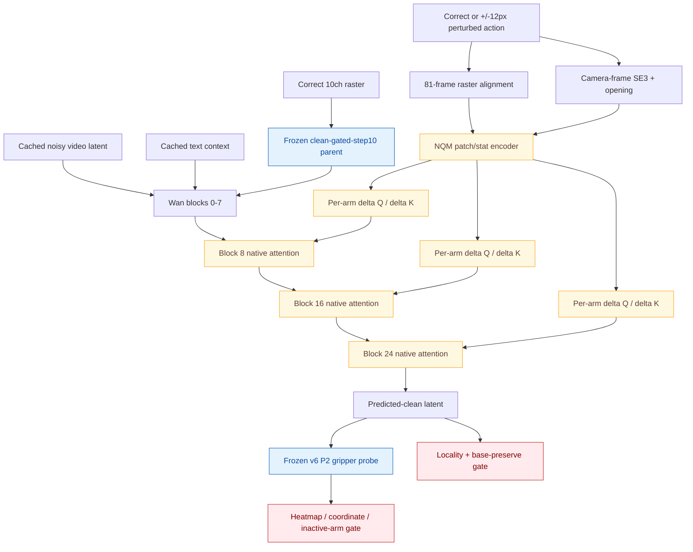

# Wan-Action v12.2-NQM Native Q/K Control 详细实验报告

日期：2026-08-19  
实验名称：`v12.2-NQM-native-qk-control`  
状态：**实现、远端 Torch 回归、零泄漏 canary、GPU6 production smoke、exposure 1–64 训练及 audit64 全部完成。audit64 趋势硬门失败，按合同停止；未运行 exposure 65–128、native-V extension、RGB 解码、fast20 或官方评测。**

---

## 1. 一页结论

v12.2 的工程链路是完整且健康的，但核心 action-causality 假设没有成立。

成立的工程事实：

- 固定 parent 为 `clean-gated-step10`，SHA256 `105fb760fd371885ba362d26ef2352c260755e47cd036f46711181edc3b30ca2`；
- 只在 Wan blocks `8 / 16 / 24` 修改 native Q/K，native V 保持冻结，native Q/K/O 使用 `1e-6`，NQM encoder/projector 使用 `3e-5`；
- 左右 head bank 永久分离：heads `0–11` 只接收 left action，heads `12–23` 只接收 right action；
- frozen raster parent 在 base/perturbed 两路始终读取 correct action，只有 NQM geometry condition 被施加 `±12 px` 水平扰动；
- 4 条 canary 为两条 left-only、两条 right-only，且与 dev-fast20、audit20 零重叠；
- 87,434,368 个可训练参数符合白名单；
- production smoke 的 native、projector、encoder 三类梯度均非零；
- GPU6 峰值 allocated `15,042,641,920 bytes`（约 `14.01 GiB`），reserved `15,611,199,488 bytes`（约 `14.54 GiB`），低于 `22 GiB` 硬门；
- smoke 单步约 `5.20 s`，64 exposures 全程 finite，无 OOM、NaN 或 Inf；
- 64-exposure checkpoint、optimizer、history 和 lineage 均原子保存。

没有成立的机制事实：

| audit64 指标 | 实测 | 趋势门 | 结论 |
|---|---:|---:|---|
| active direction rate | `51.19%` | `>55%` | 接近随机，失败 |
| median cosine | `-0.1987` | `>0` | 方向相反，失败 |
| heatmap loss reduction | `-0.304%` | `>0` | 没有下降，失败 |
| median magnitude ratio | `2.51%` | 128 硬门 `>=25%` | 控制权极弱 |
| inactive / active | `2.7435` | 128 硬门 `<=0.5` | 错误臂响应更强 |
| outside / inside | `1.5348` | 128 硬门 `<=0.75` | 响应不够局部 |
| base-parent position RMS | `0.00365` | 只作稳定性诊断 | base 路径小幅漂移 |

因此严格执行预先批准的停止规则：

```text
direction <= 55%
AND median cosine <= 0
AND heatmap loss does not decrease
    -> stop_action_architecture
```

没有生成 `exposure-0064-gated.pt`，没有启动 exposure128，也没有启用 native V 的附加 64 exposures。

**最终裁决：v12.2-NQM 只保留实现与诊断工具；`exposure-0064.pt` 禁止作为训练 parent、RGB candidate 或提交模型。比赛主线回滚到 `clean-gated-step10`。按照本轮合同，不再设计 v12.3 小分支。**

---

## 2. 实验问题与边界

### 2.1 唯一实验问题

v12.1-PRA 已证明高容量 frozen additive branch 可以改善 FM，却没有形成正确的局部 action Jacobian。v12.2 不再增加 additive video residual，而是把 action 直接写入 native self-attention 的 Q/K：

> 在 frozen parent 始终读取 correct raster 的前提下，continuous per-arm action modulation 能否使最终 predicted-clean gripper heatmap 对 `±12 px` action perturbation 产生方向正确、臂身份正确、局部且有足够幅值的响应？

### 2.2 本轮明确不做

- 不复用 v12.1 exposure256 checkpoint；
- 不使用 PRA top-k/scatter/additive geometry residual；
- 不加入 FM、trajectory loss、counterfactual ranking、Pose FiLM、Depth、JEPA、GAN 或 DMD；
- 不修改 T5、VAE、text context 或 frozen raster parent；
- 不在 trend gate 前解码 RGB；
- 不因为训练 loss finite 就绕过 observed-causality gate；
- 不在 exposure64 失败后继续 exposure128 或 native-V extension。

---

## 3. 架构

### 3.1 总体数据流



### 3.2 Native Q/K modulation

在每个目标 block、native 3D RoPE 之前：

\[
Q' = Q + s_L \Delta Q_L(a_L) + s_R \Delta Q_R(a_R)
\]

\[
K' = K + s_L \Delta K_L(a_L) + s_R \Delta K_R(a_R)
\]

约束：

- heads `0–11` 只允许 left modulation；
- heads `12–23` 只允许 right modulation；
- support 是连续权重，不使用 hard top-k routing；
- `arm_present=0` 时对应 arm modulation 严格为零；
- `force_zero_modulation=true` 时 base/perturbed prediction bitwise identical；
- native V 第一阶段冻结，只有方向和余弦通过但幅值不足时才允许显式解冻。

### 3.3 Action representation

每个 arm/time 使用：

- `60×80` raster 的 `4×4` patch statistics；
- occupancy、EEF subcell、flow、opening；
- local/cumulative camera-frame SE(3) motion；
- gripper opening；
- latent-time position。

action encoder 生成 per-arm、per-time modulation features；左右 tokenizer 可共享局部编码，但最终 Q/K projector 与 head bank 完全分开。

### 3.4 Canary objective

parent 目标来自 frozen-parent P2 heatmap。active arm 的目标 heatmap 按物理扰动平移，inactive arm 保持 parent：

\[
L = L_{heatmap\_KL}
  + 0.1 L_{coordinate}
  + 0.25 L_{inactive}
  + 0.25 L_{locality}
  + 0.25 L_{base\_preserve}
\]

本轮故意不含 FM。这样避免模型通过更好地拟合原视频背景取得低 loss，却不响应 action perturbation。

---

## 4. 数据、回放与泄漏合同

### 4.1 Canary-4

| arm | sample | task | 有效 P2 帧 |
|---|---|---|---:|
| left | `place_container_plate__...__episode_000038` | place_container_plate | 14 |
| left | `shake_bottle_horizontally__...__episode_000016` | shake_bottle_horizontally | >=12 |
| right | `shake_bottle_horizontally__...__episode_000006` | shake_bottle_horizontally | >=12 |
| right | `stack_bowls_two__...__episode_000019` | stack_bowls_two | >=12 |

筛选要求：

- high-confidence single-arm dominant；
- probe observable；
- 排除 crossing、contact ambiguity 和 unsafe geometry；
- 两条 left-only、两条 right-only；
- 与 dev-fast20 和 audit20 严格零重叠。

### 4.2 Replay

- reliable diffusion timestep：`800`；
- 固定 sample/noise/timestep；
- perturbation signs 在 `+12 px / -12 px` 间交替；
- replay 上限 `192`，但只有 gate 明确批准才能越过 `64 / 128`；
- canary SHA256：`e53eac6ec8e3208f2eaeda155fed4fc9360641847e3dab778ca0a64ac381346a`；
- replay SHA256：`386b53530e77118a09d55cf25d46763098d7face74e88a5f3f527830bc334138`。

---

## 5. 实现与验证

### 5.1 主要实现文件

- `src/worldarena_baseline/wan_v122_data.py`
- `src/worldarena_baseline/wan_v122_nqm.py`
- `src/worldarena_baseline/wan_v122_model.py`
- `src/worldarena_baseline/wan_v122_objective.py`
- `src/worldarena_baseline/wan_v122_training.py`
- `src/worldarena_baseline/wan_v122_gate.py`
- `scripts/train_wan_v122_nqm.py`
- `scripts/run_wan_v122_nqm_gpu6.sh`

### 5.2 回归测试

远端正式 Torch 环境执行：

```text
tests/test_wan_v122_data.py
tests/test_wan_v122_gate.py
tests/test_wan_v122_nqm.py
tests/test_wan_v122_model.py
tests/test_wan_v122_objective.py
tests/test_wan_v122_training.py
tests/test_wan_v122_scripts.py

24 passed
```

覆盖：

- canary 选择与 zero leakage；
- signed replay；
- per-arm Q/K head ownership；
- zero-init、null action 与 arm absence；
- modulation-before-RoPE；
- parent action 始终 correct；
- trainable whitelist 与 native-V fail-closed；
- objective 中没有 FM shortcut；
- 64/128/192 gate；
- GPU6-only launcher、路径与 topology 合同。

### 5.3 Smoke 前发现并修复的张量合同错误

第一次 smoke 在第一次 backward 之前 fail closed：

```text
ValueError: NQM support/latent geometry differs
```

远端实际张量证据：

```text
cached latent       (48, 21, 30, 40)
target clean        (1, 48, 21, 30, 40)
target heatmap      (1, 21, 2, 60, 80)
native support      (1, 2, 21, 15, 20)
upsampled support   (1, 2, 21, 30, 40)
```

根因不是空间分辨率，而是 objective 错把 support 校验成 `(B,T,2,H,W)`，producer 的正式合同一直是 `(B,2,T,H,W)`。旧单测使用 `T=2`，时间轴和 arm 轴长度相同，因而漏检。

修复过程：

1. 新增 `T=3` 的 arm-major support 回归；
2. 远端旧实现按预期 RED；
3. objective 改为显式 `(B,2,T,H,W)`，沿 dim=1 选择 active arm；
4. 远端完整 focused suite `24/24` GREEN；
5. 重新生成 source receipt 和 preflight 后才重新使用 GPU6。

修复后的 source closure SHA256：`88550cf648a42ec01883d76e98c54242e7a9c34bb729edaf23c1740ef96cc122`。

---

## 6. Preflight 与 production smoke

### 6.1 Preflight

| 项 | 结果 |
|---|---|
| topology | physical GPU6 / world size 1 |
| trainable params | 87,434,368 |
| native V | frozen |
| force-zero base/perturbed | exact equal |
| parent SHA | `105fb760...` |
| probe SHA | `300b4c6a...` |
| frozen target aggregate SHA | `d71e6d47...` |
| source closure SHA | `88550cf6...` |

### 6.2 Production smoke

smoke 包含一次 warmup，随后重置 CUDA peak，再执行三次完整：

```text
forward base
forward perturbed
objective
backward
optimizer.step
zero_grad
```

| 指标 | 结果 |
|---|---:|
| step time | `5.199 / 5.206 / 5.211 s` |
| peak allocated | `15,042,641,920 bytes`，约 `14.01 GiB` |
| peak reserved | `15,611,199,488 bytes`，约 `14.54 GiB` |
| memory gate | `<22 GiB`，通过 |
| native gradients | 非零 |
| projector gradients | 非零 |
| encoder gradients | 非零 |

smoke artifact SHA256：`c7aa7b0049b7dcd8dfd3b962b4a4d45cd8e4d08de4a32178c988e8e4d9b87046`。

---

## 7. Exposure 1–64 训练日志摘要

### 7.1 训练健康度

| 指标 | exposures 1–8 mean | exposures 57–64 mean | 变化 |
|---|---:|---:|---:|
| heatmap KL | `1.68802` | `1.67483` | `-0.78%`，很弱 |
| coordinate | `4.8395e-5` | `4.6938e-5` | `-3.01%` |
| inactive | `1.9088e-9` | `2.9481e-9` | 增加 |
| locality | `1.0238e-4` | `1.2222e-4` | 增加 |
| base preserve | `1.1409e-4` | `1.2928e-4` | 增加 |
| grad norm | `4.6856` | `4.4449` | 稳定 |

全程 grad norm 范围：`1.9020–9.1512`。训练计算健康，但 heatmap 只在训练 replay 上微降；独立双符号 audit 并未确认这种微降转化为正确 action response。

### 7.2 Checkpoint

- 路径：`/data/di/worldarena2_track1_20260815/runs/v12.2-nqm-native-qk-control/gpu6/exposure-0064.pt`
- 大小：`539,510,333 bytes`
- SHA256：`745c2dfbe73e6dfe0b18dac10c16a6da79ceaf0f96f1fcf631bb18aa9ad628db`
- 用途：只允许复现/审计；禁止作为 parent、RGB candidate 或提交模型。

---

## 8. Audit64 详细结果

### 8.1 聚合指标

```json
{
  "active_direction_rate": 0.5119047761,
  "median_cosine": -0.1986875534,
  "median_magnitude_ratio": 0.0251377523,
  "inactive_active_ratio": 2.7435283661,
  "outside_inside_ratio": 1.5347712040,
  "heatmap_loss_reduction": -0.0030397889,
  "base_parent_position_rms": 0.0036456148,
  "eligible_cases": 8,
  "finite": true
}
```

### 8.2 双符号 episode 结果

| sample | arm | sign | direction | cosine | magnitude | inactive/active | outside/inside | heatmap reduction |
|---|---|---:|---:|---:|---:|---:|---:|---:|
| place_container_plate 38 | L | + | 42.86% | -0.261 | 2.51% | 1.23 | 1.53 | -1.80% |
| place_container_plate 38 | L | - | 38.10% | -0.230 | 5.00% | 2.74 | 1.98 | -1.09% |
| shake_bottle 16 | L | + | 42.86% | -0.199 | 0.77% | 4.24 | 2.25 | +0.74% |
| shake_bottle 16 | L | - | 66.67% | +0.049 | 1.53% | 4.31 | 1.17 | -0.26% |
| shake_bottle 6 | R | + | 52.38% | +0.033 | 2.67% | 0.45 | 2.93 | +0.04% |
| shake_bottle 6 | R | - | 57.14% | +0.158 | 2.28% | 1.29 | 2.54 | +0.19% |
| stack_bowls 19 | R | + | 42.86% | -0.215 | 8.66% | 3.06 | 1.33 | -0.95% |
| stack_bowls 19 | R | - | 66.67% | +0.326 | 5.42% | 4.12 | 1.33 | +0.70% |

不存在稳定的 arm、task 或 perturbation sign 正趋势。偶发正 cosine 不能抵消整体随机方向、弱幅值和严重 inactive-arm leakage。

Audit artifact：

- 路径：`/data/di/worldarena2_track1_20260815/runs/v12.2-nqm-native-qk-control/gpu6/audit-0064.json`
- SHA256：`f167dd6abff8130f1455ee93389eb3d9946b9a0f93faa8a7865c2421da45f677`

---

## 9. 根因判断

这轮可以排除：

- NQM 没接到 Wan；
- trainable whitelist 错误；
- Q/K/O 或 encoder 没梯度；
- 显存不足；
- parent/action pair 混淆；
- canary 数据泄漏；
- perturbation 没有可靠 P2 target；
- support 空间分辨率错误；
- 训练代码没有执行。

剩余最符合证据的判断是：

> 在当前 frozen-parent + 三个 native Q/K modulation block + 小规模 heatmap canary 下，优化器可以改变最终 latent，但这些变化没有被稳定绑定到 active arm 的目标方向。native Q/K modulation 提供了参数容量，却没有形成足够强、局部且臂隔离的视觉控制权。

这与 v12.1 的负结果一致，但证据更强：v12.2 已经删除 additive PRA residual，直接修改 native attention relation，仍然没有通过最早趋势门。因此问题不再适合用“再加一层、调一个 LR、解冻 V、延长 exposures”解释。

---

## 10. 最终裁决与后续边界

### 10.1 保留

- canary-4 high-confidence single-arm selector；
- fixed reliable-sigma replay；
- frozen-parent heatmap target 与物理 `±12 px` 双符号 perturbation；
- base-correct / NQM-perturbed 因果隔离；
- arm-major support 合同回归；
- direction / cosine / magnitude / inactive / locality observed gate；
- NQM 实现作为研究参考，不作为当前比赛训练分支。

### 10.2 淘汰

- `exposure-0064.pt` 作为 parent 或候选；
- exposure65–128；
- native-V extension；
- v12.2 RGB 解码与 fast20；
- v12.3 小 Adapter/side-branch/LoRA 变体；
- 在相同 canary 上继续调 rank、层数、LR 或 support 阈值。

### 10.3 比赛主线

```text
回滚并冻结 clean-gated-step10
    -> 补齐 dev-clean50 WorldArena + VLM + JEPA profile
    -> 保护最终生成/评测窗口
    -> 不再把剩余时间投入未通过 E2 的 action architecture
```

若未来有更长研发周期，下一步不再是小分支，而应是 broader native Wan action-conditioned fine-tuning、更多 action-video 数据和直接 trajectory-aligned supervision；这不属于本轮 bounded competition experiment。

---

## 11. 证据索引

### 11.1 远端正式产物

- `/data/di/worldarena2_track1_20260815/runs/v12.2-nqm-native-qk-control/source-receipt.json`
- `/data/di/worldarena2_track1_20260815/runs/v12.2-nqm-native-qk-control/data/receipt.json`
- `/data/di/worldarena2_track1_20260815/runs/v12.2-nqm-native-qk-control/gpu6/preflight.json`
- `/data/di/worldarena2_track1_20260815/runs/v12.2-nqm-native-qk-control/gpu6/smoke.json`
- `/data/di/worldarena2_track1_20260815/runs/v12.2-nqm-native-qk-control/gpu6/exposure-0064.pt`
- `/data/di/worldarena2_track1_20260815/runs/v12.2-nqm-native-qk-control/gpu6/audit-0064.json`

### 11.2 关键 lineage

| 资产 | SHA256 |
|---|---|
| source closure | `88550cf648a42ec01883d76e98c54242e7a9c34bb729edaf23c1740ef96cc122` |
| canary | `e53eac6ec8e3208f2eaeda155fed4fc9360641847e3dab778ca0a64ac381346a` |
| replay | `386b53530e77118a09d55cf25d46763098d7face74e88a5f3f527830bc334138` |
| parent | `105fb760fd371885ba362d26ef2352c260755e47cd036f46711181edc3b30ca2` |
| frozen target aggregate | `d71e6d47067760c1d339e93a436d7ddf853fef6abf8d09601b23b6c8d335871c` |
| checkpoint64 | `745c2dfbe73e6dfe0b18dac10c16a6da79ceaf0f96f1fcf631bb18aa9ad628db` |
| audit64 | `f167dd6abff8130f1455ee93389eb3d9946b9a0f93faa8a7865c2421da45f677` |
| smoke | `c7aa7b0049b7dcd8dfd3b962b4a4d45cd8e4d08de4a32178c988e8e4d9b87046` |

---

## 12. 一句话结论

> v12.2 已把 action 从 additive side branch 提升为 native Q/K relation modulation，并通过了所有工程门，但 exposure64 对物理 `±12 px` action perturbation 仍只有 51.19% 随机方向、负 cosine、2.51% 幅值和严重跨臂/空间泄漏；因此按预先合同停止整个小型 action-architecture 分支，回滚 `clean-gated-step10`，不再继续 v12.3。
