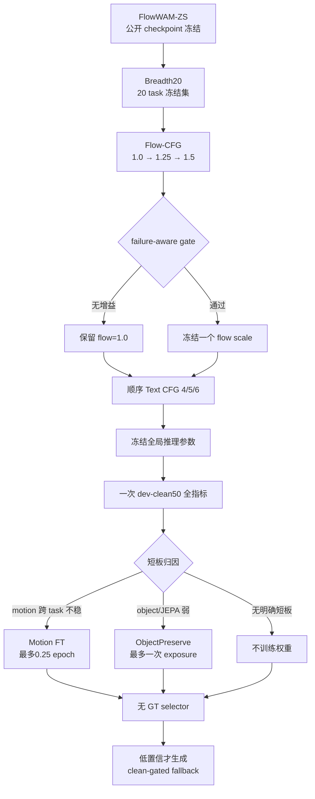

# v15 FlowWAM Balanced Campaign 实验报告

全版本总谱系入口：`reports/2026-08-24-wan-action-v1-v15-total-experiment-report.md`

## 1. 当前结论

截至 2026-08-24，v15/v16 原预注册冲分分支均已按 receipt 闭环。当前证据充分且不可覆盖的
回滚冠军是 **Official FlowWAM Stage-1 / flow20 / seed4**：其独立 dev-clean50 完整15项均为
有限值，15项未加权均值由 seed1 的 `0.656995` 提升到 `0.658660`。v16 q/v LoRA step50
通过 matched Breadth20 门，但未获得完整 clean50 画像；step100 只提升一个主质量指标，按冻结
门禁停止且不运行 step200。SeedVR2 在第三次且最后一次 4090 memory repair 后仍于 chunked
RoPE OOM，正式停止。

因此当前上线回滚合同保持官方 Stage-1 权重不变，只冻结 `seed=4` 与既有 `flow_scale=20`
推理配置。v16 step50 作为有正证据但证据层级较低的研究备选保留，不替换冠军；不再扩 seed、
prompt、Motion FT、SeedVR2 或新 action 生成架构。此历史闭环不包含随后批准的 Adaptive
Candidate System；后者必须独立通过 zero-overlap holdout 与 corrected-score clean50 门，才能
改变最终部署裁决。

## 2. 进入 v15 的证据

v14 在固定 dev-fast20 上相对 `clean-gated-step10` 得到：

- 13 胜 / 5 负 / 2 平；全20条 paired win 65%；
- valid episode 11/20 → 13/20；
- mean frame coverage 0.135802 → 0.380247；
- 共同有效6条全部获胜，mean DTW 0.207973 → 0.051040；
- 双方 black fraction 均为0。

因此 v15 的第一原则是保护这一正证据，而不是重新发明 action representation。

## 3. 冻结候选与架构平衡



固定候选：

1. `FlowWAM-ZS`：v14 主模型，checkpoint 永不覆盖；
2. `FlowWAM-Tuned`：只改变全局 Flow-CFG / Text CFG；
3. `clean-gated-step10`：低置信 fallback；
4. 最多一个由 profile 触发的短 FT 或 refine 候选。

## 4. Flow-CFG 数学合同

为了保持 `flow_scale=1.0` 与 v14 数值等价，同时只增加一次正文本、零动作前向：

```text
v_base = v_neg_flow + text_cfg * (v_pos_flow - v_neg_flow)
v_out  = v_base + (flow_scale - 1) * (v_pos_flow - v_pos_zero)
```

其中 `v_pos_zero` 使用同一正文本和全白 zero-flow latent。这样：

- `flow_scale=1.0` 精确退化为 v14；
- Flow-CFG 增量只来自 desired-flow 与 zero-flow 的差；
- 不把 text CFG 和 action CFG 混成笛卡尔积；
- sweep 只允许 `1.0 / 1.25 / 1.5`，text CFG 只允许 `4 / 5 / 6`。

## 5. 运行合同

- 物理 GPU：只允许 GPU6；
- GPU0–5 和 GPU7 的现有任务不停止、不重启、不占用；
- 持久产物：仅 `/data/di/worldarena2_track1_20260815`；
- checkpoint SHA256：`e211e32b6b79b293f7dec1a70794a69c3c1bf922483c06aef3c5f6d5c3be96c4`；
- Breadth manifest：沿用查看输出前冻结的 v14 audit20，20条且跨 task；
- resolution / frames / sampling：480×640 / 81 / 50；
- seed：20260820；
- current CFG：5；
- Flow-CFG 选择完成前，Text CFG 不启动；
- profile 触发前，任何权重训练不启动。

新增生成采用 hash-bound sidecar：只有视频字节与 sidecar SHA256 一致才允许断点复用；partial 视频不冒充完成产物。

## 6. 已完成验证

TDD RED：v15 模块缺失时6项核心测试失败；launcher 和 resume 合同随后分别先失败再实现。

本地：

```text
tests/test_flowwam_v15.py + tests/test_flowwam_v14.py
31 passed, 4 skipped（Torch optional）
py_compile PASS
bash -n PASS
git diff --check PASS
```

远端正式 venv：

```text
tests/test_flowwam_v15.py + tests/test_flowwam_v14.py
35 passed
launcher dry-run PASS
```

覆盖的关键行为：scale=1保持v14、Flow增量隔离、非白名单超参拒绝、顺序sweep、failure-aware gate、无GT selector字段白名单、checkpoint/manifest receipt、hash-bound resume。

## 7. 当前后台状态

2026-08-20 18:44 CST，三组 Breadth20 视频全部完成：`FlowWAM-ZS=20/20`、`flow-1.25=20/20`、`flow-1.5=20/20`，三个 receipt 的显存门均通过。19:33 CST 已将三组候选和 GT 合并为单次 pinned SAM3 staging，避免重复检测，正式评测正在 GPU6 上运行。

```text
SAM3 PID:        2209094
compare watcher: 2211939
续跑 watcher:    2215260
GPU6:            ~4.7 GiB, 88%
staging:          60 generated + 20 GT
trajectory:       12/80（2026-08-20 19:39 CST）
```

路径：

```text
root:    /data/di/worldarena2_track1_20260815/runs/v15-flowwam-balanced
videos:     .../breadth20/{flowwam-zs,flow-1.25,flow-1.5}
staging:    .../breadth20-sam3/staging
sam3 log:   .../logs/breadth20-sam3.log
compare log:.../logs/breadth20-compare-watcher.log
```

SAM3 将依次处理 GID1=ZS、GID2=1.25、GID3=1.5 和同一 GT。compare watcher 在80/80轨迹齐全后自动生成 failure-aware 比较；不会静默丢弃 detector-invalid episode。为了避免比较结束后 GPU6 空转，新增续跑 watcher：它只根据预注册 trajectory/coverage/black 门生成明确标记为 `final_freeze=false, quality_gate=pending` 的临时 Flow scale，随后自动生成 Text CFG=4/6；CFG=5 直接复用对应的既有 Flow 视频，不重复生成。最终 Flow scale 仍必须通过质量/身份门后才能冻结。

## 8. Flow-CFG Breadth20 正式裁决

2026-08-20 23:15 CST，pinned SAM3 已完成全部 `80/80` 视频，`Processed=80 / Skipped=0`。首次比较在最终 JSON 写入阶段失败，根因是官方 scorer 的 `valid` 字段实际为 `numpy.bool_`；数值计算和80条轨迹产物均未受影响。新增严格 JSON 回归后，仅在 `_score` 输出边界转换为 Python `bool`，本地与远端 v15 套件均为 `11/11 PASS`，随后直接复用80条轨迹重跑比较。

| Flow scale | Win/Loss/Tie vs 1.0 | Valid | Common DTW delta | Coverage delta | Black | 裁决 |
|---:|---:|---:|---:|---:|---:|---|
| 1.25 | 3/6/11 | 8 vs 9 | +0.00570 | +0.00802 | 0 | FAIL |
| 1.50 | 5/5/10 | 8 vs 9 | -0.02341 | +0.00679 | 0 | FAIL：decided win仅50% |

两种增强 Flow scale 均未达到预注册 `>=55%` failure-aware paired-win 门，因此临时选择严格回退到 `flow_scale=1.0`。该 receipt 明确记录 `final_freeze=false / quality_gate=pending`，不能冒充最终提交配置。

23:18 CST，Text-CFG 自动续跑已进入 `CFG=4.0 / flow=1.0` 模型加载，进程 PID `2396032`；随后自动运行 CFG=6，CFG=5 直接复用既有 FlowWAM-ZS 视频。

2026-08-21 00:33 CST，`CFG=4.0` 已完成 `20/20` 并写入 hash-bound receipt；`CFG=6.0` 已完成 `4/20`，GPU6 约14.5 GiB、利用率100%。Text-CFG 评测 watcher PID `2447283` 已独立启动：等待 CFG6 receipt 后，自动将 CFG4/6 各20条转换为相同81帧 SAM3 staging，复用 CFG5 与 GT 的既有 pinned 轨迹，仅检测40条新增视频，再输出 failure-aware CFG4/5/6 比较和 `final_freeze=false / quality_gate=pending` 临时候选。预计 trajectory 候选结果在01:50–02:10 CST形成。

## 9. 后续裁决

Flow-CFG 候选相对1.0必须同时满足：failure-aware paired win ≥55%、共同有效 DTW 正改善、coverage不降、black=0、质量/身份无明显回归。否则保持1.0。

完整 Breadth20 profile 后：

- trajectory 跨 task 不稳：只允许 `FlowWAM-FT-Motion`；
- trajectory强但 object/JEPA弱：只允许 `FlowWAM-FT-ObjectPreserve`；
- 没有明确短板：不进行权重训练。

任何短训练都不能覆盖 `FlowWAM-ZS`，并必须保留 clean-gated fallback。

## 10. Official FlowWAM 链路复核与执行（2026-08-21）

在 Text-CFG 收口的同时，后续路线切换为先穷尽公开 FlowWAM WorldArena 推理链，不启动新权重训练：

```text
当前自有 FlowWAM-ZS Top-1
        ├─ 官方 SeedVR2 Stage-2 refiner
        └─ 官方原生 Stage-1 参数链
                 ↓
        同一 Breadth20 failure-aware 比较
                 ↓
        Top-1 + incumbent 一次 dev-clean50 全指标
```

固定的公开 FlowWAM WorldArena source 为：

```text
path:   /home/huazhi/nlh/FlowWAM_WorldArena
commit: f06fa46042e97738c6619c868f1097be6749d48d
```

官方 shell 的 Stage-1 参数已从代码而不是 README 推断：`121 frames / flow max magnitude 20 / max stride 3 / max rollouts 2 / seed 1 / sigma 5 / 50 steps / 640×480 / flow 320×240`，且只编码 positive prompt，不存在 Text-CFG。Python parser 的默认 flow magnitude虽为25，但官方 shell显式传20，因此后续官方原生对照固定使用20。

SeedVR2 固定到 Hugging Face revision `37255ff8cccfb01071b87f635a5948ca8d53117c`：

| 文件 | 大小 | LFS SHA256 |
|---|---:|---|
| `seedvr2_ema_3b.pth` | 13,566,090,228 | `6bcc5ac59447e97b100477480aebb01be2ec724c8340bb83faae21f64848604b` |
| `ema_vae.pth` | 1,002,691,902 | `c7df8a67e68b7f9aca3d5d2153d2ce8ab4373687741a0f9ce87cb356ace51cac` |

下载采用单 worker、固定 revision、代理续传，输出只在 `/data/di/worldarena2_track1_20260815/models/FlowWAM_WorldArena/stage_2`。2026-08-21 01:34 CST 已下载约0.74GB；服务器只发现这一条模型下载，实测速率约0.9MB/s，接近10Mbps链路上限，因此没有重启或增加并发，避免破坏 partial 与抢占同事带宽。

新增可复现 refiner runner：

- 固定官方 source commit、SeedVR revision 和两份权重 size/SHA；
- `alpha=0.7 / seed=666 / one step / target area=720×1280`；
- 保留官方 `NaResize` 原宽高比结果作为 native 输出，再生成精确640×480 submission副本；
- 输入、native、submission逐视频记录SHA256，支持严格断点续跑；
- 所有持久输出强制位于正式 `/data/di` root，且物理GPU只允许6；
- 本地与远端 scoped tests：`17 passed`，远端 CPU-only dry-run 对当前 Breadth20 20/20 PASS。

WorldArena evaluator 仍固定在 `7b3feee108427bee3380064bb5154970ed7468b5`。2026-08-21 对官方 main 最新 `a555a5e93f31fb84127438774ad1e2b414657692` 做路径级比较，`video_quality_ood/` 无任何文件差异；因此保持旧SHA既保证结果可复现，也与当前最新 Track-1 evaluator代码一致。当前 Breadth20 仍只是开发评测，不冒充最终 test-1000。

Text-CFG 自动评测第一次在 staging 阶段退出，原因仅是非交互 shell 找不到 `ffmpeg`。40个源视频均完整。已将现有静态 ffmpeg 复制到本项目 `/data/di/.../bin`，不下载新包；重新启动后3240帧 staging完成并进入GPU6 SAM3。01:34 CST 为 `10/40` trajectory，预计约25分钟完成。

官方 Stage-1 RGB4 输入已从冻结 Breadth20 前4条构建，包含2个偏单臂与2个双臂/交接任务；大HDF5采用同文件系统hardlink，不产生重复数据占用。receipt绑定原manifest和4组action/robot-only/first-frame/instruction SHA256。Stage-1-only runner通过显式 identity refiner调用原官方main，从而只关闭SeedVR2、保留其余Stage-1代码和参数；GPU6 watcher PID `2507299` 等待Text-CFG SAM3结束后自动接卡。

SeedVR2首次HTTP连接在VAE下载到约0.82GB时因服务端 `IncompleteRead` 退出；partial完好。下载已改为同一revision、单worker、最多100次的断点自动重试，PID `2511660`，01:44 CST partial已增长至约0.94GB，证明从断点继续而非重头开始。隔离Python3.10环境已创建；refiner watcher PID `2510487` 只会在两文件size/SHA通过后安装官方Torch2.3/Flash2.5.9/Apex环境，并在Stage-1结束、GPU6连续空闲后启动20条refiner。

## 11. A/B/C 官方链实际执行（2026-08-21）

### 11.1 A：Custom-v15 参数冻结

Flow-CFG 与 Text-CFG 两轮顺序 sweep 均已结束，最终开发配置保持：

```text
flow_scale = 1.0
text_cfg   = 5.0
```

Text-CFG=4 相对 CFG=5 为 `6胜/4负/10平`，但共同有效 mean DTW 从
`0.14406` 恶化到 `0.15234`（`+0.00828`）；Text-CFG=6 为
`4胜/6负/10平`，coverage `-0.00247`，共同有效 mean DTW 从
`0.14607` 恶化到 `0.15537`（`+0.00930`）。两者均未通过冻结门。
正式选择文件：

```text
/data/di/worldarena2_track1_20260815/runs/v15-flowwam-balanced/gates/selected-text-cfg.json
```

### 11.2 B：Official FlowWAM Stage-1 RGB4

官方 Stage-1 RGB4 已完成。121帧 native 输出按固定合同重采样为81帧：

```text
select=not(eq(mod(n,3),2)), setpts=N/(24*TB), output fps=24
```

这一合同保留 frame0，并从每3帧删除第3帧；错误的 `fps=16 -r24` 路径曾产生
122帧，已在评测前发现、废弃并重建，未进入任何分数。

Official Stage-1 相对 Custom-v15 的 RGB4 failure-aware 结果：

| 指标 | Custom-v15 | Official Stage-1 | 变化 |
|---|---:|---:|---:|
| paired W/L/T（Official视角） | — | 3/1/0 | PASS |
| valid episode | 3/4 | 3/4 | 持平 |
| mean frame coverage | — | — | `+0.46605` |
| 共同有效 mean DTW | 0.20422 | 0.08447 | `-0.11975`，约改善58.6% |
| black | 0 | 0 | PASS |

因此 B 已通过 RGB4 晋级门。结构化结果：

```text
/data/di/worldarena2_track1_20260815/runs/flowwam-official/stage1-rgb4/custom-v15-vs-official-stage1.json
```

### 11.3 B：Official Stage-1 Breadth20

Breadth20 使用冻结的20-task manifest，而不是早期4-task×5的开发列表。输入首帧合同
为原始 `240×320` PNG；官方 runner 内部再变换到 `640×480`。20条生成、121→81
重采样和 pinned SAM3 均已完成，`Processed=20 / Skipped=0`。

| 指标 | Custom-v15 | Official Stage-1 | 变化 |
|---|---:|---:|---:|
| failure-aware W/L/T（Official视角） | — | 18/2/0 | 90% paired win |
| valid episode | 9/20 | 19/20 | +10 episodes |
| mean frame coverage | — | — | `+0.54630` |
| 共同有效 episode | 8 | 8 | matched |
| 共同有效 mean DTW | 0.15388 | 0.06815 | `-0.08573`，约改善55.7% |
| black | 0 | 0 | PASS |

结果已写入：

```text
/data/di/worldarena2_track1_20260815/runs/flowwam-official/stage1-breadth20/custom-v15-vs-official-stage1.json
```

### 11.4 C：Official Stage-1 + SeedVR2 3B

两份 SeedVR2 权重已经完成 size/SHA256 校验；隔离环境和 FlashAttention 编译也已完成。
官方默认 Stage-2 在单张4090上两次于 VAE encode 前后触发显存不足，第二次是在没有并发
GPU作业时复现，因此不是编译或抢卡问题，而是 DiT 与 VAE 同驻GPU造成的峰值。

新增 `flowwam-seedvr2-memory-safe-4090/1` 调度只改变设备驻留与 VAE chunk
上限，不改变权重、采样步数、seed、alpha或数学输出：VAE encode 前把 DiT offload到
CPU，encode结束后把VAE移回CPU并恢复DiT；VAE conv/norm memory limit固定0.5。
本地与远端聚焦测试均 `8 passed`，CPU dry-run合同通过。

为避免未经真实验证就跑4条，C采用严格两级门：

```text
Breadth20 + SAM3 完成
        ↓
GPU6 连续三次空闲
        ↓
SeedVR2 单视频 memory-safe smoke
        ↓ PASS
Official RGB4 全4条
```

排队进程随后按合同执行单视频 smoke。显存安全调度越过了原 VAE OOM 点，但在首个
Euler/DiT forward 遇到 `CUDA error: no kernel image is available for execution on the device`。
使用 `CUDA_LAUNCH_BLOCKING=1` 已稳定复现到 SeedVR2 modulation 的
`torch.cat([e.repeat(...)])` 路径；独立 FlashAttention、FP16/BF16/FP8 repeat 最小测试
均通过，说明不是整个 Torch/4090 环境失效，但 C 尚无成功 RGB 产物。按 fail-closed 规则，
C 没有进入RGB4或候选比较，GPU6已释放。
产物根：

```text
/data/di/worldarena2_track1_20260815/runs/flowwam-official/seedvr2-official-rgb4-memory-safe
```

### 11.5 当前裁决边界

- B 已通过 Breadth20：18/20 paired win、coverage大幅提升、共同有效DTW约改善55.7%、black=0。
- C 真实 smoke FAIL；测试通过不能冒充模型结果，当前不再占用GPU预算。
- 当前 Top-1 冻结为 Official FlowWAM Stage-1，下一步只运行一次 dev-clean50 的
  WorldArena + VLM + JEPA；当前结果仍不是官方 test-1000。

## 12. Top-1 dev-clean50 与 ATR 收敛执行（2026-08-21）

Official Stage-1 已冻结为不可覆盖 Top-1；SeedVR2/4090 路线停止，不再修复或重跑。
冻结 dev-clean50 为5个task×10 episode，共50条。初次 staging 发现40条原始HDF5尚未
解压，但对应4个 archive 已在正式 `/data/di` snapshot 中。解压前逐文件验证：

- Hugging Face repo/revision：`YixiangChen/FlowWAM_RoboTwin@506c4e...e2714`；
- archive size 与完整 snapshot manifest 一致；
- 下载 metadata 的LFS ETag与实际文件SHA256一致；
- safe extractor 的路径、磁盘预算和archive检查全部通过。

4个task共约6.99GB解压完成，50条 action/robot-only HDF5、unseen prompt和首帧均已
写入 hash-bound input receipt。16:04 CST，GPU6 已加载 Official Stage-1，PID
`3154461`，开始生成第一条 `grab_roller`；物理卡隔离仍为GPU6，其他卡未访问。

ATR 在CPU侧按 TDD 实现：API接收显式 generated/action timestamps，对每个action time
选择最近generated frame，距离相等时确定性选择较早帧；非有限和非严格递增timestamp
均 fail closed。本地与远端聚焦测试均 `11 passed`。数据审计同时确认当前HDF5没有独立
timestamp dataset；在现有固定帧率、相同首尾时长合同下，ATR索引精确等于现有
`0,1,3,4,...,120`。因此当前不生成字节等价的ATR副本，也不重复跑SAM3；只有取得真实
非均匀timestamp后才允许形成新候选。

dev-clean50 生成完成后按唯一顺序运行 SAM3 trajectory/coverage、WorldArena base、VLM、
JEPA和aggregate；在完整profile产生前不启动训练、第二seed或任何新超参搜索。

### 12.1 dev-clean50 生成、ATR 与 Trajectory 结果（2026-08-22）

Official Stage-1 已完成冻结 dev-clean50 的 `50/50` 条生成。所有输出均按正式提交合同从
121帧重采样为81帧，并通过 package validator：`generated=50`、`GT=50`、
`summary=50`。由于本批数据没有独立非均匀 timestamp，ATR 的 nearest-timestamp 映射与
既有固定映射 `0,1,3,4,...,120` 完全一致；因此本轮结果可同时视为 ATR 合同验证，不能把
它表述为一次额外的候选调参。

固定 evaluator commit：
`7b3feee108427bee3380064bb5154970ed7468b5`。SAM3 对 generated 与 GT 共100段视频完成
`100/100` 检测，没有静默跳过或缺失数组。Trajectory Accuracy 最终结果为：

| 指标 | 结果 |
|---|---:|
| dev-clean50 mean NDTW | **30.689** |
| variance | 508.07546024 |
| sample count | 50 |
| zero-score episode | 0/50 |

按 task 分组：

| Task | mean NDTW |
|---|---:|
| grab_roller | 20.5921 |
| open_microwave | 31.5161 |
| press_stapler | 27.6151 |
| put_object_cabinet | 27.1915 |
| stack_bowls_three | 46.5302 |

结果文件：

```text
/data/di/worldarena2_track1_20260815/official_track1_eval/checkpoints/step-0400/dev-clean-50/output/trajectory_accuracy/pinned-result.json
```

SHA256：
`14f013b23f5d1047b099e73e37d0ac97654af7a0438156f2bdb06c452ef084be`。

固定 commit 的统一 `evaluate.py` 无法直接导入，原因是该 commit 的 git tree 内存在
`WorldArena/__pycache__/action_following.cpython-310.pyc`，但缺少
`WorldArena/action_following.py`；本地与远端 git tree 已交叉确认，不是 checkout 漂移。
本轮没有修改 evaluator source，也没有替换评分算法，而是通过 `importlib` 直接加载同一
固定 commit 的 `trajectory_accuracy.py`，调用其 `compute_trajectory_accuracy` 得到上述
结果。该兼容边界必须随结果一起保留，不能把它描述为统一入口完整跑通。

### 12.2 当前完成边界

- 已完成：Official Stage-1 dev-clean50 生成50/50、ATR/package、SAM3 100/100、官方
  Trajectory Accuracy。
- 尚未完成：WorldArena Base 其余维度、WorldArena_VLM、WorldArena_JEPA 与最终
  aggregate。当前缺少12项官方权重输入，因此 **30.689 只是 dev-clean50 Trajectory
  结果，不是15项完整 profile，更不是官方 test-1000 分数**。
- GPU6 已释放；不启动 FlowWAM-DA 或任何新训练分支。后续只允许已冻结 Official
  Stage-1 的有限推理候选。

### 12.3 Flow sweep、JEPA 恢复与 seed2（2026-08-22）

在同一 Breadth20、同一 81-frame ATR/SAM3 管线下，`flow_max_magnitude=16/20/24`
均无黑帧。按预先冻结的排序（black gate、coverage、failure-aware paired win、共同有效
DTW），默认 `flow20` 保持胜者：

| Flow | valid | paired win/loss | common-valid DTW |
|---|---:|---:|---:|
| 16 | 20/20 | 16/4 | 0.07724 |
| **20** | 19/20 | **18/2** | **0.06815** |
| 24 | 19/20 | 17/3 | 0.08028 |

选择凭据：`/data/di/worldarena2_track1_20260815/runs/flowwam-official/automation/flow-selection.json`。
因此只对 `flow20` 启动 matched `seed2`；不会扩展 flow 值、Text CFG、SeedVR2 或训练。

JEPA 首次全量运行发现 JEDi 的默认 `DataLoader(num_workers=4)` 在模型初始化后无特征输出
地阻塞（GPU 利用率持续为 0）。以同一权重、同一输入做的 `num_workers=0,max_samples=1`
smoke 已成功写入 `results.json`，因此官方调用被最小化地固定为 `--num_workers 0` 后重跑。
该修复和根因证据记录于远端 `automation/jepa-dataloader-deadlock.json`；其结果仍须以
`jepa.complete.json` 与 `output_JEDi/results.json` 为准。

### 12.4 Seed 选择、JEPA 结果与 VLM 阻塞（2026-08-22）

`flow20` 的 matched seed sweep 已完成。所有候选均通过黑帧门禁；按同一冻结排序，
**seed4** 是当前唯一推理候选：

| seed | valid | paired win/loss | coverage delta | common-valid DTW |
|---|---:|---:|---:|---:|
| 1 | 19/20 | 18/2 | 0.546296 | 0.068154 |
| 2 | 20/20 | 17/3 | **0.561728** | 0.068721 |
| 3 | 20/20 | 17/3 | 0.554321 | 0.062832 |
| **4** | **20/20** | **18/2** | 0.554321 | **0.057797** |

选择凭据：`runs/flowwam-official/automation/seed-selection.json`。此选择只表示同口径
Breadth20 的推理筛选胜者；尚未等价于 dev-clean50 或 test-1000 的完整综合分数。

JEPA 已在修复后的官方 JEDi 路径完成，`jepa.complete.json` 与
`output_JEDi/results.json` 均存在，JEDi 值为 **0.9578326941**。它是 dev-clean50
完整 profile 中已补齐的一项，不应与 Trajectory 相加后自行解释为最终 EWMScore。

VLM 仍未完成：Qwen3-VL-8B-Instruct 的初次下载在一个分片完成后发生 HuggingFace Xet
CAS response-body decode error；禁用 Xet 的顺序直连重试连续26分钟没有新增分片或日志，
已停止而非无限等待。两次失败的结构化凭据分别为
`automation/vlm-xet-download-failure.json` 与 `automation/vlm-direct-download-stall.json`。
因此 Base 和 aggregate 尚未启动，当前不得声称获得15项完整 profile。

### 12.5 VLM 恢复完成与 Base 权重准备（2026-08-22）

上一节记录的 Hugging Face 下载阻塞已通过官方 ModelScope 镜像恢复。Qwen3-VL-8B-Instruct
的四个权重分片均完成下载和 SHA256 校验，随后按固定 evaluator commit
`7b3feee108427bee3380064bb5154970ed7468b5` 对同一批 dev-clean50 视频运行
WorldArena_VLM。`vlm.complete.json` 已写入，输入视频验证为 `50/50`，推理结果无错误
episode。三个归一化开发集均值为：

| WorldArena_VLM 指标 | valid | mean normalized score |
|---|---:|---:|
| Instruction Following | 50/50 | **0.692** |
| Interaction Quality | 50/50 | **0.664** |
| Perspectivity | 50/50 | **0.892** |

正式结果与完成凭据：

```text
/data/di/worldarena2_track1_20260815/official_track1_eval/checkpoints/step-0400/dev-clean-50/output_VLM/FlowWAMOfficialStage1/FlowWAMOfficialStage1_summary_val_all_intern.json
/data/di/worldarena2_track1_20260815/official_track1_eval/checkpoints/step-0400/dev-clean-50/receipts/vlm.complete.json
```

因此截至本节，已完成的正式开发评测阶段为：package、Trajectory、JEPA 和 VLM；其中
JEPA JEDi 为 **0.9578326941**，Trajectory mean NDTW 为 **30.689**。Base 与 aggregate
仍未完成，不能将当前部分结果表述为完整15项 profile。

Base 当前处于官方依赖权重准备阶段。Qwen2.5-VL-7B-Instruct 已完成全部 `16/16` 文件，
接着顺序下载 OpenAI CLIP `ViT-L/14` 与 `ViT-B/32`，之后才继续 aesthetic predictor、
RAFT、SEA-RAFT、VFIMamba、MUSIQ 与 DINO。GPU6 在权重准备期间保持空闲；所有权重就绪后，
既有自动链会取得 `gpu6.eval.lock`，运行 Base，再运行 aggregate。为避免影响同机其他任务，
下载保持单流；本次现场采样速率约 **1.08 MB/s**（下载日志约 **1.2 MiB/s**），未使用
整机级网络限速，也未并发增加下载线程。磁盘剩余约 **937 GB**。

### 12.6 Base 权重故障与并行恢复（2026-08-22）

首次 OpenAI CLIP `ViT-L/14` 下载在 904,232,960 字节处停止，但下载器仍进入最终校验，
因而触发 SHA256 mismatch。文件虽然具有 ZIP 头，但缺少 central directory，`torch.jit.load`
同样报 `failed finding central directory`；根因是截断文件，不是 evaluator 版本或模型格式差异。
官方端点声明完整长度为 932,768,134 字节，并支持 byte range。

ModelScope 存在同架构 CLIP 镜像，但公开仓库提供的是 Transformers/Safetensors 形式，不能
直接冒充官方 evaluator 需要的 OpenAI TorchScript `.pt`。因此恢复方案采用官方 URL 断点
补齐并校验，而不是做格式转换。`ViT-L/14` 已补齐至官方长度，并通过固定 SHA256
`b8cca3fd41ae0c99ba7e8951adf17d267cdb84cd88be6f7c2e0eca1737a03836`；随后自动进入
`ViT-B/32` 下载与哈希验证。

为缩短关键路径，权重准备拆成两条有界并行链：A 链处理两个官方 CLIP 权重，限速
4 MB/s；B 链处理 aesthetic predictor、RAFT、SEA-RAFT、VFIMamba、MUSIQ 与 DINO，限速
3 MB/s。两条链各自写入 ready 标志，汇合进程只有在二者完成后才生成
`base-all-weights-ready`，避免 GPU6 在依赖不完整时提前启动 Base。总配置上限约 7 MB/s，
不触碰 GPU0–5/GPU7；既有 GPU6 Base→aggregate 等待链保持不变。

### 12.7 Base 官方打包缺陷与隔离兼容层（2026-08-23）

Base 所需权重最终全部就绪；CLIP 两个权重通过官方 SHA256，SEA-RAFT 使用官方
`MemorySlices/Tartan-C-T-TSKH-spring540x960-M` 权重，并按上游 `strict=False` 合同完成
转换。首次 Base 启动被 pinned-source gate 拒绝，根因仅为 Python 运行时重写了仓库内被
错误纳入 Git 的 tracked `__pycache__/*.pyc`。恢复这些生成缓存后，HEAD 仍固定为
`7b3feee108427bee3380064bb5154970ed7468b5`，源码没有改动。

第二次启动暴露出官方 commit 自身的两项打包不一致：

1. `WorldArena/__init__.py` 导入 `WorldArena.action_following`，但仓库只发布了
   `__pycache__/action_following.cpython-310.pyc`，没有可被普通 import 发现的源码模块；
2. `subject_consistency.py` 导入 `utils.CACHE_DIR`，而同 commit 的 `utils.py` 没有定义该
   名称，且该名称在 subject-consistency 实现中没有实际使用。

为保持 evaluator 算法和 tracked tree 不变，新增了仅对 standard Base 子进程生效的隔离
兼容层：它通过 import hook 加载上述官方 Python 3.10 bytecode，并在 `WorldArena.utils`
加载后补充未使用的 `CACHE_DIR` 兼容属性。action bytecode 被固定为 SHA256
`d00ea626007d577b7ad0c3f0fb44fad66168aafba38fb556376afbe1da5aafb9`；不匹配即 fail closed。
standard evaluator 同时强制使用 `python -B`，防止再次改写官方 tracked bytecode。

本地完整合同测试为 `28/28 PASS`；远端 focused 测试与真实 WorldArena Python 3.10 import
preflight 均通过，且 preflight 后 tracked status 为空。Base 已在 GPU6 以该配置重新启动，
运行日志为：

```text
/data/di/worldarena2_track1_20260815/official_track1_eval/checkpoints/step-0400/dev-clean-50/receipts/base.retry-official-compat.log
```

截至本节写入时，Base 仍在执行，`base.complete.json` 与 `aggregate.complete.json` 尚未生成；
因此仍不能将部分结果表述为完整 profile。自动任务已升级为有界自愈：只允许在固定 commit、
GPU6 lock 和测试/preflight 门禁内修复并重启，连续三个不同修复假设失败后必须停止并报告。

### 12.8 dev-clean50 完整 15 项 profile 完成（2026-08-23）

Base 已完成，随后 aggregate 暴露并修复了 pinned commit 中两项纯聚合缺陷，未重跑视频、
未改变任何 scorer 输出：一是 JEPA 被写到错误字段名 `JEPA_Similarity`；二是 Base 与 VLM
分别产生 `episode000001` 和 `episode_000001` 两种 ID，导致同一批 50 条被拆成 100 行。
此外，官方聚合映射遗漏了 Base 已计算的 `photometric_smoothness`。隔离修复只执行确定性
ID 合并、字段名归位以及原始 photometric 逐条结果回填；遇到值冲突即 fail closed。
本地与远端回归测试均为 **29/29 PASS**。

最终 `aggregated_results.csv` 恰有 50 个唯一 Video_ID，15 个正式开发指标均为 50/50
有效；可选的独立 Action Following 链路未运行，因此该列按合同保持为空。完整均值如下：

| 指标 | valid | mean normalized score |
|---|---:|---:|
| Subject Consistency | 50/50 | 0.798286 |
| Aesthetic Quality | 50/50 | 0.387585 |
| Image Quality | 50/50 | 0.521135 |
| Background Consistency | 50/50 | 0.870120 |
| Dynamic Degree | 50/50 | 0.356577 |
| Interaction Quality | 50/50 | 0.664000 |
| Perspectivity | 50/50 | 0.892000 |
| Instruction Following | 50/50 | 0.692000 |
| Semantic Alignment | 50/50 | 0.911016 |
| Flow Score | 50/50 | 0.262336 |
| Depth Accuracy | 50/50 | 0.995980 |
| Trajectory Accuracy | 50/50 | 0.629107 |
| Photometric Consistency | 50/50 | 0.162124 |
| Motion Smoothness | 50/50 | 0.754825 |
| JEPA Similarity | 50/50 | 0.957833 |

这 15 项的简单算术平均为 **0.656995**，仅作 profile 诊断，不能冒充官方 EWMScore-P
聚合公式。Trajectory 的该列是官方归一化值；此前报告的 raw mean NDTW `30.689` 仍保留
为轨迹分析口径，两者不能混用。

最终凭据和结果：

```text
/data/di/worldarena2_track1_20260815/official_track1_eval/checkpoints/step-0400/dev-clean-50/receipts/base.complete.json
SHA256 bf5ae92828b9a56f42b51fbbf3306771e02596cc29dd067babcc7df45b2cbaeb

/data/di/worldarena2_track1_20260815/official_track1_eval/checkpoints/step-0400/dev-clean-50/receipts/vlm.complete.json
SHA256 5d8451c13f4184672600be7997b62f7096b85b6843f71a49c0de979a44badfb0

/data/di/worldarena2_track1_20260815/official_track1_eval/checkpoints/step-0400/dev-clean-50/receipts/jepa.complete.json
SHA256 8e1102b4b6e7ad9be4f49911f944412cbb09d249de418a184fd5e73b73b62dfd

/data/di/worldarena2_track1_20260815/official_track1_eval/checkpoints/step-0400/dev-clean-50/receipts/aggregate.complete.json
SHA256 4877700dd3017c9cc4fc80a851c8648b067a0f7cb93f99d68222bbdca0991c18

/data/di/worldarena2_track1_20260815/official_track1_eval/checkpoints/step-0400/dev-clean-50/csv_results/aggregated_results.csv
SHA256 e04de337a926007e761b7274e8a4fb8d336e3f82edc7542de1edd61fba6764ad
```

完成时 GPU6 已回到 `6 MiB / 0%`，`/data` 尚余约 `935 GB`。至此 package、Base、VLM、
JEPA 与 aggregate 的正式 dev-clean50 链路全部闭合，完成状态为
`official_full_eval_complete`。

### 12.9 最终冲分分支收敛与执行状态（2026-08-23）

完整 profile 表明当前 Official Stage-1 的 Trajectory、JEPA、Depth 和 Motion Smoothness
均健康，因此停止 Motion FT、ObjectPreserve 和新 action architecture。最终实验树只保留
三个有界候选：Seed4 clean50、SeedVR2 4090 兼容链，以及一个保守 prompt Breadth20。
不再扫描 seed5+、prompt grid 或 Text CFG。

Seed4 已在 Breadth20 得到 `20/20 valid`、相对 seed1 `18胜/2负`，共同有效 mean DTW
为 `0.0577972`；seed1 对应为 `0.068154`。当前 Seed4 clean50 已在 GPU6 启动，固定
Official Stage-1 checkpoint、flow magnitude 20、50 denoise steps，仅将 seed 改为 4。
独立 lineage 为：

```text
/data/di/worldarena2_track1_20260815/runs/flowwam-official/stage1-dev-clean50-seed4
```

SeedVR2 4090 修复遵循不改权重、不改官方 checkout 的兼容原则。已确认三段显存故障链：

1. Apex fused norm 没有 RTX 4090 kernel，首个 DiT forward 报 `no kernel image`；将独立
   兼容配置中的 `fusedrms/fusedln` 改为原生 `rms/layer` 后，该错误消失。
2. Diffusers RMSNorm 一次性将完整 activation 转 FP32，额外申请 722 MiB；改为按 1024
   token 行分块计算同一 FP32 variance，远端 BF16 数值对照 `max_abs=0.0`。
3. 官方多模态 RoPE 先在 GPU 构造固定 `1024×128×128` 频率表，再对完整 Q/K `.float()`，
   分别造成 7.88 GiB 与 722 MiB 峰值；兼容层改为按实际 F/H/W/text extent 生成相同整数
   位置频率，并按 1024 token 行应用 RoPE。

本地相关合同测试为 **17/17 PASS**。最终 SeedVR2 smoke→RGB4 队列已排在 Seed4 clean50
之后，并受同一 GPU6 lock 约束；这是该 4090 分支的第三个、也是最后一个显存修复假设。
若仍不能生成 `smoke.receipt.json`，分支将停止，不再继续兼容性扩展。若成功，则自动进入
RGB4，只有 Trajectory 下降不超过 5%、black=0 且 Image/Aesthetic/Photometric 至少两项
改善时才允许 Breadth20。

整个顺序已交给 15 分钟自动任务 `worldarena-final-score-pipeline`：Seed4 clean50 完成后补
独立 15 项 profile；随后处理最终 SeedVR2 gate；两条 P0 闭合后只跑一次固定 wrapper 的
prompt Breadth20。当前所有结论仍是运行中状态，不将 PID 或部分输出冒充完成 receipt。

### 12.10 v16 Official FlowWAM q/v LoRA 受控微调启动（2026-08-23）

完整 profile 后批准一次极短 domain adaptation，但不新增 action 架构或辅助损失。v16
固定以 Official FlowWAM Stage-1 为 parent，parent SHA256 为
`e211e32b6b79b293f7dec1a70794a69c3c1bf922483c06aef3c5f6d5c3be96c4`；训练数据固定为
`clean-1785.jsonl`，manifest SHA256 为
`6bcc85830fa2c6ccb45b2c3f7f593102674efce6a76a7a6e5d8871fcccdbae35`。

启动前重新以当前 dev-clean50 的精确 50 个 `(task, episode)` 身份做碰撞检查，结果为
`0/50`；因此本轮同时满足原 dev-fast20 零泄漏合同和新增 dev-clean50 零泄漏合同。

官方训练实现的 LoRA 模式会额外解冻整个 FlowStream、time projection/embedding 以及 block
modulation，这不符合本轮可归因实验。v16 通过隔离 subclass 禁止该额外解冻，并在模型
初始化后逐参数重新冻结，fail-closed whitelist 只允许 DiT self/cross attention 的 q/v
LoRA A/B 参数；K/O、MLP、FlowStream、modulation、VAE、T5 和所有 native weights 均禁止
训练。其余合同固定为：rank/alpha `8/8`、LR `2e-6`、batch `1`、gradient checkpointing、
`121×480×640`、flow magnitude `20`，loss 仅保留官方 RGB diffusion objective；不加入
SAM、Depth、JEPA 或 trajectory loss。

现有解压数据只有 640 监督流，而官方 loader 还需要独立 320 条件帧。为避免使用 640
冒充低分辨率输入，v16 只把每个 episode 的第 0 帧以 BICUBIC 从 `640×480` 降为
`320×240`，保存为带 receipt 的 deterministic reference cache；训练时仍由官方 loader
BICUBIC 升至目标尺寸。监督 RGB、robot-only、RAFT flow、instruction 和 episode 身份均
保持原文件，派生缓存不会被表述为官方发布的 320 archive。

执行改为严格分段而非直跑 200：

```text
3-step production smoke
  -> peak allocated/reserved 均 <22 GiB
  -> 0-50 step
  -> matched Breadth20 gate
  -> PASS 才携带 LoRA + optimizer state 到 100
  -> 100 仍有收益才允许 200
```

step50 gate 要求 Trajectory/JEPA 不明显下降、black=0，并且 Instruction、Interaction、
Image Quality 至少两项稳定改善。本地与远端 v16 scoped 合同测试均为 **13/13 PASS**；独立
训练环境和 1785 条低分辨率 reference cache 已完成，data receipt 记录 `rows=1785`、
`dev-clean50 collision_count=0`。环境 preflight 期间发现 `peft 0.20.0` 与官方已有
`transformers 4.38.2` 不兼容，已最小降级为 `peft 0.10.0`，并补齐官方 trainer import
所需的 ModelScope、ftfy、sentencepiece、protobuf 与 pandas；真实 Python 3.10 import
preflight 已通过。GPU6 仍由已在运行的 Seed4 clean50 使用；v16 只有在 production smoke
闭合后才可训练，当前仍不能表述为已开始 optimizer step。

### 12.11 v16 smoke 修复审计与数据尺寸硬阻断（2026-08-23）

Seed4 已生成 `50/50`，有效生成收据实际位于
`stage1-dev-clean50-seed4/output/stage1-only.receipt.json`。SeedVR2 最终 4090 smoke 在首个
DiT RoPE 路径继续因额外申请 `362 MiB` OOM，按既定合同停止，不再追加第四个兼容实验。

v16 smoke 依次暴露并修复了两个启动问题：训练器原先重复从 ModelScope 下载本机已经存在
的 32GB Wan2.2 权重；切到本地权重后，三片 DiT checkpoint 又必须作为同一个 split model
config 交给 DiffSynth。修复后远端 v16 合同测试仍为 **13/13 PASS**，本地 DiT、T5 和 VAE
均被正确识别。随后通过关闭 Accelerate 整模自动搬运、启用 FlowWAM 原生 component CPU
offload，RAFT 与整模争抢显存的问题消失，smoke 已经进入真实 forward。

当前硬阻断不是显存，而是此前数据准备合同错误。逐文件检查证明
`FlowWAM_RoboTwin_extracted` 的 RGB 与 robot-only HDF5 实际均为 `320×240`；v16 的
`dataset/640` 只是指向这些 320 文件的 symlink。原 `leakage.complete.json` 中
`first-frame-640-to-320-bicubic` 的描述因此不成立。官方 dataset 不会自动 resize RGB，
但会把 flow resize 到配置的 `640×480`，最终导致 RGB latent 为 `15×20`、flow latent 为
`30×40`，在 `flow_z[:, :, 0:1] = flow_fz` 前后触发 shape mismatch。

因此 v16 **没有完成 smoke，也没有发生 optimizer step**。GPU6 已释放、lock 已清理。
在未明确批准“从现有 320 数据派生 640 RGB”或改为 320 原生训练前，不继续改写数据合同；
零 dev-clean50 泄漏结论仍成立，但分辨率 provenance 必须更正。

### 12.12 经批准的 320→640 有界验证与 24GB 最终硬门（2026-08-23）

用户明确批准在不覆盖原始 HDF5 的前提下，对现有 `320×240` RGB/robot-only 帧做一次
`640×480` 有界派生验证。该操作不是把现有数据重新定义为“原生 640”，也不声称恢复了
原始高频细节。正式实现为训练时内存内 BICUBIC resize，并采用 fail-closed 尺寸合同：源帧
必须恰好为 `320×240`，目标固定为 `640×480`；任何其他源尺寸立即报错。receipt 合同固定
记录：

```text
rgb_source_resolution = [320, 240]
rgb_target_resolution = [640, 480]
rgb_derivation = in-memory-bicubic-no-source-overwrite
```

官方 FlowWAM 训练设计本应使用彼此独立的 `640/` 高分辨率监督根和 `320/` 条件根。本地
实际来源则是 `YixiangChen/FlowWAM_RoboTwin` 原始归档快照；因此此次 resize 只能作为
4090 可行性实验，不能替代缺失的原生 `FlowWAM_WorldArena/640` 监督数据。BICUBIC 不会
创造新细节，且可能软化机械臂边界、夹爪和小物体纹理，正好会影响本轮希望提升的 Image、
Instruction 与 Interaction 项，所以即使运行成功也必须经过 matched RGB gate 才可能晋级。

修改后远端 v16 scoped 测试仍为 **13/13 PASS**。此前 RGB latent `15×20` 与 flow latent
`30×40` 的 shape mismatch 被消除，smoke 成功进入真实 Wan dual-stream DiT forward，证明
数据尺寸路径与本地权重加载路径均已闭合。但在 Wan RMSNorm/Q 路径又发生最终显存失败：

```text
torch.cuda.OutOfMemoryError: Tried to allocate 110.00 MiB
location: diffsynth/models/wan_video_dit.py, RMSNorm forward
```

失败发生在第一个 production-shape optimizer step 完成之前。最终核验结果为：GPU6
`6 MiB / 0%`、GPU6 lock clear、无 `smoke.complete.json`、无
`train-step50.complete.json`、无 `step-50.safetensors`。因此 v16 的
`121帧 × 640×480 × 5B q/v LoRA` 在单张 RTX 4090 24GB 上未通过既定 `<22 GiB`
production smoke 门，320→640 派生 lineage 不晋级、不训练 step50，也不作为候选模型。

执行结论：若仍要重启该微调假设，必须先取得真正的官方原生 640 监督数据，并迁移至更大
显存 GPU；在当前单卡 4090 上继续追加 activation/runtime 魔改会改变实验边界且风险高于
收益。当前冠军继续保留 Official FlowWAM Stage-1，下一项低风险工作为完成 Seed4 的独立
clean50 全指标评测。

### 12.13 单卡 4090 activation-offload 修复（2026-08-23）

在无法更换硬件的约束下继续追踪后发现，前一轮 OOM 并非 `121×640×480` 在 24GB 上绝对
不可行。trainer 虽配置了 `use_gradient_checkpointing=True`，但 DiffSynth 加载后的
`pipe.dit.training=False`；官方 dual-stream pipeline 用该状态作为 checkpoint 分支条件，
因此执行栈实际走了非-checkpoint 的第 237 行，30 个 block 的双流 activation 持续保留在
GPU。最后在 RMSNorm 申请 110 MiB 失败只是表面触发点。

最小修复只做两项，不改变数据、分辨率、帧数、权重、loss、rank 或 LR：

```text
use_gradient_checkpointing_offload = True
pipe.dit.train()
```

前者使用官方已有的 `torch.autograd.graph.save_on_cpu()` checkpoint 路径；后者保证该路径
不会被 eval 状态静默绕过。合同测试按 RED→GREEN 执行，本地和远端聚焦测试均为
`3/3 PASS`。

独立单步 production probe 已真实完成 forward、backward 和 optimizer step，并生成
`smoke.complete.json`：

```text
steps               1
loss                0.1222396791
loss_rgb            0.1222396791
peak_allocated      14.6389 GiB
peak_reserved       15.0762 GiB
elapsed             75.76 s
passed              true
```

这证明单卡 RTX 4090 24GB 可以维持 v16 的 `121帧 × 640×480 × q/v LoRA` 计算合同，代价是
activation 经 CPU offload 后单步约 76 秒。正式 bounded launcher 已以 PID `1032881`
重新启动：先运行 3-step production smoke，只有生成根 lineage 的
`smoke.complete.json` 后才自动进入 step50；任何 smoke 失败都会由脚本立即停止，不能以
PID 存活代替 receipt。

正式 3-step smoke 随后闭合并生成根 lineage receipt：`steps=3`、
`peak_allocated=14.6634 GiB`、`peak_reserved=15.1367 GiB`、`passed=true`；三步 RGB
loss 分别为 `0.12224 / 0.11726 / 0.12098`。launcher 已按门禁自动进入 step50；首次核验
时完成 step4，GPU6 利用率 `97%`，无 traceback/OOM。`train-step50.complete.json` 尚未
生成，因此当前状态严格记为“训练中”。

step50 随后完成并生成正式 receipt：`steps=50`、`passed=true`、
`peak_allocated=14.6666 GiB`、`peak_reserved=15.1738 GiB`。LoRA checkpoint
`step-50.safetensors` 为 12 MiB，optimizer state `optimizer-step-50.pt` 为 23 MiB；两者均
存在。GPU6 已释放、lock clear，训练日志无 OOM/Traceback。本轮严格停在 step50，不自动
续训 100/200；下一阶段是将 Official Stage1 parent 与该 q/v LoRA 以独立推理适配叠加，
在冻结 Breadth20 上执行 matched gate。

### 12.14 v16 step50 matched inference 启动（2026-08-23）

step50 checkpoint 是 240 个 PEFT LoRA 张量，覆盖 30 blocks 的 self/cross attention q/v，
即 120 对 A/B；它不是完整 Stage1 checkpoint，不能替换 `--full_path`。推理适配因此保持
Official Stage1 parent 不变，并在官方 `enable_vram_management()` 完成后调用 Wan pipeline
原生 `load_lora(..., hotload=True)`，adapter scale 固定为 `alpha/rank=8/8=1.0`。runner
fail-closed 要求：LoRA keys 恰好 240、每个 A 都有 B、rank 恰好 8、q/v pair 恰好 120，
且 hotload 后 AutoWrappedLinear 的实际 coverage 必须为 120。

本地 pipeline 合同测试 `18/18 PASS`；远端正式 Python 环境 dry-run 通过并正确记录 parent、
LoRA、rank/alpha、seed1、flow20 和 max-episodes。远端全测试中出现的 4 个 subprocess 失败
来自 test process 的 `sys.executable` 被外部 lingbot Python 3.12 污染，不是正式 runner
失败，因此以正式 `venv_reuse` preflight 为准。

真实单视频 preflight 已在 GPU6 启动，PID `1078780`，输入冻结 Breadth20 的首个匹配样本，
输出 lineage 为 `v16-qv-lora-clean1785/breadth20-preflight1`。只有 receipt 记录
`loaded_pairs=120`、视频数为 1 且视频非黑/可解码后，才允许启动完整 Breadth20。

### 12.15 v16 step50 Breadth20 生成闭环与 matched 评测（2026-08-23）

单视频 preflight 已真实生成 `121帧 × 640×480` 视频；OpenCV 可完整解码且非黑。随后完整
Breadth20 使用与 Official Stage1 incumbent 完全相同的冻结20条输入、seed1、flow20、50步
采样和官方 parent，唯一变化是 hotload v16 step50 q/v LoRA。生成于 PID `1093422` 完成并
写入正式 `stage1-only.receipt.json`：视频 `20/20`，parent SHA256 为
`e211e32b...be96c4`，LoRA SHA256 为 `37ab801d...1fff42`，实际 loaded pairs 为 `120`，
rank/alpha 为 `8/8`，adapter scale 为 `1.0`；日志无 OOM/Traceback。

独立视频门已对20条逐帧解码，全部满足 `121帧、640×480、black=0`，结果写入：

```text
/data/di/worldarena2_track1_20260815/runs/flowwam-official/v16-qv-lora-clean1785/breadth20-step50/video-validation.complete.json
```

matched SAM3 评测已在中央 `gpu6.eval.lock` 下启动。121→81 使用与 incumbent 相同的固定
映射 `select=not(eq(mod(n,3),2))`；GT 复用冻结 v15 Breadth20 GT trajectory，incumbent
复用既有 Official Stage1 pinned SAM3 trajectory，只有 v16 的20条视频重新检测。轨迹结果
将写入 `official-stage1-vs-v16-step50.json` 与 `trajectory-gate.complete.json`。在这两个
receipt 和后续 Instruction/Interaction/Image/JEPA 门完成前，v16 不得续训 step100。

SAM3 已完成 `20/20` 并写入 trajectory receipt。相对完全同口径的 Official Stage1
seed1/flow20 incumbent，v16 step50 得到：

| 指标 | Official Stage1 | v16 step50 | 变化 |
|---|---:|---:|---:|
| valid episode | 19/20 | **20/20** | +1 |
| mean coverage | — | — | **+0.01420** |
| failure-aware paired W/L/T | — | **11/9/0** | 正向 |
| common-valid mean DTW | 0.06770 | **0.05756** | -0.01014，改善约15.0% |
| black | 0 | 0 | PASS |

因此 v16 step50 通过 trajectory/coverage/black 保护门，但这还不是最终晋级。下一阶段只补
预注册的 Instruction、Interaction、Image Quality 和 JEPA matched 门；至少
Instruction/Interaction/Image 两项提升、JEPA不明显下降才允许恢复 step100。

质量评测使用两个独立正式 package lineage：step0100 绑定 incumbent，step0200 绑定 v16，
两者各20条、各自 receipt，不覆盖 step0400 dev-clean50。第一次启动因模块文件被同步到错误
目录而在创建 package 前 fail-fast；已确认两个 package root 均不存在后修正唯一文件路径并
重启，没有复用或混入半成品。

### 12.16 Breadth20 质量门 JEPA 权重复用修复（2026-08-23）

incumbent VLM 已完成 `20/20` 并生成 `receipts/vlm.complete.json`。进入 JEPA 后发现评测链
并未使用传入的 `--model_dir`：官方 `batch.py` 最终以无参数 `JEDiMetric()` 初始化，当前
`videojedi` 因而固定从进程工作目录读取 `vith16.pth.tar` 与
`ssv2-probe.pth.tar`。原先只创建 `pretrained_models -> weights/jepa` 目录链接并不能命中
该查找路径，导致重复从 `dl.fbaipublicfiles.com` 下载约 10.4GB encoder；下载至 1.3GB 时
预计仍需两小时以上。

服务器已有完整 pinned JEPA 权重，且 step0400 正式 profile 已使用同一份文件。因此最小
修复是在每个独立 `jedi_runtime` 工作目录直接创建两个只读来源软链接，并在目标不是预期
软链接时 fail-closed；同时质量 launcher 增加 VLM/JEPA/Image 各阶段 receipt 断点判断，
避免修复重启后重复运行已完成的44分钟 VLM。测试按 RED→GREEN 执行：本地相关合同
`44/44 PASS`，远端 JEPA 聚焦测试 `2/2 PASS`，shell syntax 通过。

只终止了属于本任务的独立进程组 `1217822`，未触碰其他 GPU 或用户进程；未完成下载被
保留为可恢复文件 `vith16.pth.tar.partial-20260823T1940`。质量链以 PID `1264444` 从 VLM
receipt 断点重启，日志已明确显示从本地 `jedi_runtime/vith16.pth.tar` 加载，进程树中无
`wget`。当前 `quality-gate.complete.json` 尚未生成，step100 继续锁定。

首次本地权重启动又暴露出独立的 Python multiprocessing 边界问题：评测命令继承的
`TMPDIR` 是 checkpoint 下的长路径，DataLoader worker 创建 AF_UNIX resource-sharer socket
时超过系统路径上限。第二个最小修复仅将 bounded JEPA 的 `TMPDIR` 固定为
`/tmp/worldarena-jepa-<step>`；本地合同增至 `45/45 PASS`、远端聚焦测试 `2/2 PASS`。新链
PID `1273271` 从 VLM receipt 再次恢复后，incumbent JEPA 已完成并生成正式 receipt，分数为
`0.945533216`；随后已自动进入 incumbent Image-only。没有更改 evaluator、视频、权重或模型
参数，step100 仍保持锁定。

incumbent Image-only 随后完成并生成 receipt，`Image Quality=0.5208677350`；质量链已进入
candidate VLM，首次核验进度为 `5/20`、单条约138秒。当前日志中的 AF_UNIX traceback 均为
修复前历史内容，重启后的 JEPA、Image 两阶段没有新增错误。

最终汇总前的 fail-closed 检查发现 incumbent VLM receipt 是伪完成：20条 JSON 行都存在，但
每条 `metrics={}` 且 `error` 为 GPU7 OOM。原因是 bounded VLM 没有显式覆盖
`CUDA_VISIBLE_DEVICES`，官方 `device_map="auto"` 可见并使用了任务范围外的 GPU，且旧
`require_phase_outputs()` 只校验行数和视频名，没有拒绝 episode error/空指标。Candidate VLM
虽然产出了完整指标，也无法证明只使用 GPU6，因此同样不作为 matched 证据直接复用。

第三个也是本轮最后一个修复假设做了两项合同收紧：bounded phase 强制
`CUDA_VISIBLE_DEVICES=6`；VLM output gate 要求20条均无 error，且
Interaction/Perspectivity/Instruction 三个 normalized score 都是 `[0,1]` 内有限值。相关本地
合同 `47/47 PASS`、远端聚焦测试 `2/2 PASS`。旧 incumbent receipt/output 被保留为
`invalid-gpu7-20260823`，旧 candidate VLM 被保留为 `pre-gpu6-only-20260823`；JEPA 与
Image receipts 均保留。质量链以 PID `1323123` 从两侧 VLM 阶段重跑，启动后 GPU6 占用约
17.5GB、利用率27%，环境实测 `CUDA_VISIBLE_DEVICES=6`。只有两侧新 VLM receipts 和最终
quality-gate receipt 生成后才允许做 step100 决策。

### 12.17 Seed4 receipt 闭环与 SeedVR2 最终停止（2026-08-23）

Seed4 dev-clean50 实际已完成生成：`output/FlowWAMOfficialStage1_test` 下共
`50/50` 条 MP4，原始生成 receipt 也已在 `output/stage1-only.receipt.json`。队列
wrapper 误报失败的唯一原因是它检查了 lineage 根目录，而生成器把 receipt
写入 `output/`。已对 receipt 中50条 SHA256 逐一重算，并用 OpenCV 逐帧解码
全部视频；每条都是 `121帧、640×480`，文件非空，且没有 receipt 外的多余
MP4。通过门禁后，仅在 lineage 根目录增加了指向原始 receipt 的相对软链接
`stage1-only.receipt.json -> output/stage1-only.receipt.json`，没有改写任何视频或
receipt 内容。

SeedVR2 4090 最终第三次 memory repair 已在同一条 smoke 的首个 DiT forward
结束：unfused norm 和 VAE memory-safe 路径已越过，但 bounded/chunked RoPE 在
`apply_chunked()` 中为 `torch.empty_like(values_hld)` 再申请 `362 MiB` 时发生 CUDA
OOM。队列 PID `847553` 已退出，且没有 `smoke.receipt.json` 或
`full.receipt.json`。按预注册的“第三个 memory repair 仍失败则停止”门禁，
SeedVR2 分支正式停止，不开启第四个兼容实验。

GPU6 当前仅继续 v16 step50 matched quality 的两侧 VLM 重跑，该链强制
`CUDA_VISIBLE_DEVICES=6`。在 `quality-gate.complete.json` 产生前，v16 step100 仍锁定。

### 12.18 v16 step50 质量门通过并恢复 step100（2026-08-23）

GPU6-only 的两侧 VLM 均已完成 `20/20`，且生成新的有效 receipt。最终
`quality-gate.complete.json` 决策为 `allow_step100`：

| 指标 | Official Stage1 | v16 step50 | 变化 |
|---|---:|---:|---:|
| Interaction | 0.7100 | **0.7200** | +0.0100 |
| Image Quality | 0.52087 | **0.52201** | +0.00114 |
| Instruction | **0.7100** | 0.7000 | -0.0100 |
| JEPA | 0.94553 | **0.94608** | +0.00055 |

结合已通过的 trajectory 门（valid `19→20`、coverage `+0.01420`、common-valid DTW
`0.06770→0.05756`、paired `11/9/0`、black=0），v16 满足“JEPA不降、轨迹不降、
Interaction/Image 两项上涨”的预注册门禁。

新增了仅用于 `50→100` 的分阶段恢复启动器，要求质量 receipt 明确
`passed=true` 且 `decision=allow_step100`，并在中央 GPU6 `flock` 下加载原
`step-50.safetensors` 和 `optimizer-step-50.pt`。它不重跑 smoke，不改 parent、
rank/alpha、LR、数据、分辨率、loss 或 q/v target。远程合同测试 `7/7 PASS`后，
step100 已以 PID `1425066` 启动；成功仍必须由 `train-step100.complete.json`、
`step-100.safetensors` 和 `optimizer-step-100.pt` 三者共同证明。

### 12.19 v16 staged resume 显式恢复修复（2026-08-23）

step100 首次恢复启动暴露了两个独立的 resume 合同缺口：官方 module 对
ModelLogger 产生的相对 DiT key 报告 `Loaded 0 LoRA keys into DiT`；同时
Accelerate prepare 后加载的 AdamW state 仍在 CPU，首个 optimizer step 因 state 与
parameter 的 device/dtype 不一致而失败。该次运行未产生 step51，故没有污染新
checkpoint；原日志已保留为 `train-step100.failed-zero-lora-optimizer-device-20260823.log`。

最小修复增加 fail-closed staged-resume helper：对 step50 safetensors 强制验证且显式加载
`240` 个 q/v-only key、`120` 对 A/B、rank=8，并在加载后逐 tensor 做精确相等
校验；对 resumed AdamW state 则在 optimizer step 前对齐到对应 parameter 的
device/dtype，`step` tensor 保持 PyTorch 允许的 CPU float32。远程聚焦测试
`9/9 PASS`。修复后 PID `1436362` 的真实恢复 contract 记录
`resumed_lora_pairs=120`，且已完成 step51：loss `0.12223`，峰值 allocated/reserved
`14.64/15.08 GiB`，证明已越过首个 forward/backward/optimizer 门禁。

### 12.20 GPU0 并行 Seed4 完整15项评测（2026-08-23）

用户明确授权当晚使用 GPU0–6，GPU7 仍为禁止边界。多卡不用于改变 v16
单卡训练合同；GPU6 继续 step100，唯一高收益并行项 Seed4 完整评测放到
GPU0，GPU1–5 保持空闲。

Seed4 评测使用全新的正式 lineage：

```text
/data/di/worldarena2_track1_20260815/official_track1_eval/checkpoints/step-0600/dev-clean-50
```

模型名为 `FlowWAMOfficialStage1Seed4`，复用 pinned evaluator/env/weights，但不覆盖 step0400
Seed1 或 step0100/0200 v16 Breadth20 结果。runner 在独立
`gpu0.seed4.eval.lock` 下严格串行 `package → base → VLM → JEPA → aggregate`，
每阶段都要求 complete receipt。为使用已在布局合同中支持的独立 step600
开发 lineage，full-eval CLI 的 checkpoint choices 仅从 `(200,400)` 扩展为已存在的
`EXTENDED_FORMAL_CHECKPOINTS=(200,400,600)`；没有改 evaluator 或指标。远程聚焦测试
`39/39 PASS`后，GPU0 runner PID `1444213` 已启动并进入 package staging。

### 12.21 step100 完成与 Seed4 GT 检测开关修复（2026-08-24）

v16 `50→100` 训练已由三项产物闭环：`train-step100.complete.json`、
`checkpoints/step-100.safetensors`、`checkpoints/optimizer-step-100.pt`。receipt 记录
`start_step=50`、`steps=100`、`resumed_lora_pairs=120`，峰值 allocated/reserved 为
`14.6659/15.1855 GiB`；LoRA 与 optimizer 文件 SHA256 分别为
`445b811e301a7e70658a4c8179ba64da38ec52b222b87465a1ebf079719bb285` 和
`bfa60478fbf389d4cf19df3e45d9c3d4ece15f330933b89fbb2dcf2f646f7aff`。随后创建独立
`breadth20-step100` lineage，并在中央 GPU6 lock 下启动 seed1、flow20、121帧、
640×480 的 matched Breadth20 生成；仍需 generation receipt、20条视频验证、
trajectory/JEPA/VLM/Image 门禁共同决定是否允许 step200。

Seed4 Base 首次完成50条 generated trajectory 后退出，根因不是模型或显存，而是 pinned
`detection_tracking.py` 的历史 CLI 将 `--detect_gt` 定义为 `action=store_false`；Base
launcher 传入该参数，实际关闭了 GT 轨迹生成，随后官方 trajectory metric 因
`gt_dataset/.../traj/traj.npy` 缺失而 fail closed。新增命令合同回归测试先稳定复现失败，
随后仅从 Base detection argv 删除该反向开关；本地该模块 `32/32 PASS`、远端
`32/32 PASS`。失败日志保留为
`full-eval-gpu0.failed-inverted-detect-gt-20260823.log`，GPU0 链已从现有50条 generated
trajectory 续跑 GT，不重做 Seed4 视频，也不复用/冒充 Seed1 指标。

### 12.22 v16 step100 最终门禁与停止决定（2026-08-24）

step100 的独立 matched Breadth20 已生成并验证 `20/20` 条 `121帧、640×480` 视频，
black=0；VLM 为 `20/20` 且 error=0。相对完全同口径 Official Stage1 incumbent：

| 指标 | Official Stage1 | v16 step100 | 变化 |
|---|---:|---:|---:|
| Interaction | 0.7100 | **0.7200** | +0.0100 |
| Image Quality | **0.5208677** | 0.5195890 | -0.0012787 |
| Instruction | **0.7100** | 0.7000 | -0.0100 |
| JEPA | 0.9455332 | **0.9479611** | +0.0024279 |
| valid episode | 19/20 | **20/20** | +1 |
| coverage | — | — | +0.0271605 |
| common-valid mean DTW | 0.0676968 | **0.0571438** | -0.0105531 |
| paired W/L/T | — | 7/13/0 | — |

轨迹、JEPA 与 black 门通过，但 Instruction/Interaction/Image 三个预注册主质量指标中仅
Interaction 上升；最终 receipt 因而为 `passed=false`、`decision=stop_v16_at_step100`。
没有启动 step200。step100 gate 位于：

```text
/data/di/worldarena2_track1_20260815/runs/flowwam-official/v16-qv-lora-clean1785/breadth20-step100/quality-gate.complete.json
```

其 SHA256 为 `1ed2c984f7692bd28c0c62ca257f70e48fe183126fbe1fa0d69bb4b377ed4461`。
v16 最佳点回退为 step50；step50 gate SHA256 为
`6447d1cc5f49231b1ce5918b77810ff3b79eb9f3bd8cdf0f63dc43411c4eeece`，LoRA checkpoint
SHA256 为 `37ab801d3f04125a2dc0fe1ce6924dd90d84577c518bd18812a0806c9c1fff42`。

### 12.23 Seed4 JEPA 卡死修复与完整15项闭环（2026-08-24）

Seed4 package、Base、VLM 均完成后，JEPA 表面仍持有约3GB GPU0 显存，但持续约2.5小时
GPU利用率为0，且只生成 `intersection_names.json`。进程 wait channel 与日志共同证明根因：
evaluator 将 checkpoint 下的长路径写入 `TMPDIR`，PyTorch multiprocessing resource sharer
继续拼接 socket 名后超过 AF_UNIX 108-byte 上限，DataLoader feeder 反复抛出
`OSError: AF_UNIX path too long`，父进程阻塞在 `do_wait`。

修复按 RED→GREEN 执行：回归测试先证明 JEPA 命令仍继承长 TMPDIR，随后仅对 JEPA
command env 使用系统短目录 `/tmp`，其余 evaluator/cache 路径保持数据域隔离。本地完整
evaluator 测试 `32/32 PASS`，远端同一测试 `32/32 PASS`。只终止了 Seed4 自身进程组
`1521115`，失败日志保留为：

```text
/data/di/worldarena2_track1_20260815/runs/flowwam-official/stage1-dev-clean50-seed4/full-eval-gpu0.failed-jepa-tmpdir-20260824.log
```

修复后的 receipt 明确记录 `TMPDIR=/tmp`。JEPA 得分为 `0.9567664861679077`，随后 aggregate
自动完成。五个正式收据均存在：

```text
/data/di/worldarena2_track1_20260815/official_track1_eval/checkpoints/step-0600/dev-clean-50/receipts/package.complete.json
/data/di/worldarena2_track1_20260815/official_track1_eval/checkpoints/step-0600/dev-clean-50/receipts/base.complete.json
/data/di/worldarena2_track1_20260815/official_track1_eval/checkpoints/step-0600/dev-clean-50/receipts/vlm.complete.json
/data/di/worldarena2_track1_20260815/official_track1_eval/checkpoints/step-0600/dev-clean-50/receipts/jepa.complete.json
/data/di/worldarena2_track1_20260815/official_track1_eval/checkpoints/step-0600/dev-clean-50/receipts/aggregate.complete.json
```

aggregate receipt SHA256 为
`834137eec209870a4c00063640bc3def6175bdd2c9852de4c883e2668eafad69`；最终 CSV 为
`csv_results/aggregated_results.csv`，SHA256 为
`4304828918719322f622f06d61c8a7c0650d7b9597d407386c2f4366fabaa2e7`。CSV 共50行，以下
15项每项均有50个有限值；legacy `Action Following` 空列不计入15项：

| 指标 | Seed1 | Seed4 | Seed4 - Seed1 |
|---|---:|---:|---:|
| Subject Consistency | 0.798286 | 0.797553 | -0.000733 |
| Aesthetic Quality | 0.387585 | **0.389571** | +0.001985 |
| Image Quality | **0.521135** | 0.520689 | -0.000446 |
| Background Consistency | **0.870120** | 0.869634 | -0.000486 |
| Dynamic Degree | 0.356577 | **0.357140** | +0.000562 |
| Interaction Quality | 0.664000 | **0.668000** | +0.004000 |
| Perspectivity | **0.892000** | 0.884000 | -0.008000 |
| Instruction Following | 0.692000 | **0.704000** | +0.012000 |
| Semantic Alignment | 0.911016 | **0.926963** | +0.015947 |
| Flow Score | **0.262336** | 0.261372 | -0.000964 |
| Depth Accuracy | **0.995980** | 0.994602 | -0.001378 |
| Trajectory Accuracy | 0.629107 | **0.630883** | +0.001776 |
| Photometric Consistency | **0.162124** | 0.159870 | -0.002255 |
| Motion Smoothness | 0.754825 | **0.758854** | +0.004029 |
| JEPA Similarity | **0.957833** | 0.956766 | -0.001066 |
| 15项未加权均值（仅作同口径方向判断） | 0.656995 | **0.658660** | +0.001665 |

### 12.24 最终冠军、停止分支与上线动作（2026-08-24）

最终冠军冻结为 **Official FlowWAM Stage-1 / flow20 / seed4**。理由是它是唯一在本轮新候选中
同时具备50条完整生成验证、正式 package/base/VLM/JEPA/aggregate receipts 和完整15项有限
指标的候选，并且同口径15项未加权均值高于 seed1。主要收益集中在 Instruction、Semantic、
Interaction、Motion Smoothness、Aesthetic 与 Trajectory，符合完整 profile 暴露的目标短板。

v16 step50 在 matched Breadth20 上有真实正收益，但仅有7项门禁证据，没有独立 clean50 完整
15项画像；因此保留为研究备选，不在最终上线前替换证据更完整的 seed4。v16 step100 已门禁
失败，step200 不运行。SeedVR2 已按第三次 repair 上限停止。prompt variant、Motion FT、更多
seed、训练或架构实验均不再启动。

剩余唯一动作是按既有服务合同上线 Official Stage-1，并冻结 `flow_scale=20`、`seed=4`；上线后
仅做服务健康检查与提交端到端 smoke，不再改变模型选择。GPU0 与 GPU6 已释放。

### 12.25 v16-step50 × seed4 × LoRA scale 最终实验（2026-08-24）

为闭合“step50 只在 seed1/scale1.0 下评过”的最后证据缺口，固定 step50 LoRA SHA256
`37ab801d3f04125a2dc0fe1ce6924dd90d84577c518bd18812a0806c9c1fff42`、seed4、flow20、
20条、121帧、640×480，只扫描已批准的 inference scale `0.50/0.75/1.00`。每组均通过
generation receipt、video validation、20/20 SAM3、VLM逐行无error且有限、Base/JEPA有限与
black=0。快速九项均值使用 Instruction、Interaction、Perspectivity、Image、Aesthetic、
normalized Photometric、JEPA、`1-DTW`、coverage。

| scale | fast mean | Δ vs Official+seed4 | common DTW | JEPA | Instr. | Inter. | Persp. | Image | Aesthetic | Photometric | 结果 |
|---:|---:|---:|---:|---:|---:|---:|---:|---:|---:|---:|---|
| Official+seed4 | 0.716048 | — | 0.051752 | 0.944844 | 0.730 | 0.740 | 0.930 | 0.517448 | 0.417318 | 0.216574 | incumbent |
| 0.50 | 0.712895 | -0.003153 | 0.050372 | 0.943039 | 0.700 | 0.740 | 0.930 | 0.519164 | 0.418915 | 0.215307 | reject |
| 0.75 | 0.712950 | -0.003098 | 0.060261 | 0.943600 | 0.710 | 0.740 | 0.930 | 0.518746 | 0.417751 | 0.216716 | reject |
| 1.00 | 0.715295 | -0.000753 | 0.053727 | 0.944762 | 0.720 | 0.750 | 0.920 | 0.519879 | 0.419408 | 0.217335 | reject |

没有候选达到 `+0.003`；scale0.75 还未通过 trajectory 门。最终 selection receipt 为
`winner=null`、`decision=freeze_official_seed4`，因此按预注册合同不运行任何 LoRA 候选
clean50，正式冠军仍是 `Official Stage-1 / flow20 / seed4`（完整15项均值
`0.6586597567502485`）。

```text
/data/di/worldarena2_track1_20260815/runs/flowwam-official/v16-qv-lora-clean1785/breadth20-step50-seed4-scale050/quality-gate.complete.json
/data/di/worldarena2_track1_20260815/runs/flowwam-official/v16-qv-lora-clean1785/breadth20-step50-seed4-scale075/quality-gate.complete.json
/data/di/worldarena2_track1_20260815/runs/flowwam-official/v16-qv-lora-clean1785/breadth20-step50-seed4-scale100/quality-gate.complete.json
/data/di/worldarena2_track1_20260815/runs/flowwam-official/v16-qv-lora-clean1785/seed4-scale-selection.complete.json
```

gate SHA256：scale050
`5474c52382897bae5610a47f6239ce5cb88446f939c3013b1534c81b360e5aa3`、scale075
`dfbe5965a677caf4c6b39c777c635fa6f32bf1d091058a75be7a50efada23d38`、scale100
`4b2e7d8e40e662909b556694239cf53c38ec17c9f13f8c16bb0e158a8080c792`；selection
`398d60330e96cae5952e83f794d3bb290685007d4b76a3d3aa97f3007c2e1513`。

同轮完成两个零生成成本检查：seed1/seed4 episode oracle 为 `0.6683917311343808`，相对 seed4
上限 `+0.009731974384132314`，两边各赢25条。原轮次按旧中间带规则不投资 selector；这一
判断已被 2026-08-24 新批准的 zero-overlap Adaptive Candidate System 合同取代。编码链确认生成器
只编码一次、package 不转码。上线硬门为返回/打包 MP4 SHA256 必须等于 generator receipt SHA。
receipt 分别为：

```text
/data/di/worldarena2_track1_20260815/runs/flowwam-official/automation/seed1-seed4-oracle.complete.json
/data/di/worldarena2_track1_20260815/runs/flowwam-official/automation/track1-output-encoding-audit.complete.json
```

快速 gate 首次 finalizer 读取了 raw Photometric `1.568996`，而门禁要求官方 normalized
per-video 值 `0.216574`。最小修复改为从 `generated_results.json` 提取 normalized 结果，新增
回归测试并在本地/远端 `4/4 PASS` 后续跑；没有改变候选、形状、阈值或其他指标。

## 12.26 Adaptive Candidate System 后续主线（2026-08-24 实时状态）

该主线不重新扫 seed，也不覆盖本报告的 v15/v16 失败/通过结论。它仅围绕已知 seed1/seed4
互补性，在完全不接触 dev-clean50 的200条语料上建立可部署路由/选择器证据。批准合同为：

```text
Selector train: 160 episode
Selector holdout: 40 episode（永不参与 selector 或 LoRA 拟合）
Candidates: seed1 + seed4，合计400条视频
Models: Logistic Regression input router / post-generation selector
Primary holdout gate: corrected uplift >= 0.003
Bootstrap: task-stratified paired, 10,000 replicates, one-sided 90% lower bound > 0
Final clean50: 最多一个候选，corrected-first gate
```

截至 2026-08-24 20:16 的 receipt 审计：Adaptive run 目录尚无产物，候选生成进度为 **0/400**；
manifest、latest-scorer remote receipt、selector holdout receipt 和 action-to-text Breadth20 receipt
均缺失。latest-WA2 scorer 已有本地实现，相关测试 `8 passed`，但 GT-reference motion 远端评分
尚未 receipt-gated 完成。因此本报告不能写成“所有工作均完成”，只能确认历史分支完成、回滚
冠军有效、新主线待执行。

v17 `FlowWAM_WorldArena` 数据下载是条件性后备：当前7/100 archives、约8.5GB，尚无
`download.complete.json`。它不因下载存在而自动解锁训练；只有 Adaptive P0 与固定
action-to-text P1 在预注册时间和门禁下均终止失败，才允许按独立合同评估是否启动。

设计合同：

```text
docs/superpowers/specs/2026-08-24-flowwam-adaptive-candidate-system-design.md
```

远端目标根：

```text
/data/di/worldarena2_track1_20260815/runs/flowwam-official/adaptive-candidate-system
```

复核时 GPU0/GPU4/GPU5/GPU6 空闲；GPU1/GPU2/GPU3/GPU7 有其他用户任务，未触碰。后续仍以
receipt、hash、video count 与有限指标验证为完成标准，不以 PID 或 GPU 空闲代替。

### 12.27 Adaptive 四卡生成启动（2026-08-24 21:32 CST）

新主线已从设计阶段进入正式执行。固定源清单 SHA256
`6bcc85830fa2c6ccb45b2c3f7f593102674efce6a76a7a6e5d8871fcccdbae35` 经 dev-fast20/dev-clean50
双排除后，生成200条确定性 manifest；train/holdout=`160/40`，GPU0/GPU4/GPU5/GPU6各50条，
manifest SHA256=`4b147c15ba6b9fad45d66cdc542e57bbe9a967c0cd8d05a5f267cad7c702a18e`。完成收据：

```text
/data/di/worldarena2_track1_20260815/runs/flowwam-official/adaptive-candidate-system/manifests/selector-200.complete.json
```

四个 shard 已通过相同 dry-run（每卡50 episode、seed1/seed4共100 video、121帧、640×480、
flow20），并分别以 PID `1232329/1232332/1232339/1232348` 在 GPU0/4/5/6 启动。每条必须产生
逐视频 SHA256、形状和 black=0 收据；最终仍缺四份 `paired-generation.complete.json`，所以 PID
只表示运行中，不表示400条完成。本地和远端相关测试均 `42 passed`。SeedVR2 SP2 已有终止
receipt，不属于本轮四卡任务，也不会重试。

### 12.28 Adaptive 运行刷新：45/400 与 receipt-gated 评测队列

最新逐视频 receipt 为 GPU0 `11/100`、GPU4 `12/100`、GPU5 `10/100`、GPU6 `12/100`，合计
`45/400`。PID `1232329/1232332/1232339/1232348` 均存活，GPU0/4/5/6均为100%利用率、约
15.3GiB显存，错误标记为0；剩余磁盘约814GiB。四份最终
`generation/gpu{0,4,5,6}/paired-generation.complete.json` 仍缺，因此不得写成语料完成。

200条 action feature 已完成，JSONL SHA256
`4a09c3f5fa1c593f111efd62d9a490c075455e576165f7d315633d09fc19e0d8`，receipt：

```text
/data/di/worldarena2_track1_20260815/runs/flowwam-official/adaptive-candidate-system/features/action-features.complete.json
```

下游 eval queue PID `1325650` 正在等待最终生成 receipt；通过后才接管四张卡，在 step-0740/0750
独立 lineage 并行完成 Base/VLM/JEPA/aggregate、latest-WA2 GT-reference Motion correction，随后
只用160条训练 input router 与 post-generation selector，在40条 holdout 上执行预注册门。本地与
远端扩展聚焦回归测试均为108项通过，冠军 step-0600 未被修改。

### 12.29 Adaptive 监控路径修正与 89/400 快照（2026-08-24 22:35 CST）

一次只读监控误用了不存在的 `generate.pid` 和 `eval/` 路径，因而显示空 PID；实际合同文件为
`generation/gpuN/generation.pid`、`generation.log` 以及 `evaluation/eval-queue.pid`。按真实路径
和进程命令行复核后，GPU0/4/5/6 的 PID `1232329/1232332/1232339/1232348` 与 eval queue PID
`1325650` 均存活并持续前进，没有重启，也没有触碰其他用户任务。

当前逐视频计数为 GPU0 `22/100`、GPU4 `23/100`、GPU5 `21/100`、GPU6 `23/100`，合计
`89/400`，四份日志错误标记为0，磁盘剩余约812GiB。四份 generation final receipt 及所有下游
combined/aggregate/scorer/selector 决定性 receipt 仍缺，故冠军和部署决策不变。原有自动任务已
恢复为 ACTIVE，并固定每15分钟按正确路径发布 receipt-gated 状态。

### 12.30 Adaptive 400/400、合并血统与最小修复

GPU0/4/5/6四个相邻 paired-generation shard 已全部完成，各100视频，总计200 episode ×
seed1/seed4=400；四份终态receipt的SHA256分别为 `40a068df…af3b3`、`f29acf16…83134`、
`e242a5a2…744be`、`674cfb05…ec406`。每份均确认seed1/4各50、121帧、640×480、black=0和
Official Stage-1 SHA `e211e32b…96c4`。

评测队列首次启动在 staging 处失败，证据是 dataset 软链接真实目标不在 adaptive run root。
修复只把输入文件的允许根改为显式 artifact root，生成视频仍严格限制在 adaptive root；本地/远端
聚焦测试均 `4 passed`。另发现 step-0740 已属于既有 `FlowWAMV16Step50Seed4SelfOnlyB20`
20条血统，因此没有复用或覆盖，Adaptive seed1/seed4改用空闲step-0750/0760。修复后的队列
PID `2185267` 已生成合并收据：

```text
/data/di/worldarena2_track1_20260815/runs/flowwam-official/adaptive-candidate-system/combined/combined-lineages.complete.json
SHA256 f6785cd3ff388d164bfdced0543bde542d2cdacc597fdaf57f625b4599779344
```

该收据确认200 episode、seed1/seed4各200，manifest与checkpoint血统一致。下游正式评分正在运行，
尚缺Base/VLM/JEPA/aggregate/latest-WA2/selector终态收据，冠军不变。

### 12.31 Adaptive 评测端口修复与 P1 输入收据

step-0750/0760 package receipt 已完成。并发 Base 首次进入官方 distributed init 时，step-0750
因默认端口29500与step-0760冲突而退出；另三项 owned phase 保持运行。修复仅将每条评测的
`MASTER_PORT` 固定为 `29500+physical_gpu`，远端测试 `4 passed`。恢复器 PID `3382065` 等待
既有 step-0760 Base 与两条 VLM 完成后仅补齐缺失的step-0750 Base receipt。

Action-to-text 的唯一固定模板已完成20条 CPU 输入准备，receipt SHA256为
`82c0a7323d9bd5ae0cee15e5214738c70bd351e315290581596992d4d6e3358d`，路径为
`adaptive-candidate-system/action-to-text/input/action-text-input.complete.json`。当前没有启动该
分支 GPU 生成，也没有打开 selector holdout；冠军仍是Official Stage-1 / flow20 / seed4。

### 12.32 Adaptive 正式评分与零成本 Flow 分支关闭（2026-08-25 09:17 CST）

400/400 生成、四份 paired receipt 和 `combined-lineages.complete.json` 继续有效。正式评测快照为
step-0760 Base 73/200、seed1 VLM 173/200、seed4 VLM 185/200；GPU4/5/6 属于本项目活跃
evaluator，GPU0 空闲，GPU1/2/3/7 的其他用户进程未触碰。恢复器 PID `3382065` 只在这三条
owned phase 自然结束后补齐缺失的 step-0750 Base；action-to-text queue PID `3522020` 等待
step-0760 Base receipt，尚未生成视频。

flow16/20/24 只存在旧 ATR/SAM3 选择证据，没有冻结合同要求的三套 matched corrected-15 分数；
又因合同禁止新增 flow16/24 生成，oracle 已以证据支持的缺前置条件状态永久关闭：

```text
/data/di/worldarena2_track1_20260815/runs/flowwam-official/adaptive-candidate-system/flow-oracle/flow16-20-24.complete.json
SHA256 15430fea559c75bdaa925eaf6b98f5f5f3c8b7096e5eec2717909f73b24ec26c
decision=close_missing_prerequisites_no_new_generation
```

该关闭不改变 flow20/seed4 冠军，也不授权 flow router。其余 P0/P1/P2 与最终决策仍以缺失终态
receipt 为未完成；磁盘尚余约713GiB。

### 12.33 P1 启动故障的测试先行修复（2026-08-25 09:30 CST）

step-0760 Base 已完成200/200，receipt SHA256 为
`51e405da36ad679a0e938bb7da7f0e2bb01e84549a36dcb33679a296978ac686`。随后 action-to-text queue
在生成前因启动器漏传 `--physical-gpu "$GPU"` 退出：环境是 GPU4，Stage-1 默认参数仍是GPU6，
因此保护检查按设计拒绝不一致映射；没有生成视频。

已先补回归断言并观察失败，再只增加该参数。本地/远端 action-to-text 测试均 `4 passed`，shell
syntax 与同步文件 SHA 验证通过，脚本 SHA256 为
`58a3e810f97119bb7cc6921c78d72e777d49c3816bd634b489029a51a35bcfae`。失败日志保留后仅重启该
owned queue；PID `3772998`、runner `3773008` 已在验证空闲且锁未占用的 GPU4 上进入第1/20条
去噪，UUID 为 `GPU-651bd630-9a1d-c4c2-1089-8501d6ef1051`，当前无错误。VLM seed1/seed4
分别约179/200、190/200；其余门与冠军均未改变。

### 12.34 Seed4 VLM 200/200 有效收据（2026-08-25 09:58 CST）

seed4 VLM 已完成并形成 `vlm.complete.json`，SHA256
`4606b8ff85cbadb6a9b34c3afa912013795bbf115539e573dcfd46c53edf37c2`。其200行输出逐行具备三项
指标，1200个数值字段均有限，错误字段为0；GPU6 随后回到约6MiB/0%，没有重复启动评测。

seed1 VLM 继续推进至192/200且无错误，恢复器 PID `3382065` 只等待其完成后补缺失的
step-0750 Base。action-to-text 已在 GPU4 生成9/20，runner PID `3773008` 持有 generation lock，
日志新鲜且无错误。当前仍缺其 video-validation/quality-gate，以及 JEPA、aggregate、Motion、
selector、训练和最终决策收据；正式冠军保持不变。

### 12.35 双侧 VLM 完成并恢复缺失 Base（2026-08-25 10:16 CST）

seed1 VLM 已形成200/200有效 receipt，SHA256
`2bd5d98a8f29ac25f36c6603c760fdd6f5902c2e5a90b4aacb70c62d336476a2`；逐行检查200行、1200个
数值字段均有限，error=0、空 metrics=0。两侧 VLM 至此均为有效终态，GPU5/6 已释放。

恢复器 PID `3382065` 随后只补跑缺失的 step-0750 Base，父 PID `3929854` 显式使用批准的物理
GPU0；锁归属与恢复链一致，未重复任何已完成 phase。action-to-text 当前15/20且无错误。
Base750 尚在初始化，后续仍以其正式 receipt 与有限输出为准，不以 PID 判完成。

### 12.36 Action-to-text 生成与验证收据闭环（2026-08-25 10:35 CST）

唯一固定 action-to-text lineage 已完成20/20，Stage-1 receipt SHA256
`1270106c53855e638020445afe5f0ab69fd37233c583a844571dfcc2990a7ddc`。审计发现原队列在生成收据
出现后直接退出，没有计划要求的 video-validation 阶段。已按 RED→GREEN 增加真实视频验证测试、
CPU 验证器和 receipt-gated 队列终点；本地9项、远端5项测试通过，且没有重新生成任何视频。

视频验证收据 SHA256 `20ed7a9a2650254abecc0b9ae4cb551ba1773f8dce7e28626c7a7503773cefff`，
确认20/20、121帧、640×480、black=0、20个唯一哈希并绑定生成收据。该收据只证明视频血统有效，
不代表 action-to-text 质量门通过；正式 VLM/JEPA/Trajectory/raw/corrected 比较仍待运行。Base750
继续在 GPU0 运行且无错误，GPU4 已释放。

### 12.37 P0/P1 并行评分快照与端口恢复（2026-08-25 11:35 CST）

正式收据路径复核后，Adaptive 两侧当前为：step-0750 已有 package/VLM，Base 活跃、JEPA与
aggregate待补；step-0760 已有 package/Base/VLM，JEPA与aggregate待补。VLM750、Base760、
VLM760 的 SHA256 分别为 `2bd5d98a8f29ac25f36c6603c760fdd6f5902c2e5a90b4aacb70c62d336476a2`、
`51e405da36ad679a0e938bb7da7f0e2bb01e84549a36dcb33679a296978ac686`、
`4606b8ff85cbadb6a9b34c3afa912013795bbf115539e573dcfd46c53edf37c2`。恢复器 PID `3382065`
只运行 step-0750 Base 子链，GPU0 当前子指标75/200且无错误；GPU5/6 空闲，等待后续两侧 JEPA。

P1 的 step-0751/0752 package 均已 receipt-gated 完成。step-0751 Base 首次执行在轨迹预处理40/40
后因默认端口29500冲突退出；旧 PID `4083982` 已死亡。按物理 GPU 隔离的既有工作模式，仅将恢复
进程环境固定为 `127.0.0.1:29504`，没有改质量门、数据或模型。新 queue PID `29400`、子 PID
`31494` 已在 owned GPU4 上恢复，端口环境和 UUID 回读一致，semantic_alignment 子指标14/20，
当前日志无错误。GPU1/2/3/7 的其他用户作业仍未触碰。

400/400 生成、combined lineage（SHA256 `f6785cd3ff388d164bfdced0543bde542d2cdacc597fdaf57f625b4599779344`）、
action features 与 P1 video validation 收据继续有效；flow16/20/24 oracle 保持证据支持的关闭终态。
Winner-SFT 与 Preference-LoRA 的高置信 train-only 合同实现聚焦测试12项通过，但 selector 训练集
分数尚未闭环，故没有启动训练或打开holdout。预计3--5小时得到 P0/P1 首轮决定；完整关闭路径约
6--10小时，若两条训练与最终 clean50 均解锁则约10--22小时。冠军仍为 Official Stage-1 /
flow20 / seed4，最终收据尚缺。

### 12.38 Action-to-text incumbent Base 收据闭环（2026-08-25 11:55 CST）

step-0751 Base 已完成20/20并形成正式 receipt，SHA256
`83bde0774a3e42fb993be4c0277dbe97316025e5548821c7249b2b58a85ebb1e`，证明29504端口恢复有效。
原 queue PID `29400` 已自然进入 incumbent VLM 3/20，GPU4 owned 子进程与UUID匹配且无错误；
没有重复作业。主 step-0750 Base 在GPU0继续推进，GPU5/6空闲。P1尚缺其余正式指标和质量门，
不能进入 clean50，冠军不变。

### 12.39 四卡加速：Base/JEPA 收据与 P1 candidate 预跑（2026-08-25 12:19 CST）

seed1 Base 已形成正式 receipt（SHA256 `2421f57c15303540d3f3a5a735a509f0c7c688db3472c6a2f1fe96c81f55430f`）。
两侧 JEPA 已在 owned GPU5/6 并行完成200/200，SHA256 分别为
`8073d9d35962bb29a8a0fdff6dcaf33449814d0b5fbe71ec6915efcb6398417e` 与
`e64c36c7b9943ef0a254446e24b3e80eb90a48a2bc17bd61a0bf21fcb6fd22ea`。主队列的 phase/GT
receipt-skip 保护已按RED→GREEN修复并在本地、远端各4项通过。

一次对 live shell 的脚本替换造成 aggregate 提前失败，失败日志已保留且无 aggregate receipt；恢复器
PID `191763` 现只等待 owned GT-motion receipt，再从 aggregate 续接。并行侧 GPU4 继续 P1 VLM，
GPU5 预跑 candidate step-0752 Base，避免后续12分钟串行等待。当前活跃日志无错误；P0/P1首轮决定
预计约1--2小时，冠军不变。

### 12.40 P0 selector 通过、训练数据门解锁（2026-08-25 12:55 CST）

GT-reference motion 的 dynamic/flow/smoothness 各200条已完成。收尾文件名连字符/下划线不一致已
通过 canonical copy + receipt-only finalize 修复，没有重跑600项；GT receipt SHA256 为
`3cb9817db8f1c23b96edc6f0586fd735d89f52c6e74df602b553c2f92e7f3017`。Semantic Alignment
唯一 `1.000977` 为半精度舍入超界，统一0.001容差并以测试确认 `1.01` 仍拒绝。

冻结holdout只打开一次。input router 因 corrected/raw/non-motion 均回退而关闭；postgen selector
通过全部门：corrected `+0.003067329787`、bootstrap 90% lower `+0.0028273658672715294`、raw
`+0.0030790212375193136`、non-motion `+0.003942522790525055`、seed1/4选择16/24。最终P0策略为
`postgen_selector`，policy receipt SHA256
`aa551c7b849b03158864c9cb5d2a85f15ddfde4ee0d5c6527f8caf73c86e0af7`。

160条训练分区的 raw/corrected winner agreement + margin>=0.003 预计算得到71条seed1、58条seed4，
平衡选择116条，P2两条step25分支正式解锁。P1 incumbent 全评分已收据闭环，candidate Base 在GPU4
继续；检测到原queue与GPU5预跑重复后只停止GPU5 owned duplicate，未触碰其他用户或禁用卡。
P1质量门预计45--70分钟，clean50尚未分配，冠军不变。

### 12.41 正式 pseudo-target lineage 与 P1 candidate VLM（2026-08-25 13:05 CST）

`training/pseudo-targets.complete.json` 已正式形成，SHA256
`4b9d270a94b13ba0192d7d8b6b416e815efa721c0ed83bf1ac20a0f5543ab966`。它只从冻结160条训练分区
筛选，40条 holdout 完全排除；eligible seed1/seed4 为71/58，按任务和种子确定性平衡为58/58、
共116条，并逐条绑定 winner/loser MP4 SHA256。构建实现本地13项、远端12项聚焦测试通过。

P1 candidate step-0752 Base 已有 receipt，唯一原队列 PID `29400` 正在 GPU4 执行 VLM，13:05为
2/20、约138秒/条；GPU所有权、UUID、日志和磁盘均正常，GPU0/5/6空闲。P2只获得 smoke 权限，
尚无 checkpoint receipt；在严格 self-attention q/v-only、rank/alpha8/8、LR1e-6、step25 与共享
episode/timestep/noise 合同通过前不会占用空闲卡。P1质量门预计约40--60分钟，冠军和clean50配额
均未改变。

### 12.42 P2 双 smoke 收据闭环（2026-08-25 13:43 CST）

两条正式production-shape smoke均通过：Winner-SFT SHA256
`947e3bcb52b9a61f15cae38c838ee581c937325292141c049c4390500827f940`、Preference-LoRA SHA256
`b5a75c5f6f2c6c889a178cd0b12cfc455860cb4d34f84e06080cc973bc7007d0`。二者均真实运行
121x640x480、batch1前反传，峰值allocated为14.52/14.65GiB，并由回执列出仅self-attention q/v
LoRA的120个可训练张量。Preference smoke的一次step门误伤已最小修复并经本地22项、远端20项
回归验证，没有复制Winner任务。

### 12.43 P1关闭、Winner step25与配对推理修复（2026-08-25 13:52 CST）

Action-to-text视频验证20/20、121x640x480、black0，质量门SHA256
`67ccea4098b8093e80d164a248a586224a999f0a68e9b6e79a5f16181c9bc342`。虽然raw/corrected均提升，
但Instruction未提升且corrected motion为-0.000413，故按冻结合同永久关闭。Winner-SFT正式step25 receipt
SHA256为`0586df9004f4bc977fbeb568847ddb4bd309d7c7c242f23d22ea7762f8fda999`，LoRA与optimizer哈希已独立
匹配。Breadth20首次尝试在输出前暴露旧v16推理过滤器与新self-only checkpoint布局不兼容；最小修复
将source layout显式区分为`all-qv`/`self-qv`，后者仍严格要求60个self-attention q/v LoRA对且拒绝
任何cross-attention。失败尝试0视频，恢复仅覆盖缺失的seed1/seed4。

### 12.44 Preference step25收据与四卡checkpoint验证（2026-08-25 14:14 CST）

Preference-LoRA 25/25正式receipt SHA256为
`623af5d3e9d888b583fc600794aaec7e4b373ed972ac233b0a5fa942cae03e51`，LoRA/optimizer SHA256为
`09b4317db5ce845f222e6e5dff81511b941281fe616d32b490834c59273e60a9`/
`1bac48245b4aaf79071b91907794e717f0b954dee2471f30c024d432b2fd96e0`，均独立匹配。Winner两条配对
生成在GPU0/GPU6为5/20、6/20；GPU4/GPU5经compute PID、UUID和锁核验为空闲后，已启动Preference
自己的seed1/seed4 Breadth20。无seed5+、无重复任务、无clean50消耗。

### 12.45 P0 clean50一次性验证通过（2026-08-25 14:34 CST）

冻结postgen selector已直接复用既有两套clean50视频与完整15项评分，未等待P2、未重新生成、未看
clean50后改模型或阈值。输入严格绑定seed1 raw SHA `e04de337...`、seed4 raw SHA `430482891...`、
冻结模型SHA `4e97e87...`、policy SHA `aa551c7...`及最新版GT-capped corrected CSV；历史100行拼接
CSV因行数不符被执行器拒绝。

选择分布27/23，50条全部有限、121x640x480、black0，生成/返回MP4 SHA逐条一致。corrected uplift
`+0.004216075078498971`、raw uplift `+0.00406053839763354`、non-motion uplift
`+0.005244083882822492`、Trajectory/JEPA delta分别`+0.004067166005776723`/
`+0.0005757522583007546`，全部替换门通过。receipt SHA256
`1d72aa6b1a6f260c963756309f3c74a57504381b929663b9361a8201248b187e`。P0现为合格最终候选；Winner
双seed已20/20收据闭环，Preference仍为13/20和14/20，按原四卡调度继续。

### 12.46 P2低成本动作门与剩余时间（2026-08-25 16:12 CST）

四组checkpoint Breadth20已全部20/20并完成Base。使用既有SAM3轨迹对Official seed4基线做严格
common-episode复算后，Winner seed1/seed4和Preference seed4通过动作门；Preference seed1因
coverage delta `-0.020987654`低于`-0.01`且common-valid DTW delta `+0.012798740`高于`+0.01`
而关闭。通过组的动作摘要分别为：Winner seed1 valid 19/19、coverage `-0.001234568`、DTW
`-0.004719808`；Winner seed4 valid 20/19、coverage `+0.043209877`、DTW `-0.015589791`；
Preference seed4 valid 20/19、coverage `-0.006172840`、DTW `-0.001441817`。四份receipt SHA见总实验
报告14.20，均绑定Base与视频验证SHA及完全一致的GT轨迹集合。

三条幸存线已在GPU0/GPU6/GPU5并行执行VLM、JEPA、aggregate和latest-WA2 corrected。16:12均为
2/20，135--137秒/条，预计16:52--16:56完成数值，17:05前完成九项门裁决。无P2晋级时全项目约
1.5--2小时收口；若唯一P2获新clean50配额则约3--5小时；只有Winner step25明确通过并有继续余量
时才可能触发step50，使完整上界约5--8小时。审计确认Task 6固定背景投影仍缺终态收据，已列为
明确待办并可使用空闲GPU4并行补齐，绝不静默跳过。当前合格候选仍为P0 selector。

### 12.47 Task 6固定背景投影终态关闭（2026-08-25 16:17 CST）

精确前置审计确认20条seed4视频、首帧、robot-only HDF5和SAM3 centroid trajectories完整，但冻结
support union所需的renderer/expected-flow masks、generated RAFT active-flow tensors及SAM3
robot/object masks均未持久化（审计计数0）。不允许用centroid伪mask、部分union或门槛扫描替代，
因此该分支以`closed_prerequisite_failed`形成终态receipt，而非静默跳过；没有新生成、没有GPU占用。
receipt路径为`adaptive-candidate-system/background-projection/quality-gate.complete.json`，SHA256
`3a0c5f149ed34b6b55437650909ba77f99ebf676e4cd2c1932db1d4256e757a8`。

16:17三条P2九项门均为VLM 3/20且无错误，预计16:52--16:56完成数值、17:05前裁决。无P2晋级时
约17:30--18:00最终收口；一条晋级唯一clean50时约3--5小时；仅Winner明确过step25门才可能触发
step50，完整上界约5--8小时。P0 selector继续是唯一已通过clean50替换门的候选。

### 12.48 P0升为正式冠军并冻结P2新基线（2026-08-25 16:44 CST）

clean50替换门的含义已正式收敛：P0 post-generation selector是当前正式冠军，corrected/raw为
`0.6592060841461832`/`0.662720295147882`；Official+seed4仅是不可变回滚冠军。P2必须直接超过
`P0-selector-Breadth20`，不能再用旧seed4作为晋级基线。冻结门为corrected `>=P0+0.003`、raw
`>=P0`、non-motion `>=P0+0.002`、Trajectory/JEPA各`>=P0-0.005`、paired wins `>=12/20`及
black0；不训练新selector、不逐episode选P2 seed、不重用40条holdout。

P0 Breadth20重放器聚焦测试13项通过。clean50预测与Breadth20身份零重叠，已安全拒绝子集复用并改为
在exact Official seed1/seed4 Breadth20评分上重放冻结模型。seed1 corrected mean已完成为
`0.6652987549716861`；GPU4只补seed4缺失评分。16:44三条P2 VLM均约17/20、无错误，预计15--25分钟
形成P0直接裁决。无P2过门时约45--90分钟收口；唯一P2过门时新clean50约再需2--4小时。step50仅在
step25先过P0门、corrected uplift `>=0.006`且Instruction/Interaction/Image无回撤时解锁。

### 12.49 Adaptive MoE终态：保留P0（2026-08-25 17:39 CST）

P0 Breadth20正式基线为corrected/raw `0.6729899737`/`0.6754179853`，选择seed1/seed4为11/9。
Winner-SFT seed1以corrected `0.6661127522`、wins `8/20`关闭；Winner-SFT seed4虽以corrected
`0.6801319441`超过P0 `+0.0071419704`，但wins仅`11/20`且Instruction回撤`-0.01`，故关闭且
step50 contractually skipped；Preference seed4为`0.6725589567`、wins `11/20`，关闭，seed1已在
动作门关闭。两条训练分支均有显式quality receipt，没有新clean50、merge或额外scale试验。

最终冠军是P0 post-generation selector，clean50 corrected/raw为`0.6592060841`/`0.6627202951`；
Official+seed4仅保留为回滚。最终收据路径为
`/data/di/worldarena2_track1_20260815/runs/flowwam-official/adaptive-candidate-system/final-decision.complete.json`，
SHA256 `2ad2b56f162b3863f6acfee2944dc443613d42bb7322e198a85dbcea5bfc8d59`，状态
`complete_retain_p0`且deployment SHA gate为true。部署model/policy SHA分别为
`4e97e87fa645793f885675fc98d6ae460c216395069c0c35a720264886cbf5fa`/
`aa551c7b849b03158864c9cb5d2a85f15ddfde4ee0d5c6527f8caf73c86e0af7`。

该分数是dev-clean50终态证据，不是当前官方Track 1测试分。远端尚无官方
`WorldArena/WorldArena2.0/dataset_track1.tar.gz`或其revision/SHA收据；正式测试集镜像、一次性推理和
提交应作为独立后续阶段，且测试输入/GT不得用于训练、router、阈值或模型选择。

### 12.50 官方Track 1测试资产补齐（2026-08-25 18:15 CST）

上段“远端尚无”是17:39时点状态，现已补齐。官方`WorldArena/WorldArena2.0`仓库revision固定为
`af1ac34d3881f84096345542c631fbb1b9540d50`；`dataset_track1.tar.gz`为85,474,554 bytes，SHA256
`7973bf1e9222086279aa12eb593b4c7adb88f781a5811b05ae5134d52c96bb41`。安全解包验证得到1000条连续
episode、1000个HDF5、1000张首帧PNG、1000份instruction JSON，共3000文件、156,497,293 bytes，
逐episode三文件SHA清单完整。

资产根目录为`/data/di/worldarena2_track1_20260815/datasets/WorldArena2.0-official-track1`；主收据
`official-track1-dataset.complete.json` SHA256为
`d6f66953860abca36b2b495ac96879924fa965f08761f38521386bc817b73eb1`，零污染收据
`zero-contamination-audit.complete.json` SHA256为
`4d44235e3081d4d5a4b43564533125b14bdefc6981fb88bc3341b04b56f84d0a`。审计扫描5811个运行文本文件，
资产路径引用0、活动进程引用0，且下载发生在Adaptive最终裁决之后。该正式测试split仍只允许最终推理与
提交；WorldArena 1.0/2.0的公开非测试训练/开发split可作为后续独立数据源接入，但必须使用不同清单和
用途收据，禁止与此正式测试split混合。

### 12.51 冻结P0之上的Challenger与六卡授权（2026-08-25 19:54 CST）

新增研究不撤销既有P0冠军与最终收据，只允许在全新隔离证据上挑战它。Oracle(P0, Winner)相对P0
uplift为`+0.0113728028`、Winner wins `11/20`；ActionText对P0+Winner额外贡献仅
`+0.0013367522`，因此不重开。唯一新增模型动作是Winner-SFT step25 seed4 LoRA scale0.5 Breadth20；
20/20生成、black0和合并谱系已完成，现于独立step774并行跑Base/VLM/JEPA。

fresh40已按旧200、fast20、clean50排除并写出终态收据；正式test只绑定零污染receipt、未读取内容。
GPU2/3经UUID、compute PID和锁核验后解除禁用，当前可用池为GPU0/2/3/4/5/6；GPU1外部进程占用，
GPU7不用。fresh40已按`7/7/7/7/6/6`物化，四卡立即生成、GPU2/3评分完成后自动接力。研究必须在
8月27日白天冻结，正式1000条最晚8月27日晚启动；六卡完整正式流水理论下限约28--30小时。

### 12.52 Challenger最终关闭与交卡状态（2026-08-26 07:18 CST）

ExpertPool-v2所需train160/Fresh40生成和15项评分已全部receipt-gated完成。冻结policy因train160
OOF候选违反Trajectory/JEPA护栏而设threshold 1.0，Fresh40一次性验证选择P0 40/40，所有
uplift与bootstrap下界均为0，故按closed_uplift_below_0_004关闭。收据SHA256为
76df6b8733234eba4e03ea5b5498ad097483a40497f499573ea3f0c634bced29。

Safe-Winner-25的实测完整下界约91分钟，而07:12至08:30仅78分钟，无法在固定资源截止前形成训练、
Breadth20、Base/VLM/JEPA及corrected完整门。该分支未启动GPU并以
closed_resource_deadline关闭；收据SHA256
bbb04f6a2ab7763bc843287cb8cf34fd596ab3196612e57c7e0fe7904a0af23b。没有弱化门槛，也没有把
部分结果当作通过。

最终决策仍为complete_retain_p0，当前收据SHA256
5eb9e43450bef05e24e8f8f600b5668f66971370b9c31e85422f63e272fad9cf，已包含25项terminal outcome，
deployment SHA gate为true。P0 dev-clean50 corrected/raw保持0.6592060841/0.6627202951；
Official+seed4仅为回滚。07:18核验GPU0/2/3/4/5/6已无自有进程、利用率0%、活动锁为空；GPU7外部
进程保持不动。研究与候选选择至此冻结。

### 12.53 P0发布代码与HF匿名回环验证（2026-08-26 12:20 CST）

当前P0模型/策略/final decision与官方test资产已由新的Track1 release工具做SHA冻结，并生成确定性的
1000条seed1/seed4配对计划（1000行、2000候选）。冻结selector在隔离输出目录重新执行，预测SHA
`102184cde847bcdf4d9fb7a4f47a43b5d6f1762b32af4b5490951da209655ea0`、27/23选择和raw/corrected
均值与原终态完全相同；发布CLI同时固化九项generated-only特征schema、候选视频SHA、121帧、
640x480、black0、确定性archive和严格路径安全门。

正式数据episode1已在自有GPU0/GPU4完成seed1/seed4真实生成烟测并退出。严格1条smoke包已上传到
公开非gated HF dataset `clusternlh/worldarena-track1-p0-submission-smoke`，commit
`8165ebbaa2a178e38d9e7e5fae8897236466c60c`；无token匿名回下载SHA与本地archive一致，均为
`83873237aad18f353a542b722092c744e63146a65ffa717791b48d094b54d609`。项目HF token只存在submission
隔离目录，使用本机7890代理，未触碰其他项目全局token。总验证receipt路径为
`/data/di/worldarena2_track1_20260815/submission/releases/p0-r1/track1-release-verification.complete.json`，
SHA256 `bfccefb91925af8dcaa57a56405273f3a585f4cde177d8144153cd7b0cc07c73`。完整命令和go/no-go门已写入
`docs/TRACK1_P0_RELEASE_RUNBOOK.md`。本轮只验证链路，不运行全量test-1000、不发送官方提交邮件。
