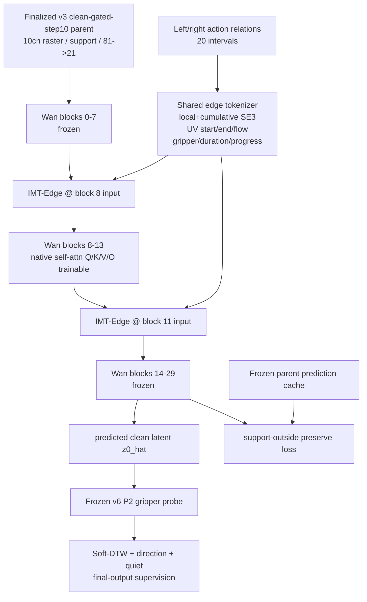

# Wan-Action v12-IMT-Edge 实验报告

日期：2026-08-19  
状态：**实现完成；Phase-0 完成；preflight/smoke 通过；step8 硬门失败；按合同停止，未运行 step9–25。**

## 1. 最终裁决

v12 的工程实现和训练链路健康，但核心机制假设没有通过最早的因果门：

- native Wan blocks 8–13 Q/K/V/O、edge tokenizer、sparse transport、左右输出和 gate 均获得非零梯度；
- 真实 production shape 单卡峰值显存低于 22 GiB；
- FM 没有退化，edge-zero 后 action perturbation 响应严格为零；
- 但动作扰动没有稳定沿正确方向作用于 active arm，跨臂泄漏严重，destination 响应也没有稳定高于 source；
- step8 observed gate 因四项失败而拒绝晋级。

严格执行原定规则：

```text
step8 FAIL
  -> 不生成 step-000008-gated.pt
  -> 不运行 step9–25
  -> 不运行 counterfactual / Motion-Drop 课程
  -> 不运行 step25 / step100
  -> v12 时间运输架构线停止
```

这不是训练崩溃或显存失败，而是**结构能训练，但没有证明动作对最终轨迹具有正确、隔离的方向控制**。

## 2. 核心假设与架构

v12 验证的唯一假设是：把 21 个 latent state 视为节点、20 个 action interval 视为严格的 `source t -> destination t+1` 边，通过 flow-guided sparse attention 读取 source/latent0 anchor 并只写 destination，同时窄带解冻 Wan 原生视觉注意力，能否让 action 真正控制最终 P2 轨迹。



单条 IMT-Edge：

```text
action interval A_t^arm
  -> strict source slot t / destination slot t+1
  -> destination query
  -> sparse K/V from current source hidden + latent0 clean anchor
  -> SE(3)/flow/gripper/time bias
  -> arm-specific output projection
  -> destination support only
  -> overlap-normalized scatter
  -> zero-init channel gate
```

硬合同：latent0 不接受 action write；左右臂使用不同 head group/support/output projection；tokenizer 和 kernel 共享；absent arm 严格为零；双臂 overlap 允许且归一化相加；offset 被限制在 flow source 周围 ±1 token。

明确不复用 v8–v11 checkpoint，不使用 persistent slots、GRU、TCN、full hidden warp、backward detach 或 internal EEF BCE。

## 3. 可训练参数与优化器

真实 preflight 统计：`305,085,368` parameters。

| 参数族 | 范围 | LR |
|---|---|---:|
| native Wan attention | blocks 8–13 self-attn Q/K/V/O | `1e-6` |
| edge tokenizer | shared four-modality tokenizer | `1e-4` |
| sparse transport | Q/K/V、edge K/bias、offset | `5e-5` |
| arm output | left/right O projection | `5e-5` |
| channel gate | stage8/stage11 left/right gate | `1e-3` |

其余 Wan blocks、parent adapter 和 frozen P2 均冻结。

## 4. 数据与零泄漏

| 资产 | 数量/用途 | 约束 |
|---|---:|---|
| optimizer manifest | 2060 action-video episodes | 与 audit20 零交集 |
| v12 replay | 100 observable rows | 从固定 replay500 确定性派生 |
| audit | 20 held-out observable episodes | 不参与 optimizer replay |
| parent cache | 120 predictions | replay100 + audit20，固定 noise/timestep |
| lag sweep | 8 个不同 task | Phase-0 only，无训练 |

Replay SHA256：`80ac380e44a3c33015bad5c5b35c4218584938147d753cf90c4061d58bd45d21`。

## 5. 不可变输入与 lineage

| 资产 | SHA256 |
|---|---|
| finalized clean-gated-step10 parent | `105fb760fd371885ba362d26ef2352c260755e47cd036f46711181edc3b30ca2` |
| internal raw step10 parent | `50de8166dc08691b0e85bb7df5806b708f418482d39394dfa4f5ae143d22a39f` |
| frozen v6 P2 probe | `300b4c6a7aa246110625d2e1747273ee07e30cc4f6d92e544799567496531480` |
| VAE temporal kernel | `1b919a503da409a1cf12fdebcf0338a6d5af7efed6a11416a971076782e44c84` |
| parent cache semantic digest | `326b1dd1876fc89ff94076ddec0b20284d67c4ad203328e8cc96d3adc2a4b4e2` |
| relation cache | `99055685c841c6e4095fb643b4052001294552c77c0ded45ee7c46abbfb20d19` |
| audit20 | `17dbc1223811cd147d82641937b78523efd6c5380eec6f74c32cc497019e2d06` |

训练 checkpoint 记录的 runtime source closure：`2dd4bb93aaeb3dc8c6dd8c29516276574522a416b3724482c73815633e0b154a`。

## 6. Phase-0A：VAE temporal kernel

输出 response shape `[21,81]`，dominant RGB frames：

```text
[0,2,7,10,14,20,24,28,32,36,35,44,48,52,56,60,63,68,71,75,79]
```

整体接近约 4 RGB frames / latent，但 first-frame 和 causal receptive field 造成局部不规则；没有证据支持手拍固定 `+2 latent`。因此 v12 保持结构化 `edge t -> latent t+1`，不加经验 offset。

## 7. Phase-0B：full-system lag sweep

比较 `parent / v11 controller-off / v11 controller-on`，lag 为 `-3..+3`，8 个 task，固定 noise/timestep，统一 frozen P2。

| 系统 | 聚合最优 lag | 结论 |
|---|---:|---|
| parent | `+3` | parent 自身存在 task-dependent timing sensitivity |
| v11-off | `+3` | 与 parent 完全一致 |
| v11-on | `-2` | controller 改变曲线，但没有形成统一 offset |

不同 task 的最优 lag 不一致，不能使用单一全局 phase offset。结果支持 fixed edge topology + Soft-DTW，而不是经验 `t+k` 映射。

Artifact SHA256：`d27a5127dd2ebcd4e23470e1c3829d6892dd95c67da50bd911bf2a4a350400ea`。

## 8. Parent output cache

- 完成 120/120；
- 每条绑定 sample、noise seed、timestep seed 和 finalized parent SHA；
- tensor shape 固定 `(1,48,21,30,40)`；
- receipt SHA256：`61b1150a8be1590779a9c9249544d0a2bb6a5f35e46bbd987a823c142ed80011`。

## 9. 测试与运行中修复

远端正式 Torch suite 最终：**55 passed**。

覆盖 temporal response、edge shape/presence/slot、four-modality tokenizer、sparse gather/scatter、anchor read、left/right ownership、bounded offset、zero-edge parent equivalence、native attention whitelist、optimizer groups、objectives/curriculum、replay/checkpoint lineage、lag shift 和 launcher/source closure。

真实运行中发现并修复：

1. Wan 顶层 import 拉入无关 S2V/librosa：改用 TI2V import guard；
2. parent-cache/probe helper 依赖未初始化全局 `torch`：改为函数内自包含导入并加回归；
3. production support 是 `(B,2,21,15,20)`：修正 lag time dimension；
4. preserve support 上采样错误 flatten 时间维：改为 `B,T,H,W -> B,1,T,H',W'` exact helper。

## 10. Preflight 与梯度标定

Preflight 通过：GPU6/world1；trainable count 正确；source/data/parent/probe/cache/replay lineage 全匹配；gradient-ratio calibration 冻结成功。

| loss | lambda |
|---|---:|
| FM | 1.000000 |
| preserve | 1.000000 |
| Soft-DTW | 0.744899 |
| direction | 0.004523 |
| quiet | 0.291006 |
| counterfactual | 0.059599（step9 后才启用） |
| phase | 0.044671（step25 通过后才启用） |

## 11. Production smoke

连续三次 `forward -> backward -> optimizer.step -> zero_grad`：

| 项 | 结果 |
|---|---:|
| peak allocated | `15.34 GiB` |
| peak reserved | `16.03 GiB` |
| hard limit | `<22 GiB` |
| step time | `2.33–2.38 s` |
| native/tokenizer/transport/output/gate gradients | 全部 nonzero |

Smoke：**PASS**。

## 12. Step1–8 训练

- 只启用 FM + preserve + Soft-DTW + direction + quiet；
- CF、phase、stretch 和 Motion-Drop 均未启用；
- 8 steps 全部 finite；
- step2 起五类梯度均非零；
- 单步约 `2.35 s`；
- 保存 candidate `step-000008.pt`，没有伪装成 gated checkpoint。

Candidate SHA256：`6d7d7108b6eafe932a11f237fff27a7e565067c42777269ee4830af222c88b63`。

## 13. Step8 observed audit

| 指标 | 实际 | 门槛 | 结论 |
|---|---:|---:|---|
| directional response | `9/20 = 45%` | `>=70%` | FAIL |
| mean cross-arm response ratio | `10.508` | `<0.25` | FAIL |
| median cross-arm response ratio | `2.735` | `<0.25` | FAIL |
| destination > source | `9/20` | 稳定多数/合同 14 | FAIL |
| edge-zero response ratio | `0.0` | `<=0.25` | PASS |
| FM finite | true | true | PASS |
| FM regression | `-0.0036%` | 不退化 | PASS |
| outside deviation | `2.570e-4` | `< inside` | FAIL |
| inside deviation | `2.032e-4` | reference | — |
| edge-on vs edge-zero wins | `8/20` | 辅助诊断 | 弱/负信号 |

Gate reasons：

```text
directional_response_below_70_percent
cross_arm_response_above_25_percent
destination_does_not_exceed_source
outside_support_not_preserved
```

### Soft-DTW telemetry 说明

Artifact 中 `soft_dtw_improvement=111255049.7` 不能使用：smoothed Soft-DTW 可为负，原百分比对负 parent mean 使用 `max(parent,1e-12)`，造成无意义放大。该值没有参与 step8 的四个失败项。

该 telemetry 公式已在实验结束后修正为以 `abs(parent)` 归一化，并增加负 Soft-DTW 回归测试；immutable step8 artifact 保留原始值以维持审计真实性。

基于 immutable episode rows 的稳定后验：parent mean `-0.739577845`，v12 mean `-0.739689100`，差 `-0.000111255`；按 `abs(parent)` 归一化仅约 `+0.015%`，远不是有效轨迹改善。

Audit SHA256：`d5134f97a6efde4375ce1a9320e7c0520d8b64c3f741725f2f430bb82268e549`。

## 14. 为什么不继续 step25

step8 必须先证明：active arm 正确方向响应、inactive arm 受控、destination 强于 source、edge-zero 后消失。实际只证明最后一项。

此时加入 CF 和 Motion-Drop 会无法区分 edge transport 真正学习、native attention 仅拟合 FM，或 CF 放大错误跨臂路径。停止是实验设计的一部分，不是资源不足。

## 15. 保留与淘汰

保留：finalized `clean-gated-step10` incumbent、VAE temporal kernel 工具、frozen P2 evaluator、zero-leakage replay/audit/cache lineage、production smoke/source closure 工具，以及 sparse gather/scatter 的工程资产。

不晋级：v12 step8 candidate、IMT-Edge 比赛主线、step9–25 CF/Motion-Drop、step26–100 phase，以及继续设计 v13 时间架构。

## 16. 下一步建议

1. 回到唯一有 matched RGB 正收益的 `clean-gated-step10`；
2. 完成 dev-clean50 的 WorldArena + VLM + JEPA profile；
3. 不再围绕 ±1 latent phase 投入；
4. 从完整 profile 只选一个短板进入下一轮：object consistency、depth/geometry 或画质；
5. 若未来重启 action architecture，应使用更大 action-video 数据并做 broader native Wan fine-tuning，而不是继续堆小型时间旁路。

## 17. 产物路径

全部持久产物：`/data/di/worldarena2_track1_20260815/runs/v12-imt-edge`

```text
phase0/vae-temporal-kernel.pt
phase0/vae-temporal-kernel.json
phase0/full-system-lag-sweep.json
replay100.jsonl
source-receipt.json
parent-output-cache/receipt.json
gpu6/calibration.json
gpu6/preflight.json
gpu6/production-smoke.json
gpu6/training.jsonl
gpu6/step-000008.pt
gpu6/audit-0008.json
```

明确不存在：

```text
gpu6/step-000008-gated.pt
gpu6/step-000025.pt
gpu6/step-000100.pt
```

GPU6 已释放：`6 MiB`, utilization `0%`。
