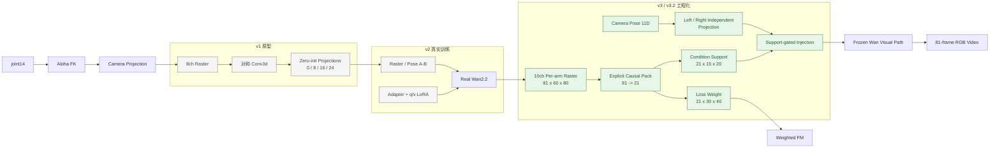
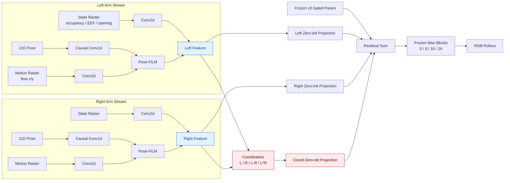
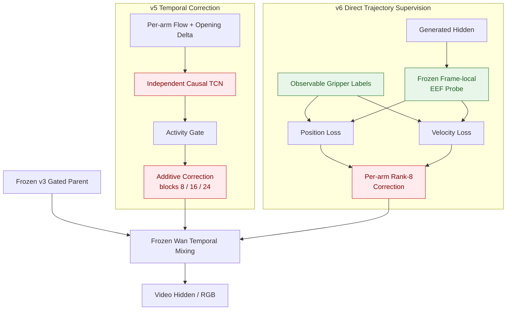
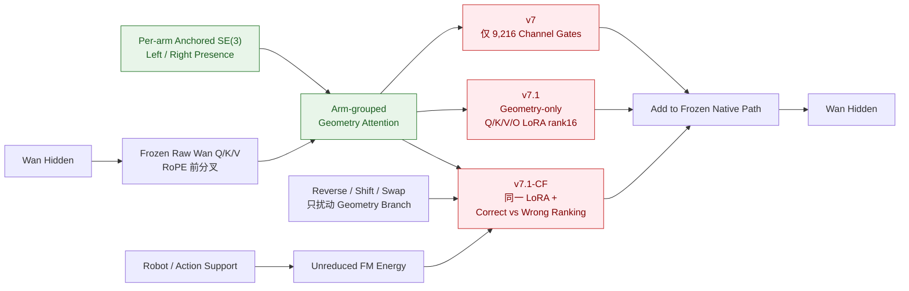
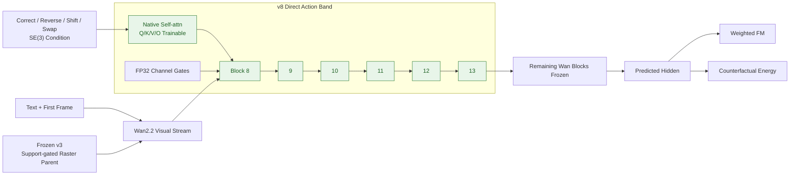
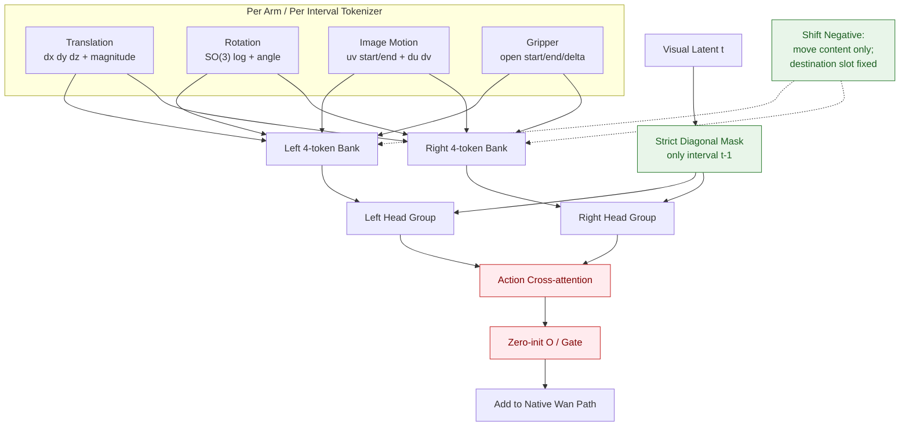
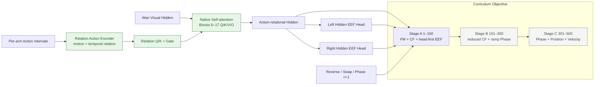
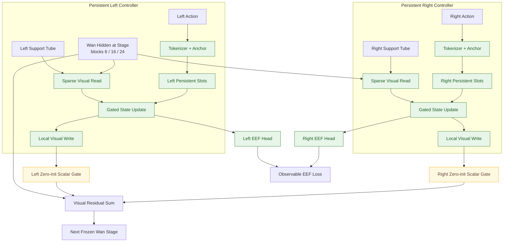
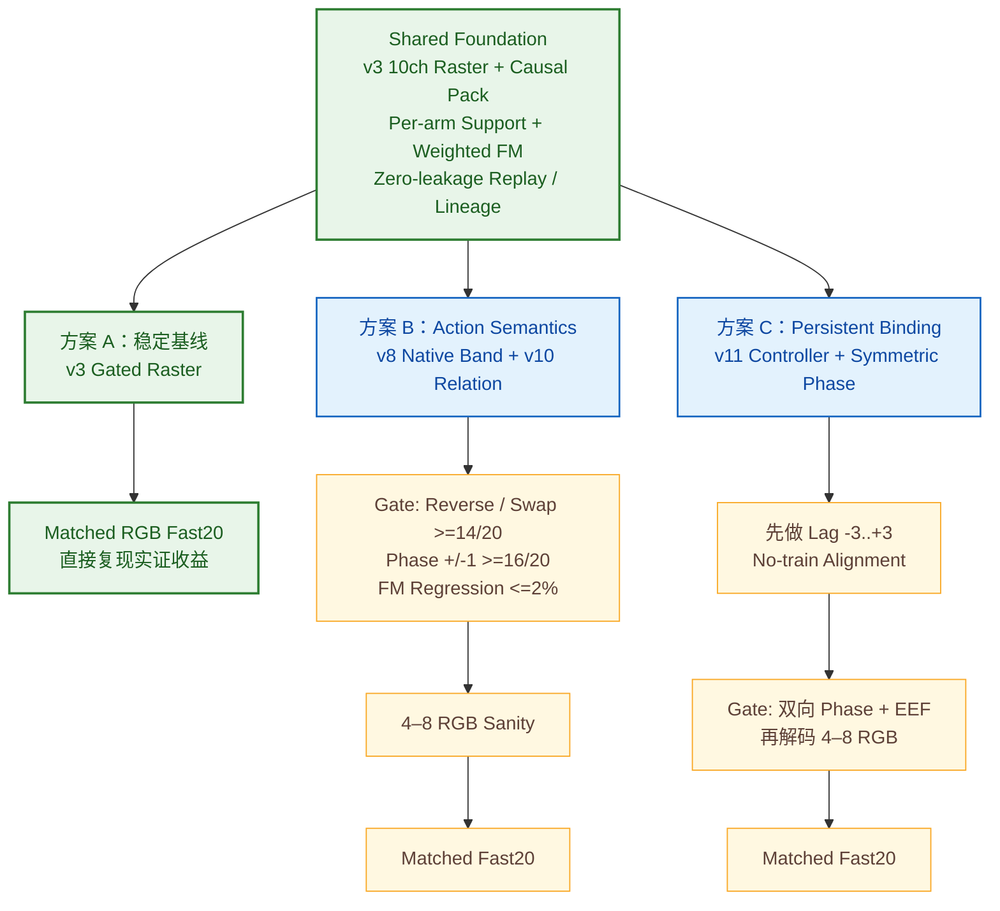

# Wan-Action v1–v11：架构演进、实验日志与可复用技术谱系

日期：2026-08-19  
项目：WorldArena 2.0 Track 1 / `video_quality_ood`  
基础模型：Wan2.2-TI2V-5B  
正式产物根：`/data/di/worldarena2_track1_20260815`  
远端源码：`/home/huazhi/nlh/baseline`  

---

## 0. 报告目的

这不是一份只描述“最新 v11”的运行报告，而是一份可供后续架构选型使用的技术谱系档案。它回答四个问题：

1. v1 到 v11 每一版到底改变了什么；
2. 每一版实际跑了什么实验、拿到了什么证据；
3. 哪些结论来自 RGB 视频或官方 SAM3，哪些只是中间机制审计；
4. 哪些模块可以复用，哪些 checkpoint 或训练路线应当淘汰。

早期 v1–v3 的命名在代码、run directory 和讨论中并不完全一致。本报告采用“逻辑架构版本”统一命名，并在每节保留真实 run 名、checkpoint 和证据路径，避免把后期命名倒灌到早期产物。

---

## 1. 证据等级与阅读规则

### 1.1 证据等级

| 等级 | 含义 | 能否声称视频轨迹提升 |
|---|---|---|
| E0 | 设计文档、单元测试、形状/数学合同 | 否 |
| E1 | production-shape smoke、梯度、显存、checkpoint 完整性 | 否 |
| E2 | 固定 held-out hidden/probe/counterfactual audit | 只能声称机制信号 |
| E3 | matched RGB dev-fast20 proxy | 可声称该 proxy 下相对改善 |
| E4 | pinned official SAM3 dev-fast20 | 可声称官方评测器下的开发集结果 |
| E5 | 官方完整 WorldArena + VLM + JEPA test-1000 | 可声称完整官方结果 |

本项目截至 v11 没有 E5 结果。任何“成功”都必须结合证据等级理解。

### 1.2 主要评测口径

- 主目标：机械臂轨迹，通常记录 DTW、`mean(1/d)`、paired win、检测覆盖率。
- 安全护栏：黑帧、严重崩坏、机械臂检测失败、arm swap/temporal leakage。
- hidden 机制指标：correct vs reverse / shift / swap、position/velocity probe、routing retention、FM regression。
- pinned official trajectory evaluator commit：`7b3feee108427bee3380064bb5154970ed7468b5`。
- official SAM3 SHA256：`9999e2341ceef5e136daa386eecb55cb414446a00ac2b55eb2dfd2f7c3cf8c9e`。

### 1.3 本报告中的三个“不能混淆”

1. **FM 下降不等于 trajectory 变好。** v6、v7.1、v7.1-CF、v8、v9、v10 都反复证明了这一点。
2. **内部 action separation 不等于 RGB rollout 变好。** gated-step10 是正例；很多后续版本只到 E2，不能当发布候选。
3. **可检测性提高不等于轨迹更正确。** v4 clean-scale、E1/E1v2 都出现过 coverage 改善但 DTW/trajectory 不提升。

---

## 2. 一页总览

| 版本 | 核心变化 | 训练主体 | 最高证据 | 最强正信号 | 核心失败 | 最终状态 |
|---|---|---|---|---|---|---|
| v1 | 8 通道 action raster + 4 点 zero-init residual | 小型 Adapter | E0/E1 | 几何、梯度、zero-init 成立 | 未证明真实 Wan 视频收益 | 保留原型思想 |
| v2 | 真实 Wan Adapter、初始 A/B、Adapter/LoRA 微调 | Adapter / LoRA | E4 | S1A125 成为长期 baseline | Stage2 长训黑屏；LoRA 不赢官方 gate | 淘汰长训 recipe |
| v3/v3.2 | 10 通道、11D pose、81→21 因果、support、weighted FM、严格 lineage | Action Adapter | E4 | support gate 后 RGB proxy +7.82% | 双臂 temporal role leakage | 保留 gated-step10 架构，不直接发布 |
| v4 | 左右独立 geometry stream + Pose-FiLM + late fusion + coordination | 大型双臂 Adapter | E3 | arm-swap proxy 降低 | DTW +110.7% 劣化；data scale 不救 | 淘汰 checkpoint/recipe |
| v5 | 每臂 causal TCN temporal motion correction | 小型 additive correction | E2 | router 自身未来泄漏为 0 | Wan 输出 leakage +1.37% | 淘汰 |
| v6 | frozen probe + gripper position/velocity supervision | rank-8 correction | E2 | probe 精度和监督链成立 | position/velocity 都变差 | 淘汰 correction，保留 probe |
| v7 | arm-grouped SE(3) attention，gate-only | 9,216 gates | E2 | SE(3) 数学/运行正确 | shift/swap separation 不稳定 | 淘汰 gate-only |
| v7.1 | geometry-only Q/K/V/O LoRA | 1.19M geometry branch | E2 | 容量和梯度成立 | weighted FM 不关心 action correctness | 淘汰 FM-only |
| v7.1-CF | v7.1 + explicit counterfactual ranking | 同上 | E2 | sampled margin 有微弱变化 | audit20 三类全部失败 | 结束 frozen-small-branch 路线 |
| v8 | blocks 8–13 原生 Q/K/V/O 解冻 + CF | 226.6M | E2 | reverse 16/20、swap 17/20 | hard shift 5/20 | 保留 native attention band 思想 |
| v9 | 4 modality token × arm × interval，strict phase lock cross-attn | 257.4M | E2 | phase contract严格、工程健康 | ranking≈ln2，step100 近随机 | 淘汰该 recipe |
| v10 | relation action state + blocks 6–17 native Q/K/V/O + staged losses | 453.6M | E2 | phase +1 19/20、-1 20/20 | swap margin 仍负 | 保留 phase/relation 组件 |
| v11 | 左右永久隔离 persistent closed-loop controller | 40.24M | E2 | EEF loss 0.693→0.070，读写稳定 | 双向 phase 13/20、8/20 | 保留 controller 骨架，不续训当前 ckpt |

### 2.1 架构图索引

| 图 | 覆盖内容 | 适合用来回答 |
|---|---|---|
| v1–v11 总演进图 | 所有版本与保留/淘汰状态 | 整体技术路线如何变化 |
| v1–v3 基础设施图 | raster、pose、causal pack、support、weighted FM | 最稳定的 action-conditioning 地基是什么 |
| v4 双臂 late-fusion 图 | 独立 arm stream、Pose-FiLM、coordination | 为什么身份隔离成立但 rollout 仍失败 |
| v5–v6 监督链图 | causal correction、EEF probe、position/velocity | 哪些监督工具可保留、哪些 correction 应淘汰 |
| v7 系列 SE(3) 图 | gate-only、geometry LoRA、CF ranking | frozen-small-branch 路线为何结束 |
| v8 native band 图 | 部分解冻原生 Q/K/V/O | action semantics 从哪里真正出现 |
| v9 phase-lock 图 | 四子 token、strict diagonal mask | 如何避免 shift counterfactual 作弊 |
| v10 relation/curriculum 图 | relation attention、EEF head、三阶段 loss | timing 能力和未执行阶段如何区分 |
| v11 persistent controller 图 | per-arm state、visual read/update/write | 可复用的长期双臂闭环骨架是什么 |
| 三方案选型图 | 稳定基线、semantics、persistent binding | 下一轮应抽取哪套架构 |

---

## 3. 架构演进主线

```text
v1  2D action raster -> additive residual
 |
v2  real Wan training + Adapter/LoRA
 |
v3  productionized raster/pose/support/causal/lineage
 |        \
 |         support-gated step10: first matched-RGB positive signal
 |
v4  separated arm streams + late fusion + coordination
 |   (identity partly better, rollout badly worse)
 |
v5  temporal causal correction
 |   (router causal, Wan mixing unchanged)
 |
v6  direct gripper trajectory supervision
 |   (probe works, additive correction does not)
 |
v7  explicit arm-grouped SE(3) attention
 |
v7.1 geometry QKVO LoRA -> v7.1-CF
 |   (capacity works, frozen side branch cannot establish semantics)
 |
v8  partial native Wan attention unfreeze
 |   (reverse/swap learned, ±1 timing failed)
 |
v9  strict phase-locked four-token cross-attention
 |   (hard wiring alone still insufficient)
 |
v10 relational native attention + staged objective
 |   (timing solved at audit layer, swap remains weak)
 |
v11 persistent left/right visual closed-loop controller
     (EEF representation learned, bidirectional phase still failed)
```

这条链路的本质变化是：

```text
弱 additive condition
-> arm identity isolation
-> temporal routing
-> direct trajectory supervision
-> explicit SE(3) representation
-> native attention adaptation
-> phase-locked action relation
-> persistent closed-loop arm state
```

### 3.1 v1–v11 可视化演进图

```mermaid
flowchart LR
    V1["v1<br/>8ch Raster<br/>Additive Adapter"] --> V2["v2<br/>真实 Wan<br/>Adapter / LoRA"]
    V2 --> V3["v3<br/>10ch + Pose + Support<br/>因果与 Lineage"]
    V3 --> G3["gated-step10<br/>唯一 matched RGB 正信号"]
    G3 --> V4["v4<br/>双臂独立 Geometry<br/>Late Fusion"]
    V4 --> V5["v5<br/>Causal Temporal<br/>Correction"]
    V5 --> V6["v6<br/>Gripper Trajectory<br/>Supervision"]
    V6 --> V7["v7<br/>Arm-grouped<br/>SE(3) Gate"]
    V7 --> V71["v7.1<br/>Geometry QKVO LoRA"]
    V71 --> V71CF["v7.1-CF<br/>显式 Counterfactual"]
    V71CF --> V8["v8<br/>Native Attention<br/>Partial Unfreeze"]
    V8 --> V9["v9<br/>Phase-locked<br/>Four Tokens"]
    V9 --> V10["v10<br/>Action Relation<br/>Curriculum"]
    V10 --> V11["v11<br/>Persistent Bimanual<br/>Closed Loop"]

    classDef retained fill:#e8f5e9,stroke:#2e7d32,color:#1b5e20,stroke-width:2px;
    classDef mechanism fill:#fff8e1,stroke:#f9a825,color:#5d4037,stroke-width:1.5px;
    classDef retired fill:#ffebee,stroke:#c62828,color:#7f0000,stroke-width:1.5px;
    class V3,G3,V8,V10,V11 retained;
    class V1,V2,V7,V71 mechanism;
    class V4,V5,V6,V71CF,V9 retired;
```



图例：绿色表示存在可复用的实证组件；黄色表示机制或工程成立、但没有形成 RGB 晋级证据；红色表示该 checkpoint/训练 recipe 已被实验淘汰。颜色描述的是“能否复用当前实现或结论”，不是对研究价值的评价。

### 3.2 v1–v3：从动作栅格到可训练基础设施



v3 不是另起炉灶，而是把 v1/v2 的动作栅格原型升级成具有明确空间、时间、左右臂和训练权重合同的生产路径。

---

## 4. v1：Action Raster Adapter 原型

### 4.1 目标

在不修改官方 Wan2.2 源码、不先下载完整权重的前提下，证明 action raster 可以被编码到 Wan token grid，并通过 zero-init residual 安全注入。

### 4.2 数据与 action 表示

输入是 `(B,8,T,H,W)` 的双臂 raster：

| 通道 | 含义 |
|---:|---|
| 0 | left gripper heatmap |
| 1 | right gripper heatmap |
| 2–3 | left flow x/y |
| 4–5 | right flow x/y |
| 6 | left gripper state |
| 7 | right gripper state |

几何来自 `joint14 -> Aloha FK -> camera projection`。左右臂身份在 raster channel 中固定，不再用共享颜色骨架表达。

### 4.3 架构

```text
8-channel raster
  -> Conv3d stride aligned to VAE/token grid
  -> adapter_dim=256
  -> four independent zero-init Linear
  -> Wan blocks 0 / 8 / 16 / 24
```

原始 real-grid 目标是 81 帧、480×832，Wan token grid `21×15×26=8190`。后续 Track-1 正式训练改为 480×640。

### 4.4 验证结果

- tiny backbone 上 shape、zero-init identity、梯度和异常清理合同成立；
- zero-init 时 wrapped/unwrapped output 必须完全一致；
- action raster、encoder、gate、projection 都能获得梯度；
- 没有形成独立、可核验的正式 RGB trajectory 结果。

### 4.5 结论与复用价值

**保留：**

- raster 化动作的总体方向；
- 左右臂固定通道；
- zero-init residual；
- blocks 0/8/16/24 多层注入；
- 不侵入官方 Wan checkout 的 wrapper/hook 思路。

**不再直接复用：**

- 高分辨率对称 Conv3d；
- 8 通道缺少静止机械臂 full-arm occupancy；
- 没有显式 81→21 因果时间合同。

证据等级：E0/E1。  
主要证据：

- `docs/superpowers/specs/2026-08-15-action-raster-geometry-gate-design.md`
- `docs/superpowers/specs/2026-08-15-wan-action-adapter-smoke-design.md`
- `docs/superpowers/plans/2026-08-15-wan-action-adapter-smoke.md`

---

## 5. v2：真实 Wan Adapter / LoRA 初代训练线

### 5.1 目标

把 v1 原型接入真实 Wan2.2-TI2V-5B，在 Stage-1 比较 raster-only 与 raster+pose，再在 Stage-2 尝试 Adapter + q/v LoRA。

### 5.2 主要 run lineage

早期 remote run 包括：

- `wan_action_stage1_a_2d_v2`
- `wan_action_stage1_b_pose_v2`
- `wan_action_single_gpu_warmstart_v3`
- `wan_action_stage2_A_ws7`
- `stage2-recovery-v2-500-loraonly-ws7`
- `stage2-recovery-v2-1000-general-loraonly-ws7`
- `ablation-v2-1k-adapteronly-ws7`
- `ablation-v2-1k-adapteronly-lr2e5-warmup-ws7`
- `ablation-v2-1k-qonly-lora2e6-ws7`

### 5.3 Stage-1 A/B

正式 matched A/B 后，S1A125 raster-only 成为长期 baseline：

- checkpoint：`runs/s1A_branch_0125_ws7/step-000125.pt`
- SHA256：`59b0de933abc5229cd81ad8507b3f7ab550f996d29038496ae8a58e373fb6df3`
- world size：7

arm-proxy matched20：

| 指标 | S1A125 | S1B125 pose |
|---|---:|---:|
| mean DTW | 28.1120 | 25.8184 |
| trajectory score | 0.05348 | 0.06593 |
| paired win | baseline | 55% |
| mean coverage | 0.6548 | 0.5661 |
| detector failure | 45% | 55% |
| black | 0% | 0% |

Pose B 在轨迹 proxy 上有信号，但 detector failure 比 A 恶化 10 个百分点，违反 guardrail，因此没有成为正式 parent。

### 5.4 Stage-2 失败模式

原 recipe 同时更新 Adapter 和 q/v LoRA：

- Adapter LR `1e-4`；
- LoRA LR `2e-5`；
- blocks 8–29；
- rank/alpha 16/16。

真实视频出现明显过训练：

| checkpoint | mean black frames |
|---:|---:|
| step100 | 2.0% |
| step200 | 58.4% |
| step400 | 83.6% |

hybrid 诊断表明，step200 的 Adapter 即使不带 LoRA 也已经严重变暗。因此主失败源不是 LoRA 本身，而是继续大 LR 更新 Adapter。

### 5.5 1k Adapter-only / LoRA-only ablation

Adapter-only 1k proxy 曾出现“轨迹变好但视频质量崩”的假阳性：

| ckpt | mean DTW | paired win | black | detector failure | 结论 |
|---:|---:|---:|---:|---:|---|
| S1A125 | 28.112 | — | 0% | 45% | baseline |
| adapter step25 | 26.779 | 65% | 0% | 85% | 检测崩，拒绝 |
| adapter step50 | 26.990 | 65% | 15% | 55% | 黑帧，拒绝 |
| adapter step75 | 22.077 | 65% | 15% | 55% | proxy +7.14%，仍拒绝 |

官方 SAM3 dev-fast20 更明确：

| candidate | all20 mean(1/d) | valid | paired win | 相对 S1A125 | 决策 |
|---|---:|---:|---:|---:|---|
| S1A125 | 1.9091 | 6/20 | — | — | baseline |
| adapter lr2e-5 step25 | 1.2076 | 7/20 | 25% | -36.74% | FAIL |
| adapter lr2e-5 step50 | 0.0000 | 0/20 | 0% | -100% | FAIL |
| adapter recovery75 | 1.6344 | 7/20 | 25% | -14.38% | FAIL |
| q/v LoRA-only step75 | 1.8593 | 8/20 | 20% | -2.61% | FAIL |

q-only LoRA `2e-6` step50 在自研 proxy 对 q/v step75 为正：DTW `27.28 -> 25.41`、win 65%、黑帧 0%。但 pinned official SAM3 对 S1A125 的 paired finite 只有 4/20，paired win 0%，raw DTW 与 action adherence 都更差。all20 inverse mean 被单个 outlier 放大到 29.99，不能用于晋级。

### 5.6 结论与复用价值

**已证实：**

- 小数据 Adapter 可以快速改变 rollout；
- 但 high LR / 长训极易摧毁 Wan 原始视频分布；
- LoRA-only 比 Adapter+LoRA 稳，但没有通过官方开发 gate；
- 不能用 invalid episode 被静默丢弃后的均值选模型。

**保留：** S1A125 作为早期 baseline 和固定 parent 参考。  
**淘汰：** 原 Stage-2 joint update、所有 adapter-only/LoRA-only ablation checkpoint 作为发布候选。

证据等级：E3/E4。

---

## 6. v3 / v3.2：Wan-Action-Lite+ 正式工程化版本

### 6.1 v3 相对 v2 的关键变化

v3 不是简单“再训练一次”，而是重建了条件、缓存、时间、loss、训练和评测合同。

#### 10 通道 action raster

每臂 5 通道：

```text
occupancy / EEF heatmap / flow-x / flow-y / opening-map
```

左右两臂共 10 通道，直接渲染为 `(81,10,60,80)`。

#### 显式 81→21 因果打包

```text
latent0  <- frame0
latent1  <- frames1..4
...
latent20 <- frames77..80
```

frame-wise shared Conv2d 先编码每臂，再按固定 group mean 打包；替代 v2 高分辨率 Conv3d。

#### 相机坐标 11D pose

```text
relative xyz 3
absolute depth 1
relative rotation R6D 6
gripper opening 1
```

Pose statistics 只来自 train-40，并用 schema/version/SHA 绑定。

#### 双尺度缓存

- `condition_support=(2,21,15,20)`：控制 Adapter 注入；
- `loss_weight=(1,21,30,40)`：控制 weighted FM；
- 两者都由 stored float16 raster 重新推导和校验。

#### 分离投影

- left/right raster projection 独立；
- left/right pose projection 独立；
- blocks `0/8/16/24`；
- 全部 zero-init。

#### null 与 hold 分离

- null：全零 raster/support、`pose=None`、`action_present=0`；
- hold：保留 frame0 occupancy/EEF/depth/opening、运动增量为 0、`action_present=1`。

### 6.2 训练与推理合同

- Stage-1：只训练 Action Adapter；Wan 全冻结；prefix 0→50，A/B matched 50→125。
- Stage-2：后续安全 recipe 冻结 Adapter，仅允许 blocks 8–29 q/v LoRA。
- 三前向 action CFG：null-text/null-action、text/null-action、text/action。
- 正式视频：81 帧、480×640、50 sampling steps。
- T5/VAE 离线缓存，禁止进入训练热路径。
- GPU topology、replay、lineage、optimizer state、source closure 全部 fail closed。

### 6.3 关键 causality audit

S1A125 与 q-only50 都能区分 correct/reverse/swap/random，但原始 arm routing 不合格：

| arm | S1A125 same/cross | q-only50 | 要求 |
|---|---:|---:|---:|
| left | 1.0524 | 1.0514 | >=1.5 |
| right | 0.9538 | 0.9544 | >=1.5 |

这说明模型“看 action”，但 action 对左右臂的梯度路由发生跨臂泄漏。

### 6.4 support gating：v3 最重要的结构修复

不改 checkpoint 权重，只在输出端把每臂 residual 限制到自身 support，得到：

| 指标 | standard | support-gated |
|---|---:|---:|
| left isolation | 1.4207 | 2.1027 |
| right isolation | 1.2532 | 2.1230 |
| left routing | 1.0524 | 3.1372 |
| right routing | 0.9539 | 2.8468 |
| robot sensitivity median | 0.01461 | 0.04798 |

support-gated-to-standard sensitivity ratio 为 `3.284×`。这是整个链路中最明确、最可复用的低成本结构修复之一。

### 6.5 gated step10：第一个真实 RGB 正信号

从 S1A125 继续 10 step 的 support-gated Adapter checkpoint：

- parent lineage：clean gated step10；
- 后续统一使用 SHA256 `105fb760fd371885ba362d26ef2352c260755e47cd036f46711181edc3b30ca2`；
- matched dev-fast20 proxy：

| 指标 | S1A125 | gated step10 | 变化 |
|---|---:|---:|---:|
| mean DTW | 18.0911 | 16.2742 | **-10.04%** |
| trajectory score | 0.08087 | 0.08720 | **+7.82%** |
| paired win | — | 60% | 通过 55% 方向门 |
| mean coverage | 0.6508 | 0.8752 | 明显提高 |
| detector failure | 50% | 15% | 明显降低 |
| black | 0% | 0% | 持平 |

但 arm-swap proxy 从 25% 到 35%，人工复核确认两个 `dump_bin_bigbin` 样本不是 detector 误判，而是真实模型错误：

- temporal role confusion：本应“右、右、左”，前两个阶段左右混着执行；
- dual-arm coactivation：本应“先右后左”，模型同时抓取。

因此 gated-step10 是**有轨迹生命力但存在 temporal-role leakage 的研究 parent**，不是已经通过全部发布门的模型。

### 6.6 E1 / E1v2 temporal-role 支线

E1v2 使用五状态：`LEFT_ONLY / RIGHT_ONLY / BOTH / QUIET / AMBIGUOUS`，只在明确单臂窗口做 correct-vs-swap 和 inactive-arm quiet penalty。

train-1k 角色比例：

| role | fraction |
|---|---:|
| LEFT_ONLY | 31.845% |
| RIGHT_ONLY | 26.415% |
| BOTH | 19.645% |
| QUIET | 13.395% |
| AMBIGUOUS | 8.700% |

matched fast20：

| 指标 | S1A125 | E1v2 step5 |
|---|---:|---:|
| raw DTW | 18.0911 | 17.9704（仅 +0.67%） |
| trajectory score | 0.08087 | 0.06828（-15.56%） |
| paired win | — | 50% |
| catastrophic | 65% | 25% |
| black | 0% | 0% |

bimanual subset DTW 反而恶化 24.41%。这说明“role mask 合同”是对的，但在共享 Adapter 上加单臂 quiet 监督会全局改变双臂 rollout。

### 6.7 v3 最终结论

**可以直接复用：**

- 10 通道 raster；
- 11D pose 与 train-only normalization；
- 81→21 因果打包；
- null/hold/action_present；
- per-arm support gating；
- weighted-FM cache；
- deterministic replay / lineage / official-evaluator parity；
- five-state temporal role 作为数据标注与 audit，不作为共享 Adapter 强约束。

**当前最有价值 checkpoint：** gated-step10，只作为研究 parent/incumbent。  
**不能直接复用为发布结论：** E1/E1v2 checkpoint。

证据等级：E4（早期官方 SAM3 baseline/ablation）+ E3（gated-step10）。

---

## 7. v4：Dual-Arm Geometry Late Fusion

### 7.1 核心假设

共享 Adapter 会把左右臂时序和空间角色混在一起，因此让左右臂永久通过独立 geometry stream 编码，再在后层加入 coordination branch。

### 7.2 架构

每臂 `ArmGeometryStream`：

```text
state raster: occupancy + EEF + opening
  -> Conv2d

motion raster: flow-x/y
  -> Conv2d

11D pose
  -> causal Conv1d
  -> gamma/beta Pose-FiLM on motion

state + routed motion
```

左右 stream 参数完全独立。coordination branch 输入：

```text
[left, right, left-right, left*right]
```

left/right/coord 各自 zero-init projection，注入 blocks `0/8/16/24`，与 frozen gated parent residual 相加。



结构上 v4 首次实现左右流参数隔离；实验上的问题集中在这些 feature 仍以 additive residual 方式写回 frozen Wan，coordination 分支还会放大双臂耦合。

### 7.3 训练规模

- 7×4090，GPU0–6；
- dataset 1,000；global batch 7；
- step1200/2400/3600 对应 8.4/16.8/25.2 epochs；
- warmup 50；robot weight 0.5；
- production smoke：约 7.60 GiB allocated、9.51 GiB reserved，后续 step 约 4.01s。

### 7.4 step3600 matched RGB

| 指标 | S1A125 | gated-step10 | v4-step3600 | v4 vs parent |
|---|---:|---:|---:|---:|
| mean DTW | 18.09 | **16.27** | 34.28 | **+110.7% worse** |
| trajectory score | 0.0809 | **0.0872** | 0.0457 | **-47.6%** |
| paired win vs parent | 40% | — | 20% | FAIL |
| coverage | 65.1% | 87.5% | 48.3% | worse |
| detector failure | 50% | 15% | 80% | worse |
| catastrophic | 65% | 45% | 80% | worse |
| endpoint | 34.42 | 30.01 | 41.76 | worse |
| arm-swap proxy | 12.9% | 15.8% | **4.2%** | better |
| black | 0% | 0% | 0% | pass |

v4 确实改善了静态 arm identity proxy，但付出了严重 rollout/trajectory 代价。

### 7.5 data-scale clean experiment

历史 v2-1000/v4 数据与 dev-fast20 有 13/20 overlap，只能作为污染诊断。之后重建：

- clean-1000：1,000，zero dev overlap；
- clean-1785：1,785，zero dev overlap；
- clean-1000 是 clean-1785 的严格子集；
- 两条线按 5/10/15 effective epochs 保存。

matched proxy：

| variant | DTW | paired win vs S1A125 | coverage | catastrophic | black |
|---|---:|---:|---:|---:|---:|
| S1A125 | **18.091** | — | 0.651 | 65% | 0% |
| clean1000 e5 | 22.462 | 45% | 0.866 | 55% | 5% |
| clean1000 e10 | 24.937 | 25% | 0.839 | 45% | 10% |
| clean1000 e15 | 27.634 | 25% | 0.782 | 45% | 5% |
| clean1785 e5 | 24.697 | 35% | 0.800 | 50% | 5% |
| clean1785 e10 | 23.746 | 30% | 0.796 | 35% | 0% |
| clean1785 e15 | 26.915 | 40% | 0.767 | 45% | 5% |

大数据没有恢复 v4 的 trajectory；5→15 epoch 也没有稳定单调改善。由此可以排除“只是 1k 数据太少”作为唯一解释。

### 7.6 结论与复用价值

**淘汰：** v4 所有 checkpoint、coordination residual 作为直接 additive 输出、25 epoch 长训。  
**保留：**

- 左右臂独立 stream 的身份思想；
- Pose-FiLM 和 state/motion 分解可作为 tokenizer 前端参考；
- balanced sampling 与 exposure-aligned data-scale 实验合同；
- clean-1000/1785 零泄漏 manifest。

证据等级：E3。

---

## 8. v5：Temporal Motion Correction

### 8.1 假设

v4 的主要问题可能是双臂时序角色泄漏，因此不改 parent/Wan，只加每臂局部 causal temporal correction。

### 8.2 架构

- frozen gated-step10 parent；
- frozen Wan；
- 每臂输入 flow-x、flow-y、opening delta；
- shared-weight、independent-execution causal TCN；
- support-weighted causal context；
- independent activity gate；
- independent zero-init projection；
- 只注入 blocks `8/16/24`；block0 parent-only；
- weighted FM only。

### 8.3 运行

- clean-1000；7×4090；
- production smoke：6.273–6.274 GiB allocated，7.799–8.025 GiB reserved；
- step time 约 3.44s；
- step10 checkpoint SHA `a07fcab4841ea50986b0f8fd4fa4748176ce77194c0b683d43879dab296b039c`。

### 8.4 discovery8

| 指标 | parent | v5 step10 | 结果 |
|---|---:|---:|---|
| model future→current leakage | 0.0235682 | 0.0238905 | **+1.37% worse** |
| router leakage | — | 0.0 | PASS |
| left routing | 2.1097 | 2.1903 | 稳定 |
| right routing | 2.2195 | 2.2161 | 稳定 |
| inactive-arm leakage change | — | -0.000282 | 小幅改善 |

### 8.5 结论

router 自己严格 causal，但进入 frozen Wan 后没有降低输出时序混合。问题不在 TCN 实现，而在“additive correction 无法控制 Wan 内部 temporal mixing”。

**淘汰：** v5 checkpoint、继续加深 TCN、继续扫 LR。  
**保留：** future-impulse leakage audit、activity gate、对 BOTH/overlap 的合法处理。

证据等级：E2。

---

## 9. v6：直接 Gripper Trajectory Supervision

### 9.1 假设

既然 routing/coverage 可以改善但 RGB DTW 不稳定，就直接用可微 gripper position/velocity supervision 拉最终视觉 latent。

### 9.2 两个组件

#### Frozen frame-local probe

- 从 latent 单帧预测左右 EEF heatmap；
- exact future independence；
- visibility/mask/velocity 合同；
- held-out 精度：median `0.619 px`，P90 `2.254 px`；
- correct mean error `1.137`，swap `46.561`。

#### Trainable correction

- frozen Wan + frozen gated parent + frozen probe；
- per-arm rank-8 correction；
- blocks `8/16/24`；
- predicted clean latent 上计算 position/velocity；
- weighted FM + calibrated position/velocity；
- calibration lambda：position `107.750`，velocity `43.494`。

### 9.2.1 v5–v6：从时序纠偏到直接轨迹监督



v5 证明“纠偏器自身 causal”并不能改变 Wan 内部混合；v6 证明 EEF probe 和标签链可靠，但弱 correction 仍不足以把监督转成正确 rollout。因此后续保留 probe，停止 additive correction。

### 9.3 运行与结果

- 7×4090 smoke：约 6.01 GiB allocated、7.72 GiB reserved、3.49s；
- step25：

| 指标 | 结果 |
|---|---:|
| FM regression | -0.0672%（FM 略好） |
| position improvement | **-2.09%** |
| velocity improvement | **-1.94%** |
| routing retention | 1.0 |
| correct better than shift/reverse/swap | false |

### 9.4 结论与复用价值

**保留：** frozen probe、标签/observability、position/velocity audit、anti-exploitation 思路。  
**淘汰：** rank-8 additive correction 与当前 loss 接线。

v6 的核心证据是：**监督标签是可学的，但弱 additive correction 没有把它传成正确 rollout。**

证据等级：E2。

---

## 10. v7：Gate-Only Arm-Grouped SE(3) Attention

### 10.1 假设

模仿 DreamX 中最直接的几何思想：把左右臂 SE(3) identity 固定在 attention head group 内，不再只靠 raster residual。

### 10.2 数学与架构

- raw Wan Q/K/V 在 3D RoPE 前分叉；
- per-arm anchored SE(3)：`(G_1^L)^-1 G_t^k`；
- left/right head ownership 固定；
- arm absent 时对应 output exact zero；
- blocks `8/16/24`；
- 原 Wan Q/K/V/O 完全 frozen；
- 只训练每层 `(24,128)` FP32 channel gate；
- 总可训练参数 `9,216`。

### 10.3 单卡运行

- physical GPU6；clean-1000；max 50；实际到25；
- smoke 13.15 GiB allocated、13.61 GiB reserved；平均 2.40s；
- 原 Wan gradient 0，gate gradient finite/nonzero。

### 10.4 初始 discovery8 与修正版 audit20

原 discovery8 全是 `click_alarmclock` 且 3/8 probe 无效，因此只用于停止 step50，不用于永久淘汰 SE(3)。随后补了 20 条多任务、全 probe-observable no-train audit：

| ckpt | reverse | shift | swap | stable |
|---|---:|---:|---:|---|
| zero-gate | 14/20 | 10/20 | 10/20 | no |
| step10 | 13/20 | 12/20 | 10/20 | no |
| step25 | 14/20 | 10/20 | 9/20 | no |

step25 improvement（wrong error - correct error，正才好）：

| negative | position | velocity |
|---|---:|---:|
| reverse | -0.000218 | -0.000810 |
| shift | +0.000600 | -0.000469 |
| swap | +0.004649 | -0.000512 |

### 10.5 结论

SE(3) cache、inverse、head grouping、Wan integration 都成立；但只训练 9,216 个 gate，weighted FM 不能塑造稳定 action semantics。

**保留：** SE(3) condition contract、arm-grouped attention、anchor、presence、inverse/cache tests。  
**淘汰：** gate-only 训练与 checkpoint。

证据等级：E2。

---

## 11. v7.1：Geometry Q/K/V/O LoRA

### 11.1 相对 v7 的唯一变化

保留 blocks `8/16/24` 和 arm-grouped SE(3)，但 geometry branch 获得自己的 rank16 Q/K/V/O LoRA；native Wan path 仍 frozen。

- 每 block：Q/K/V/O rank16 + 3072-channel gate；
- 27 trainable tensors；
- 1,188,864 trainable params；
- weighted FM only；
- no trajectory/CF/Pose-FiLM/Depth/JEPA/coordination。

### 11.2 结果

- smoke reserved 14.13 GiB；
- 25 steps = clean-1000 的 0.025 nominal epoch；
- FM regression step25 `-0.0037%`；

| ckpt | reverse | shift | swap |
|---|---:|---:|---:|
| step10 | 14/20 | 10/20 | 8/20 |
| step25 | 13/20 | 11/20 | 7/20 |

step25：

| negative | position improvement | velocity improvement |
|---|---:|---:|
| reverse | -0.001099 | -0.002154 |
| shift | +0.001437 | +0.000529 |
| swap | +0.005388 | -0.001539 |

所有 Q/K/V/O/gate 都更新，但 action separation 没形成。

### 11.3 结论

**容量不是主要阻塞；weighted FM 对 action correctness 的监督太弱。**  
保留 geometry LoRA 实现作为后续受显式 objective 驱动的模块；淘汰 FM-only checkpoint。

证据等级：E2。

---

## 12. v7.1-CF：Geometry LoRA + Counterfactual Ranking

### 12.1 唯一变化

从同一 clean-gated parent 重新初始化，不 warm-start v7.1 step25。frozen parent raster 始终使用 correct action，只扰动 geometry branch。

每 step：correct + 一个 wrong；wrong 循环 reverse / shift±1 / swap。

```text
E(action) = robot/support 区域 unreduced FM
L_cf = softplus((E_correct - E_wrong) / tau)
L = weighted_FM(correct) + lambda_cf * L_cf
```

step0 按 channel-gate gradient 1:1 标定：

- FM grad `0.00411794`；
- raw CF grad `0.03466029`；
- `lambda_cf=0.11880849`；
- `tau=0.1`。

### 12.1.1 v7 系列：同一 SE(3) 分支的三次容量/监督升级



三版共同证明 SE(3) 数学、head ownership 和可训练容量均不是工程阻塞；失败的是 frozen native path 条件下，FM 或局部 CF energy 没有把几何分支变成可泛化的 action semantics。

### 12.2 训练与 audit

- 25 steps：reverse 9、shift 8、swap 8；
- smoke step 4.67–5.07s；低于22 GiB；
- sampled training margin 只有 `1e-5~1e-4`；

| negative | step10 wins | step25 wins | step25 mean margin | position sep | velocity sep |
|---|---:|---:|---:|---:|---:|
| reverse | 6/20 | 7/20 | +0.0000331 | -0.000452 | -0.001480 |
| shift | 5/20 | 8/20 | -0.0000343 | -0.001227 | -0.001172 |
| swap | 5/20 | 8/20 | +0.0000033 | -0.001539 | -0.001445 |

correct rollout 相对 parent：

| ckpt | position improvement | velocity improvement | FM regression |
|---|---:|---:|---:|
| step10 | -0.238% | -0.271% | -0.0021% |
| step25 | -0.171% | -0.265% | -0.0035% |

### 12.3 结论

即使显式要求 correct 优于 wrong，冻结 Wan 上的小型 geometry side branch 仍只学到局部 energy bias，没有形成 held-out action semantics。

由此正式结束：

```text
small Adapter
gate-only geometry
frozen-native geometry LoRA
```

这三条冻结-backbone小分支路线。

证据等级：E2。

---

## 13. v8：Direct Action Band，部分解冻原生 Wan Attention

### 13.1 设计变化

第一次承认 frozen native Wan 是主要瓶颈，直接解冻 blocks `8–13` 原生 self-attention Q/K/V/O，同时保留 action/SE(3) 条件与 counterfactual ranking。

- trainable native band：blocks 8–13 Q/K/V/O；
- 六个 FP32 channel gates；
- trainable params：226,584,576；
- parent、raster Adapter、其他 Wan、probe、T5/VAE 全冻结；
- clean-1785，optimizer 1765，audit20 独立；
- native LR `1e-6`，gate LR `5e-5`；
- 25-step warmup + cosine；
- `lambda_cf=0.1100865660`。



v8 的关键变化不是再加一个 side branch，而是允许 action objective 直接更新原生 visual self-attention。reverse/swap 的显著分离由这条 native band 产生，gate-zero 对照表明 SE(3) gate 不是主要贡献者。

### 13.2 运行

- GPU6；
- smoke 14.43 GiB allocated、15.03 GiB reserved；6.58–6.60s；
- 100 steps；FM `0.4375 -> 0.2679`；
- 无 OOM/NaN/Inf。

### 13.3 held-out audit20

| negative | wins | mean margin | 结果 |
|---|---:|---:|---|
| reverse | 16/20 | +0.005639 | PASS |
| hard shift | 5/20 | -0.000161 | FAIL |
| swap | 17/20 | +0.005441 | PASS |

gate-zero 结果几乎一致，说明主要能力来自 native Q/K/V/O adaptation，不是 SE(3) channel gate。

### 13.4 结论与复用价值

v8 是重要分水岭：

- native attention 解冻能建立“方向反转”和“左右 arm swap”语义；
- 但 current action interface/objective 无法识别一个 latent step 的时间错位；
- 不应继续把更多容量加到 gate/LoRA side branch。

**保留：** 6-block partial native Q/K/V/O band，作为 action semantics 的有效容量边界。  
**淘汰：** v8 checkpoint 作为 RGB 候选；未通过 shift gate，不解码。

证据等级：E2。

---

## 14. v9：Phase-Locked Four-Token Action Cross-Attention

### 14.1 目标

专门解决 v8 的唯一明显短板：±1 latent temporal shift。

### 14.2 架构

每个 arm、每个 interval 产生四个 modality tokens：

1. translation：Δx/Δy/Δz + magnitude；
2. rotation：SO(3) log-map + angle；
3. image motion：u0/v0/u1/v1/Δu/Δv；
4. gripper：opening start/end/delta。

硬合同：

```text
latent0 -> exact zero
latent t -> only interval t-1
left heads -> only left four tokens
right heads -> only right four tokens
arm absent -> exact zero
```

shift negative 只移动 action content，destination slot 不变，不允许通过 source phase embedding 作弊。

训练：

- blocks 8–13；
- native Q/K/V/O + tokenizer + cross Q/K/V/O + channel gate；
- trainable params 257,423,488；
- clean-1785 optimizer1765 / audit20；
- weighted FM + rotating CF；
- final `lambda_cf=2.4163222`，`tau=0.1`。



这张图突出 v9 最重要的 anti-cheating 合同：shift 只替换动作内容，不能携带 source phase ID；但实验表明，严格 wiring 仍不能代替有效的 action objective。

### 14.3 结果

- smoke 14.89 GiB allocated、15.52 GiB reserved；
- 100 steps，mean 6.446s；
- ranking loss `0.693063 ≈ ln(2)`；

| negative | step25 | step100 |
|---|---:|---:|
| reverse | 11/20, +4.82e-5 | 8/20, -1.64e-5 |
| shift+1 | 10/20, -2.64e-5 | 10/20, -4.10e-5 |
| shift-1 | 10/20, +5.03e-5 | 9/20, +2.55e-6 |
| swap | 6/20, -3.22e-5 | 9/20, -5.88e-6 |

FM regression step100 `-0.01439%`，routing 100%，但 separation 接近随机且没有随训练改善。

### 14.4 结论

strict diagonal phase lock 消除了结构歧义，但没有让 current energy objective 学出 action semantics。硬 mask 本身不是监督。

**保留：** 4-token tokenizer、严格 destination-slot contract、per-arm token bank、shift anti-cheating 设计。  
**淘汰：** v9 checkpoint 与该 CF recipe。

已知实验限制：只有17/20 finite probe；fresh branch 全局初始化 seed 最初未完全锁定。它们削弱复现性，但不会反转 action audit 失败。

证据等级：E2。

---

## 15. v10：Action-Relational Native Attention + Curriculum Loss

### 15.1 设计变化

v10 不再把 action 作为旁路 token attention，而是把完整 action relation state 融入部分解冻的 native attention。训练目标改为课程式，不让五种 loss 从 step0 同时抢同一批参数。

### 15.2 架构

- parent：clean-gated-step10；
- blocks `6–17` native Q/K/V/O trainable；
- relation action encoder、relation Q/K、relation gate；
- left/right hidden EEF heads；
- trainable params：453,560,260；
- outside-whitelist gradient 必须为0。



绿色部分表示 v10 实际证明过的结构能力：relation representation 进入原生 attention 后，phase `+1/-1` 分离显著。灰色 Stage B/C 是原计划但未执行，不能视为已有实验结果。

### 15.3 课程计划

| Stage | steps | objective | 实际执行 |
|---|---:|---|---|
| A semantics | 1–150 | FM + CF + hidden EEF；hidden backbone stop-grad 后 ramp | 完成，失败 |
| B timing | 151–300 | reduced CF + hidden EEF + ramp phase | 未启动 |
| C trajectory | 301–500 | FM + small CF + phase + ramp pos/vel | 未启动 |

注意：最终强 phase separation 实际已经在 Stage-A audit 中出现，但 Stage B 没有启动；这说明 phase 主要来自 relation representation / parent/cache，而不是正式 phase-loss 训练。

### 15.4 数据

总 action-video 2,100：

- optimizer 2,060；
- audit 20；
- dev 20；
- 42 clean tasks × 50 episodes；
- optimizer strata：917 single-dominant、504 bimanual-heavy、414 mixed、265 quiet；
- 三个 split 零重叠；official test unavailable；
- relation cache 2,080/2,080；扩展 T5/VAE cache 315/315。

### 15.5 梯度标定

以 native action-head Q/K/V/O 的 FM grad `0.0489040` 为基准：

| objective | target grad ratio | lambda |
|---|---:|---:|
| CF | 0.25 | 0.535397 |
| hidden EEF | 0.20 | 0.001382 |
| phase | 0.45 | 17.1533 |
| position | 0.30 | 527.484 |
| velocity | 0.20 | 192.086 |

大 lambda 来自 normalized loss 原始梯度很小，不代表实际梯度爆炸。

### 15.6 运行结果

- smoke：15.89 GiB allocated、20.32 GiB reserved，低于22 GiB；
- step time ~6.06s；
- 150 formal steps ~15.15min；
- no OOM/NaN/Inf/outside gradient。

| 指标 | step50 | step150 |
|---|---:|---:|
| phase +1 | 19/20, +0.010005 | 19/20, +0.010014 |
| phase -1 | 20/20, +0.010813 | 20/20, +0.010812 |
| reverse | 9/20, -5.26e-5 | 12/20, +2.19e-7 |
| swap | 9/20, -4.43e-5 | 12/20, -1.48e-5 |
| FM regression | -0.0020% | -0.0261% |
| position improvement | +0.1996% | +0.0837% |
| velocity improvement | +0.2844% | -0.0652% |
| routing | 100% | 100% |

step150 唯一正式失败项是 `swap_margin_not_positive`。relation-enabled 也没有稳定优于 relation-zero。

### 15.7 结论与复用价值

**保留：**

- blocks 6–17 native band；
- relation representation；
- hidden EEF head 先 head-only 再 ramp 的梯度隔离；
- gradient-ratio calibration；
- staged objective；
- 2,100/2,060/20/20 数据合同。

**不能复用为发布 checkpoint：** step150；`step-000050-gated.pt` 只可作机制对照。  
**最关键研究结论：** timing 已不再是唯一短板，arm/action semantic binding，尤其 swap，仍然不足。

证据等级：E2。

---

## 16. v11：Persistent Bimanual Closed-Loop Controller

### 16.1 设计动机

v10 证明“大 native band + relation”可以学时间，但没有稳定绑定左右 arm。v11 因此不再继续堆 additive relation，而是给左右臂永久隔离、可读视觉、可写视觉的 persistent state。

### 16.2 架构

三个 controller stages：Wan blocks `6/16/24` 后。

每只 arm 有独立 persistent slots，执行：

```text
action tokenize + anchor
  -> sparse support tube
  -> visual read cross-attention
  -> gated state update
  -> visual write cross-attention
  -> zero-init scalar gate
  -> frozen Wan visual stream
```

状态是 forward-local functional state，不保存在模块全局属性中，避免跨 batch 泄漏。



左右状态在整个 forward 内永久隔离，只在对视觉流写回时相加；这使 v11 与 v4 的“先独立编码、再共享 additive coordination”有本质区别。当前 EEF state 学习成立，但 phase objective 不对称，因此现有 checkpoint 不能直接晋级 RGB。

参数：

| family | params | share |
|---|---:|---:|
| visual read Q/K/V/O | 15,925,248 | 39.57% |
| visual write Q/K/V/O | 15,925,248 | 39.57% |
| state updater | 5,315,328 | 13.21% |
| EEF head | 1,575,936 | 3.92% |
| tokenizer + anchor | 1,502,976 | 3.74% |
| FP32 gates | 6 | <0.001% |
| total | **40,244,742** | 100% |

Wan native params、parent Adapter、object/coordination/depth/semantic branches 全冻结。

### 16.3 数据与目标

复用 v10：source 2100、optimizer2060、audit20、dev20。

正确路径：

```text
L_correct = weighted_FM + lambda_eef * visual_EEF
```

binding path 用 wrong-left、wrong-right、active-arm-null；不训练显式 phase loss。梯度比：binding/FM=0.5，EEF/FM=0.2，得到：

- `lambda_binding=0.07882299`；
- `lambda_eef=0.04922694`。

### 16.4 工程结果

- GPU6 单卡；
- 54/54 remote Torch tests；
- smoke 14.379 GiB allocated、15.977 GiB reserved；
- 100 steps，无 OOM/NaN/Inf；
- mean step 5.634s；纯 optimizer 9.39min；
- checkpoint `step-000100.pt`，SHA `ee9e201cca5717650ed8e651c1575b550992fce686918d17eae538cd68127783`。

EEF 学习：

| window | observable EEF loss |
|---|---:|
| steps1–10 | 0.69298 |
| 26–50 | 0.66020 |
| 51–75 | 0.44105 |
| 76–100 | 0.09768 |
| last10 | ~0.06993 |

左右 slots 均非零，write RMS 最大约0.028，无 residual 爆炸。

### 16.5 observed audit20

原 audit 曾错误使用固定占位 `18/20` 并生成假 gated checkpoint；已标记无效。唯一有效结果来自重新加载 raw step100 的 observed audit：

| 指标 | 结果 | gate |
|---|---:|---:|
| phase +1 | 13/20, margin +0.001255 | >=16/20 FAIL |
| phase -1 | 8/20, margin -0.000875 | >=16/20 FAIL |
| left slot RMS | 0.8073 | non-collapse |
| right slot RMS | 0.4106 | non-collapse |
| max write RMS | 0.02817 | stable |
| repeated-forward leak | false | PASS |
| audit FM | 0.35617 | finite |

只有 1/20 episode 同时对前后 phase 都正确。模型表现出明显单方向时间偏置。

### 16.6 结论与复用价值

**保留：**

- persistent per-arm state；
- sparse support tube read/write；
- functional state lifecycle；
- EEF head；
- 40M 级单卡可训结构；
- ablation/telemetry/checkpoint contracts。

**淘汰：** 当前 step100 作为晋级或 RGB candidate；禁止继续 step500。  
**下一版最小变化：** 先做 lag -3…+3 no-train 对齐；若数据无错，只增加双向 phase loss，不同时加 object/coordination/更多 block。

证据等级：E2。

---

## 17. 跨版本定量对照

### 17.1 可训练规模与单卡/七卡代价

| 版本 | trainable params | GPU topology | peak reserved | step time | 备注 |
|---|---:|---|---:|---:|---|
| v7 gate-only | 9,216 | GPU6 | 13.61 GiB | 2.40s | 极轻，但无 semantics |
| v7.1 | 1.19M | GPU6 | 14.13 GiB | ~2.36s | geometry LoRA |
| v7.1-CF | 1.19M | GPU6 | <22 GiB | ~4.67s | two-forward |
| v8 | 226.58M | GPU6 | 15.03 GiB | ~6.59s | native blocks8–13 |
| v9 | 257.42M | GPU6 | 15.52 GiB | 6.45s | native + cross-attn |
| v10 | 453.56M | GPU6 | 20.32 GiB | 6.06s | 接近22 GiB门 |
| v11 | 40.24M | GPU6 | 15.98 GiB | 5.63s | persistent controller |
| v4 | 未在正式报告固定总数 | GPU0–6 | ~9.51 GiB/rank | ~4.01s | 25.2 epochs overfit |
| v5 | 小型 router/correction | GPU0–6 | 7.80–8.03 GiB/rank | ~3.44s | 10-step stop |
| v6 | rank-8 correction | GPU0–6 | ~7.72 GiB/rank | ~3.49s | 25-step stop |

### 17.2 哪一版解决了什么

| 问题 | 最强证据版本 | 结论 |
|---|---|---|
| 左右 arm support 路由 | v3 support gate | 已解决到 routing >2.8–3.1 |
| matched RGB trajectory | v3 gated-step10 | 唯一明确正信号，+7.82% proxy |
| 静态 arm identity | v4 | proxy swap 降低，但 rollout 严重受损 |
| 未来信息泄漏 | v5 router | router 自身可消除，Wan 内部仍混合 |
| 可微 EEF 标签/探针 | v6 | probe 成立，可复用 |
| SE(3) 数学注入 | v7 | 数学/工程成立，gate-only监督失败 |
| geometry branch 容量 | v7.1 | LoRA 可训练，但 FM 不塑造 semantics |
| reverse/swap semantics | v8 | 16/20、17/20，是最强 native-band 证据 |
| 严格 phase tokenization | v9 | wiring 成立，但 objective 下没学会 |
| ±1 phase audit separation | v10 | 19/20、20/20，是最强 phase 证据 |
| persistent EEF state | v11 | EEF 0.693→0.070，是最强闭环 state 证据 |
| 最终 WorldArena full score | 无 | 尚未完成 E5 |

### 17.3 反复出现的负结论

1. additive residual 越强，不代表最终轨迹越好；
2. frozen backbone 上的小模块即使有梯度，也难以建立 action semantics；
3. global/weighted FM 对 correct-vs-wrong action 不敏感；
4. counterfactual energy 只要仍在整体 FM 边界上，margin 常停在 `1e-5~1e-4`；
5. 只解决 which-arm 会暴露 when 的问题；只解决 when 又会暴露 arm-swap；
6. 数据从 1k 增加到 1.785k 不会自动修复失配架构；
7. 机制 audit 必须是真实 forward，不能用占位指标放行。

---

## 18. 可直接抽取的架构模块

### 18.1 强烈建议保留：基础数据/条件层

来自 v3：

- 10-channel per-arm raster；
- 11D camera pose；
- 81→21 causal pack；
- per-arm support；
- loss-weight cache；
- null/hold/action_present；
- FK、camera projection、counterfactual builders；
- zero-leakage manifest / deterministic replay / source closure。

理由：这些模块已经跨 v4–v11 复用，是所有后续实验的稳定地基。

### 18.2 强烈建议保留：support-gated raster parent

来自 v3 gated-step10：

```text
per-arm residual * per-arm support
```

这是唯一兼具内部 routing 提升和 matched RGB trajectory 正收益的低成本模块。它适合继续作为 frozen parent 或对照模型。

### 18.3 建议保留：trajectory probe 与 observability

来自 v6：

- frame-local EEF probe；
- visibility mask；
- position/velocity labels；
- finite coverage / crossing audit；
- anti-exploitation 验证。

建议把它用于 audit 和辅助监督，但不要复用 v6 rank-8 correction。

### 18.4 建议保留：native attention band

来自 v8：

- 6 个连续 block 的 Q/K/V/O 部分解冻；
- reverse/swap 可达到 80%/85% paired wins；
- 226M 规模单卡可运行。

如果后续目标是先解决 arm/action semantics，v8 的 native band 比 v7.1 side LoRA 更有实证基础。

### 18.5 建议保留：phase relation representation

来自 v9/v10：

- 4 modality tokens；
- destination-slot fixed、content-only shift；
- strict per-arm token bank；
- v10 relation representation 和 phase audit。

但不要直接复用 v9 的独立 cross-attention training recipe；它没有学会 separation。

### 18.6 建议保留：persistent bimanual controller 骨架

来自 v11：

- per-arm persistent slots；
- sparse support read；
- state update；
- local write；
- EEF head；
- function-local state。

它是目前参数效率最高的“真正结构级”候选：40M params，比 v10 453M 小很多，同时确实学会了 EEF representation。下一次只应修时间监督，不应同时扩 object/coordination。

---

## 19. 明确不要复用的东西

| 项目 | 原因 |
|---|---|
| v1 高分辨率对称 Conv3d | 时间错位和高显存风险，已被 v3 frame-wise Conv2d 替代 |
| v2 Adapter+LoRA 长训 | step200/400 黑帧崩坏 |
| v4 additive coordination output | identity 改善但 trajectory 严重退化 |
| v5 additive temporal correction | router causal不等于Wan输出 causal |
| v6 rank-8 correction | position/velocity supervision反向退化 |
| v7 gate-only | 容量过小且 FM 无语义 |
| v7.1 FM-only checkpoint | 有容量、无 action dependency |
| v7.1-CF checkpoint | explicit ranking 仍不泛化 |
| v9 checkpoint | ranking≈ln2，step100接近随机 |
| v10 step150 | swap margin仍负，无 gated ckpt |
| v11 fake gated artifact | 来自占位 audit，已明确无效 |
| 任意未通过机制 gate 的 RGB 大规模解码 | 浪费生成预算且容易产生错误晋级结论 |

---

## 20. 可使用的三套架构方案



三套方案共享相同的数据、几何和 lineage 地基，但研究变量互斥：方案 B 只验证 native action semantics；方案 C 只验证 persistent state 与双向 phase。不要在第一轮把 B、C 合并，否则无法归因。

### 20.1 方案 A：最稳、最快——v3 Gated Raster Baseline

适用：需要最快得到可生成视频的稳定 action-conditioned baseline。

```text
Wan2.2-TI2V-5B frozen
+ v3 10ch raster adapter
+ per-arm support gating
+ blocks 0/8/16/24
+ weighted FM
```

Parent 使用 clean gated-step10。不要继续长训 Adapter；只做 inference/action-scale 和短期 paired eval。

优势：唯一有 matched RGB 正收益。  
缺陷：temporal role leakage，双臂 case 不稳定。

### 20.2 方案 B：优先解决 action semantics——v8 Native Band + v10 Relation

适用：目标是 correct vs reverse/swap，而不是先做大规模 RGB。

```text
frozen gated raster parent
+ native blocks 8–13 Q/K/V/O trainable
+ v10 relation action representation
+ hidden EEF head
+ FM + calibrated CF + head-first EEF curriculum
```

不要把 v9 side cross-attention 和 v11 controller 同时加进第一轮。先要求：

- reverse/swap >=14/20；
- phase±1 >=16/20；
- relation-enabled > relation-zero；
- FM regression <=2%。

优势：v8 对 reverse/swap、v10 对 phase 都有分别成立的证据。  
风险：组合后仍需 matched audit，不能假设两个正信号自动相加。

### 20.3 方案 C：长期最有研究价值——v11 + 双向 Phase Objective

适用：希望保留参数效率、左右臂永久隔离和局部视觉闭环。

```text
frozen gated raster parent
+ v11 persistent per-arm controller at 6/16/24
+ v11 EEF head
+ explicit symmetric phase loss against t-1 and t+1
```

必须先做 lag `-3..+3` no-train audit。如果 step0 已偏移，先修 label/packing；如果只在训练后偏移，再加入 phase loss。

第一轮只改 phase objective：

- 不加 object branch；
- 不加 coordination slot；
- 不加 Depth/V-JEPA/GAN；
- 不增加 block；
- 最多100 step重新验证。

优势：40.24M 参数、单卡约16 GiB reserved、EEF representation 学习最强。  
风险：当前版本存在单方向 temporal bias，尚未证明 RGB trajectory。

---

## 21. 推荐的下一次可归因组合顺序

如果要从本谱系中选择模块继续做，推荐按下面顺序，而不是“大一统”：

```text
Step 1  固定 v3 gated raster parent
        -> 作为 where / visibility / base rollout

Step 2  选择一个主变量：
        A. v8 native band + v10 relation，解决 semantics
        或
        B. v11 controller + symmetric phase，解决 persistent binding

Step 3  20条固定 audit：reverse / swap / phase±1 / relation-zero

Step 4  机制通过后只解码 4–8 条 RGB

Step 5  RGB 方向一致后才跑 matched fast20

Step 6  通过 fast20 后再进入 official SAM3 / full dev metrics
```

不要在一个首轮实验里同时加入：

```text
native band + relation + v11 controller + trajectory loss
+ object + coordination + V-JEPA
```

那样无法判断哪一项有效，也会重演 v4“内部信号好、rollout 崩”的问题。

---

## 22. 数据演进日志

| 阶段 | 数据 | 主要问题/结论 |
|---|---:|---|
| v1 geometry smoke | 20/100 diagnostics | 只验证投影/raster |
| v2/v3 early | 4 tasks / 200 + v2-500/1000 | 早期部分数据与 dev overlap，后续废弃选择结论 |
| v3 clean | clean-1000 | zero dev leakage，长期机制验证集 |
| v4 scale | clean-1000 / clean-1785 | data scale 没救 v4；5/10/15 epoch 均不赢 S1A125 |
| v8/v9 | clean-1785，optimizer1765 + audit20 | 适合 bounded mechanism |
| v10/v11 | source2100，optimizer2060 + audit20 + dev20 | 当前最完整 action-video 数据合同 |

当前数据量相对 DreamX 的 25k action clips 仍小，但实验已经证明：在架构不匹配时，从1k增加到1.785k不能自动改善 trajectory。下一次扩大数据应发生在某个 action-semantics/phase 机制先通过 audit 之后。

---

## 23. 评测与泄漏演进日志

### 23.1 已修复的问题

- 训练/dev overlap 被正式识别，旧 v2/v4 污染结论降级为 diagnostic；
- clean manifests 与 dev-fast20 zero overlap；
- official test 标为 unavailable，不参与训练或选择；
- invalid episode 不再静默丢弃；
- paired win、coverage、failure-aware score 与均值同时记录；
- v9 finite probe coverage 问题被发现；
- v11 占位 audit 被识别并撤销假 gated checkpoint。

### 23.2 尚未完成

- v3 gated-step10 没有完整 WorldArena + VLM + JEPA dev-clean50；
- v4–v11 大多在机制 gate 前停止，没有 RGB；
- 没有冻结 checkpoint 后的官方 test-1000 一次性完整评测；
- 没有可以声称 leaderboard 提升的 E5 结果。

---

## 24. Checkpoint 使用白名单

### 24.1 可用于对照/parent

| checkpoint | 用途 | 限制 |
|---|---|---|
| S1A125 `59b0de...` | 长期 raster baseline | 早期 lineage；需注意后续 clean parent 差异 |
| clean-gated-step10 `105fb7...` | v6–v11 固定 parent | 最有价值研究 parent，不等于发布模型 |
| v10 step50 gated `192dea...` | phase/relation 机制对照 | 不作为最终 RGB candidate |
| v11 raw step100 `ee9e20...` | persistent controller 诊断 | 只用于 no-train lag/ablation |

### 24.2 禁止作为 parent 或发布候选

- v2 joint Stage2 step100/200/400；
- v4 step2500/3600 及 clean-scale checkpoints；
- v5 step10；
- v6 step25；
- v7 step10/25；
- v7.1 step10/25；
- v7.1-CF step10/25；
- v8 step100 failed-gate；
- v9 step100 failed-gate；
- v10 raw step150；
- v11 `step-000100-gated.pt`（占位 audit 产生，明确无效）。

---

## 25. 最终技术判断

### 25.1 当前真正成立的架构事实

1. image-space raster 是必要且有效的 where signal；
2. per-arm support gating 是目前回报最高的低成本改动；
3. arm identity 必须绑定 kinematic stream，不能绑定画面左右半区；
4. frozen-small-branch 路线不足以建立稳定 action semantics；
5. partial native attention unfreeze 对 reverse/swap 有效；
6. compact relation representation 可以强分离 ±1 phase；
7. persistent controller 可以快速学 EEF 中间表示；
8. 但目前还没有一个版本同时通过 arm semantics、双向 timing 和 RGB trajectory 三道门。

### 25.2 最值得抽取的架构

如果只拿一个立即使用：**v3 gated raster parent**。  
如果拿一个 action semantics 研究骨架：**v8 native Q/K/V/O band + v10 relation**。  
如果拿一个长期结构骨架：**v11 persistent bimanual controller + symmetric phase supervision**。

### 25.3 不建议的选择

- 不要从 v4/v5/v6/v7.1 failed checkpoint warm-start；
- 不要再做 Adapter LR/rank/block sweep；
- 不要用 FM 下降替代 trajectory 证据；
- 不要因为 v10 phase 强就宣称 final trajectory 强；
- 不要因为 v11 EEF loss 低就跳过 phase/RGB gate。

---

## 26. 证据索引

### 26.1 本地正式报告

- `reports/v4-step3600-matched-fast20-assessment.md`
- `reports/v4-clean-data-scale-preparation-20260817.md`
- `reports/v5-temporal-motion-correction-20260818.md`
- `reports/v6-gripper-trajectory-supervision-20260818.md`
- `reports/2026-08-18-v7-se3-single-gpu-mechanism-probe.md`
- `reports/2026-08-18-v71-se3-geometry-lora-mechanism.md`
- `reports/2026-08-18-v71-se3-geometry-lora-cf.md`
- `reports/2026-08-18-v8-direct-action-band.md`
- `reports/2026-08-19-v9-phase-locked-action-cross-attention.md`
- `reports/2026-08-19-v10-staged-loss-training-report.md`
- `reports/2026-08-19-v11-stagea-detailed-experiment-report.md`

### 26.2 关键本地设计/工程档案

- `docs/superpowers/specs/2026-08-15-action-raster-geometry-gate-design.md`
- `docs/superpowers/specs/2026-08-15-wan-action-adapter-smoke-design.md`
- `docs/WAN_ACTION_LITE_V3_2_RUNBOOK.md`
- `.superpowers/sdd/2026-08-15-wan-action-lite-v3/progress.md`
- `docs/superpowers/specs/2026-08-18-v5-temporal-motion-correction-design.md`
- `docs/superpowers/specs/2026-08-18-v8-partial-wan-action-finetune-design.md`
- `docs/superpowers/specs/2026-08-18-v9-phase-locked-action-cross-attention-design.md`
- `docs/superpowers/specs/2026-08-19-v10-action-relational-native-attention-design.md`
- `docs/superpowers/specs/2026-08-19-v11-worldarena-balanced-bimanual-controller-design.md`

### 26.3 关键远端评测/实验产物

- `/data/di/worldarena2_track1_20260815/experiments/reports/official-sam3-dev-fast20-scoreboard.v1.md`
- `/data/di/worldarena2_track1_20260815/experiments/action_causality_audit/reports/action-causality-report.v1.md`
- `/data/di/worldarena2_track1_20260815/experiments/action_causality_isolation_audit/reports/support-gating-comparison.v1.json`
- `/data/di/worldarena2_track1_20260815/experiments/e1_temporal_role_v2/report.md`
- `/data/di/worldarena2_track1_20260815/eval/s1a125-vs-support-gated-step10-fast20/s1a125-vs-gated-step10.proxy.json`
- `/data/di/worldarena2_track1_20260815/eval/s1a125-vs-support-gated-step10-fast20/identity-adjudication/identity-adjudication.json`
- `/data/di/worldarena2_track1_20260815/eval/clean-scale-proportional-fast20-20260817-r2/trajectory-proxy.json`
- `/data/di/worldarena2_track1_20260815/runs/v7-se3-single-gpu/mechanism/retirement-audit20-*.json`
- `/data/di/worldarena2_track1_20260815/runs/v10-action-relational-native-attention/2026-08-19-v10-staged-loss-training-report.md`
- `/data/di/worldarena2_track1_20260815/runs/v11-worldarena-balanced-bimanual-world-controller/DETAILED_EXPERIMENT_REPORT.md`

---

## 27. 一句话收口

> v1–v11 的主线不是“模块越来越多”，而是逐步定位 action conditioning 的真实瓶颈：v3 已经解决 where 和基础 routing，v8/v10 分别证明 native attention 能学 arm semantics 与 phase，v11 证明 persistent controller 能学 EEF state；下一步应在这三项已验证能力之间做一次最小、可归因的组合，而不是继续堆新的 side branch。
